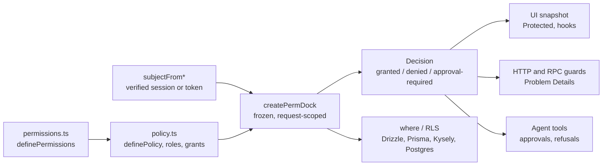

# PermDock

Typed permissions for TypeScript apps, APIs, databases and AI agents: one definition, one decision object, checked in the UI, the API, SQL, Postgres RLS and agent tool approvals.

[](https://www.npmjs.com/package/permdock)
[](https://github.com/ScaleDockHQ/PermDock/actions)
[](./LICENSE)


[](./CODE_OF_CONDUCT.md)

[**Docs**](https://permdock.dev/docs) · [**npm package**](./packages/permdock/README.md) · [**Product brief**](./PRODUCT.md) · [**Roadmap**](./apps/docs/content/docs/roadmap.mdx) · [**Agent guide**](./AGENTS.md) · [**Contributing**](./CONTRIBUTING.md) · [**Report issue**](https://github.com/ScaleDockHQ/PermDock/issues)

> **Pre-release.** Nothing is published yet. The first release of `permdock` is `0.1.0`: one package with core, every adapter, the `permdock` CLI and `permdock/testing`.

---

## Why PermDock

Permission logic in a typical TypeScript app lives in `if (user.role === 'admin')` checks in components, `'post:update'` strings in middleware, a hand-written client copy of the server rules, RLS policies nobody diffs against the app, and AI agents that call tools with no way to say "ask first". PermDock replaces them with one typed definition and one `Decision`.

- **Typed references, not strings.** `permissions.post.update` is a frozen object with a `key`, a `scope` and the resource's Standard Schema. Renames are safe and the definition is the catalog.
- **Policy as data.** Roles are arrays of `allow` / `deny` grants with a portable condition AST that evaluates in the browser, filters arrays, compiles to Drizzle, Prisma and Kysely `where`, and generates Postgres RLS.
- **Three outcomes.** `granted`, `denied` or `approval-required`, with denial reasons, permitted alternatives and a replay-safe approval token.
- **Embedded.** Every decision runs in-process. PermDock Cloud is optional and never on the decision path.

The user-facing overview with code for every surface is the [npm README](./packages/permdock/README.md); the full reference is the [docs](https://permdock.dev/docs).

## What ships

| Surface | Entries |
| --- | --- |
| UI | `permdock/react`, `react-native`, `vue`, `svelte`, `solid` |
| Full-stack and HTTP | `permdock/next`, `server`, `hono`, `express`, `fastify`, `elysia`, `nest`, `node`, `trpc`, `orpc`, `terminal` |
| Agents | `permdock/mcp`, `ai-sdk`, `claude-agent`, `eve`, `openai`, `webmcp`, `a2a` |
| Decision plane | `permdock/authzen`, `approvals`, `cloud`, `scim`, `ssf`, `openapi`, `otel`, `pdp` |
| Data | `permdock/drizzle`, `prisma`, `kysely`, and `permdock rls generate / import / verify` |
| Auth providers | `permdock/jwt`, `supabase`, `supabase/middleware`, `better-auth`, `clerk`, `convex` |
| Tooling | the `permdock` CLI, `permdock/testing`, `permdock/next/plugin`, `permdock/unplugin`, the `wire-permdock` and `audit-permissions` agent skills |

Every entry has a page under [`apps/docs/content/docs/adapters`](./apps/docs/content/docs/adapters/index.mdx) and, where it has a runtime, an app under [`apps/examples`](./apps/examples).

## For AI agents

- Consumers: `npx skills add ScaleDockHQ/PermDock` installs `wire-permdock` and `audit-permissions`; Claude Code can add the marketplace in [`.claude-plugin/marketplace.json`](./.claude-plugin/marketplace.json) with `/plugin marketplace add ScaleDockHQ/permdock`.
- Maintainers: [`AGENTS.md`](./AGENTS.md) (imported by `CLAUDE.md`) is the entry point, and the topic rules in [`.agents/rules`](./.agents/rules) attach by path in Cursor and Claude Code.
- Every docs page is served as Markdown, plus `llms.txt`, `llms-full.txt` and a public docs MCP at `/mcp`. Read [For AI agents](./apps/docs/content/docs/for-ai-agents.mdx).

## Quick Start

### Prerequisites

- Node.js 24 or later (`.node-version` pins 24, which CI runs)
- pnpm 12.8.1 exactly: `devEngines` fails any other version
- Docker, only for `pnpm test:integration`
- Bun on `PATH`, only for `pnpm test:runtimes`

### First run

```bash
git clone https://github.com/ScaleDockHQ/PermDock.git && cd PermDock
pnpm install        # also installs the lefthook git hooks
pnpm build          # tsdown builds packages/permdock; apps and tests import dist/
pnpm test           # vitest unit and type tests
pnpm docs:dev       # docs on http://localhost:3001/docs
```

No environment variables are needed for build, check or test. `CONTRIBUTING.md` covers installing pnpm 12 when Corepack is unavailable.

## Common Commands

| Command | What it does |
| --- | --- |
| `pnpm build` | `turbo run build` (tsdown for `permdock`, `next build` for the apps) |
| `pnpm verify` | `format:check`, `lint`, `typecheck`, `typecheck:tooling`, `knip`, `boundaries`, `test` and `docs:drift` |
| `pnpm test` | Vitest unit and type tests across the workspace |
| `pnpm test:e2e` | Playwright across `apps/examples` and `tests/e2e/fixtures` |
| `pnpm test:integration` | Postgres via testcontainers: RLS parity and providers |
| `pnpm test:runtimes` | The WinterTC app on Bun, Deno and workerd |
| `pnpm size` | Per-entry min+gzip against the recorded baseline |
| `pnpm check:publish` | publint and arethetypeswrong on the published package |
| `pnpm docs:drift` | Docs mention every CLI flag, doctor code and package entry; every page is in `meta.json` |
| `pnpm docs:dev` / `pnpm marketing:dev` | Docs on `:3001`; marketing on `:3000` with `/docs` proxied |
| `pnpm format` / `pnpm lint` | Oxfmt over the whole repository; Oxlint per workspace |
| `pnpm knip` | Unused files, exports and dependencies |
| `pnpm openapi:generate` | Refresh the vendored OpenAPI and Overlay schemas |
| `pnpm changeset` | Record a user-visible change |

## Code Standards

- Fifteen invariants (fail-closed, deny overrides allow, no string keys, frozen JSON leaves, zero runtime dependencies beyond `@standard-schema/spec`, authentication upstream, the Cloud optional, and more) are listed in [`AGENTS.md`](./AGENTS.md) and spelled out in [`.agents/rules/invariants.mdc`](./.agents/rules/invariants.mdc). A PR that breaks one is wrong.
- The naming convention is public API: every adapter exports `createPermDock`, every provider is `subjectFrom*`. See [`.agents/rules/naming.mdc`](./.agents/rules/naming.mdc) and the [naming page](./apps/docs/content/docs/getting-started/naming.mdx).
- TypeScript 7 in strict mode with `exactOptionalPropertyTypes`, `isolatedDeclarations` and `erasableSyntaxOnly`; presets in `packages/typescript-config`.
- Oxlint with type-aware rules and Oxfmt (single quotes, semicolons, width 80); config in `packages/ox-config`.
- Exact dependency pins from the pnpm catalog, `trustPolicy: no-downgrade`, and a one-day minimum release age.
- Conventional commits, enforced by commitlint on `commit-msg`. Prose follows [`.agents/rules/writing.mdc`](./.agents/rules/writing.mdc).

## CI And Release

- `ci.yml` runs on pushes to `main` and `develop`, on pull requests, and nightly with every e2e test repeated three times. It calls `verify.yml`, a matrix of format, lint, Knip, typecheck (with the TypeScript 5.9 / 6 / 7 type matrix), unit tests, boundaries, `audit:high`, catalog, docs and OpenAPI drift, `permdock doctor` over the examples, bundle size and publish checks, affected-only on pull requests. Integration, runtimes and sharded Playwright e2e run against the built `dist/`.
- `release.yml` runs `verify` and Changesets on `main`. Pending changesets open a version pull request (`pnpm version-packages` also updates the root `CHANGELOG.md`); merging it publishes `permdock` to npm with trusted publishing (OIDC and provenance, no npm token) once the `NPM_PUBLISH` repository variable is `true`.
- The marketing and docs apps deploy as two Vercel Services of one project; see `vercel.json` and [`.agents/rules/deployment.mdc`](./.agents/rules/deployment.mdc).

## Contributing

Read [`CONTRIBUTING.md`](./CONTRIBUTING.md). Public API changes start as an RFC issue. Every user-visible change has a changeset, and every adapter ships with a docs page, a skill reference, an example app and tests ([change checklist](./.agents/rules/change-checklist.mdc)). This project follows the [Contributor Covenant](./CODE_OF_CONDUCT.md).

## Monorepo Map

### Packages

| Path | Contents |
| --- | --- |
| [`packages/permdock`](./packages/permdock) | npm `permdock`: `src/core`, `src/conditions`, one folder per adapter, `src/cli` (the `permdock` bin), `src/testing` (`permdock/testing`), JSON schemas, the OpenAPI lint ruleset and the consumer skills |
| [`packages/typescript-config`](./packages/typescript-config) | Private tsconfig presets: `base`, `library`, `react-library`, `next` |
| [`packages/ox-config`](./packages/ox-config) | Private Oxlint and Oxfmt configuration |

### Apps

| Path | Contents |
| --- | --- |
| [`apps/docs`](./apps/docs) | Fumadocs on Next.js 16.3; content in `apps/docs/content/docs`; served at `/docs` |
| [`apps/marketing`](./apps/marketing) | Next.js 16.3 marketing site; served at `/` |
| [`apps/examples`](./apps/examples) | One app per adapter: `next`, `react-vite`, `expo`, `vue`, `svelte`, `solid`, `hono`, `express`, `fastify`, `elysia`, `nest`, `terminal`, `trpc`, `orpc`, `mcp-server`, `ai-sdk-agent`, `claude-agent`, `eve-agent`, `openai-agent`, `webmcp`, `a2a-agent`, `authzen-pdp`, `scim`, `supabase-rls`, `supabase-middleware`, `drizzle`, `prisma`, `better-auth`, `clerk`, `convex`, `monorepo` |

### Tests

| Path | Contents |
| --- | --- |
| [`tests/e2e`](./tests/e2e) | Playwright over the examples, plus scenario fixture apps (Next, SvelteKit, Nuxt, TanStack Start, SolidStart, Expo, MCP OAuth, AI chat, realtime, Turborepo, SCIM, Cloud contract) |
| [`tests/integration`](./tests/integration) | Postgres via testcontainers: RLS parity and providers |
| [`tests/runtimes`](./tests/runtimes) | Bun, Deno and workerd |
| [`tests/types`](./tests/types) | The public types under TypeScript 5.9, 6 and 7 |
| [`tests/bundle`](./tests/bundle) | Per-entry size baseline and client-entry assertions |

## Architecture At A Glance



- Definitions are importable everywhere, including client bundles; policies and closures stay on the server.
- A request builds one frozen `PermDock` from the policy and a verified subject. Adapters translate its `Decision` into their surface.
- The same portable conditions compile to SQL and RLS, and `permdock rls verify` checks the database against `can()`.
- Stores, sinks and sources (`ApprovalStore`, `DecisionSink`, `SnapshotSource`, `MembershipSource`) are interfaces with in-process defaults; PermDock Cloud is one implementation.

## Further Reading

- [Docs index](./apps/docs/content/docs/index.mdx), [installation](./apps/docs/content/docs/getting-started/installation.mdx) and [quick start](./apps/docs/content/docs/getting-started/quick-start.mdx)
- [Concepts](./apps/docs/content/docs/concepts), [adapters](./apps/docs/content/docs/adapters), [CLI](./apps/docs/content/docs/cli), [standards](./apps/docs/content/docs/standards) and [security](./apps/docs/content/docs/security)
- [Threat model](./apps/docs/content/docs/security/threat-model.mdx) and [comparison](./apps/docs/content/docs/comparison.mdx)
- [`PRODUCT.md`](./PRODUCT.md), the product brief, and the [roadmap](./apps/docs/content/docs/roadmap.mdx)

## Security

Report vulnerabilities privately; see [`SECURITY.md`](./SECURITY.md). Do not open public issues for security reports.

## License

[MIT](./LICENSE) © 2026 ScaleDockHQ
