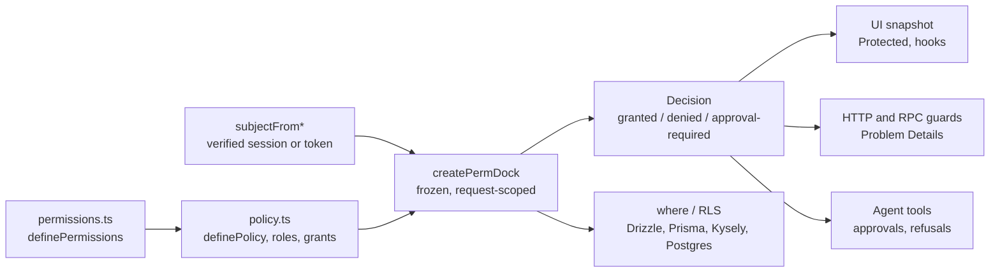

# PermDock

Typed permissions for TypeScript apps, APIs, databases and AI agents: one definition and one decision object, checked in the UI, the API, SQL, Postgres RLS and agent tool approvals.

[](https://www.npmjs.com/package/permdock)
[](https://github.com/ScaleDockHQ/PermDock/actions)
[](./LICENSE)


[](./CODE_OF_CONDUCT.md)

[**Docs**](https://permdock.com/docs) · [**npm package**](./packages/permdock/README.md) · [**Changelog**](./CHANGELOG.md) · [**Product brief**](./PRODUCT.md) · [**Roadmap**](./apps/docs/content/docs/roadmap.mdx) · [**Agent guide**](./AGENTS.md) · [**Contributing**](./CONTRIBUTING.md) · [**Report issue**](https://github.com/ScaleDockHQ/PermDock/issues)

`permdock@0.1.0` is on npm: one package with core, every adapter, the `permdock` CLI and `permdock/testing`. Releases follow semver; the [roadmap](./apps/docs/content/docs/roadmap.mdx) says how versions are numbered.

```bash
pnpm add permdock
```

```ts
import { allow, createPermDock, definePolicy, principal, role } from "permdock";

const policy = definePolicy(
  { permissions, roles },
  {
    roles: [
      role(roles.member, [
        allow(permissions.post.read),
        allow(permissions.post.update, { where: { authorId: principal.id } }),
        allow(permissions.post.delete, { approval: "human" }),
      ]),
    ],
    principal: (user: User | null) =>
      user && { id: user.id, roles: user.roles },
  },
);

const permdock = await createPermDock(policy, user);
permdock.decide(permissions.post.delete, post); // { outcome: 'approval-required', token, ... }
```

The [npm README](./packages/permdock/README.md) walks through every surface with code; the [docs](https://permdock.com/docs) are the full reference.

## Why PermDock

Permission logic in a typical TypeScript app lives in `if (user.role === 'admin')` checks in components, `'post:update'` strings in middleware, a hand-written client copy of the server rules, RLS policies nobody diffs against the app, and AI agents that call tools with no way to say "ask first". PermDock replaces them with one typed definition and one `Decision`.

- **Typed references.** `permissions.post.update` is a frozen object with a `key`, a `scope` and the resource's Standard Schema. A rename is a type error everywhere it is used, and the definition is the catalog.
- **Policy as data.** Roles are arrays of `allow` / `deny` grants with a portable condition AST that evaluates in the browser, filters arrays, compiles to Drizzle, Prisma and Kysely `where`, and generates Postgres RLS.
- **Three outcomes.** `granted`, `denied` or `approval-required`, with denial reasons, permitted alternatives and a replay-safe approval token. `explain()` names the grant or deny that decided it.
- **Agents as actors.** A subject carries the user and the agent acting for them. Policy delegations cap what an agent may do, and approvals take a quorum, stages and escalation.
- **Changes reviewed in CI.** `permdock diff` fails a pull request that takes access away, and `permdock rls verify` checks the database against `can()`.
- **Adoption in steps.** An app keeps its permission keys, SQL helpers, tokens and custom roles while it moves over ([existing apps](./apps/docs/content/docs/getting-started/existing-apps.mdx)).
- **Embedded.** Every decision runs in-process. PermDock Cloud is optional and never on the decision path.

## What ships

| Surface             | Entries                                                                                                             |
| ------------------- | ------------------------------------------------------------------------------------------------------------------- |
| UI                  | `permdock/react`, `react-native`, `vue`, `svelte`, `solid`                                                          |
| Full-stack and HTTP | `permdock/next`, `server`, `hono`, `express`, `fastify`, `elysia`, `nest`, `node`, `trpc`, `orpc`, `terminal`       |
| Agents              | `permdock/mcp`, `ai-sdk`, `claude-agent`, `eve`, `openai`, `webmcp`, `a2a`                                          |
| Decision plane      | `permdock/authzen`, `approvals`, `cloud`, `scim`, `ssf`, `openapi`, `otel`, `pdp`                                   |
| Data                | `permdock/drizzle`, `prisma`, `kysely`, and `permdock rls generate / import / verify / migrate`                     |
| Auth providers      | `permdock/jwt`, `supabase`, `supabase/middleware`, `better-auth`, `clerk`, `convex`                                 |
| CLI                 | `permdock collect`, `catalog`, `diff`, `usage`, `doctor`, `skills`, `openapi`, `rls`, `arazzo`, `cloud`, `supabase` |
| Tooling             | `permdock/testing`, `permdock/next/plugin`, `permdock/unplugin`, the `permdock` and `permdock-*` agent skills       |

Every entry has a page under [`apps/docs/content/docs/adapters`](./apps/docs/content/docs/adapters/index.mdx) and, where it has a runtime, an app under [`apps/examples`](./apps/examples).

## For AI agents

- Consumers: `npx skills add ScaleDockHQ/PermDock` installs the `permdock` skill, `permdock-wire`, `permdock-audit` and the topic skills. Claude Code can add the marketplace in [`.claude-plugin/marketplace.json`](./.claude-plugin/marketplace.json) with `/plugin marketplace add ScaleDockHQ/permdock`.
- Maintainers: [`AGENTS.md`](./AGENTS.md) (imported by `CLAUDE.md`) is the entry point, and the topic rules in [`.agents/rules`](./.agents/rules) attach by path in Cursor and Claude Code.
- Every docs page is served as Markdown, with `llms.txt`, `llms-full.txt` and a public docs MCP server at `https://permdock.com/mcp`. Read [For AI agents](./apps/docs/content/docs/for-ai-agents.mdx).

## Develop locally

### Prerequisites

- Node.js 24 or later (`.node-version` pins 24, which CI runs).
- pnpm 12.8.1 exactly: `devEngines` fails any other version.
- Docker, only for `pnpm test:integration`.
- Bun on `PATH`, only for `pnpm test:runtimes`.

### First run

```bash
git clone https://github.com/ScaleDockHQ/PermDock.git && cd PermDock
pnpm install        # also installs the lefthook git hooks
pnpm build          # tsdown builds packages/permdock; apps and tests import dist/
pnpm test           # vitest unit and type tests
vercel link         # once, maintainers only: links the Vercel project
pnpm env:pull       # maintainers only: writes .env.local from Vercel
pnpm dev:portless   # marketing and docs through Portless
```

No environment variables are needed for build, verify or test; `.env.example` lists the optional keys. `CONTRIBUTING.md` covers installing pnpm 12 when Corepack is unavailable.

### Local URLs

`pnpm dev:portless` runs both apps through [Portless](https://portless.sh), which serves named HTTPS URLs from a local proxy. The first run asks for `sudo` to bind port 443 and trust its local CA.

| App       | URL                                                                             |
| --------- | ------------------------------------------------------------------------------- |
| Marketing | `https://permdock.localhost`                                                    |
| Docs      | `https://permdock.localhost/docs` (served by `https://docs.permdock.localhost`) |
| Docs MCP  | `https://permdock.localhost/mcp`                                                |

In a git worktree the branch is prefixed: `https://<branch>.permdock.localhost`. Without Portless, `pnpm dev:marketing` serves `http://localhost:3000` with docs on `:3001`.

## Common commands

| Command                                | What it does                                                                                                                                                |
| -------------------------------------- | ----------------------------------------------------------------------------------------------------------------------------------------------------------- |
| `pnpm build`                           | `turbo run build` (tsdown for `permdock`, `next build` for the apps)                                                                                        |
| `pnpm check`                           | The fast gate: `format:check`, `lint` and `typecheck`                                                                                                       |
| `pnpm verify`                          | Every CI gate: `format:check`, `lint:root` and `boundaries`, then one cached `turbo run` of the rest                                                        |
| `pnpm test`                            | Vitest unit and type tests across the workspace                                                                                                             |
| `pnpm test:integration`                | Postgres via testcontainers: RLS parity and providers                                                                                                       |
| `pnpm test:runtimes`                   | The WinterTC app on Bun, Deno and workerd                                                                                                                   |
| `pnpm size`                            | Per-entry min+gzip against the recorded baseline                                                                                                            |
| `pnpm gen:check` / `pnpm doctor`       | Generated catalogs and SQL are current; `permdock doctor` (and `better-supabase doctor`) in every example                                                   |
| `pnpm check:publish`                   | publint and arethetypeswrong on the published package                                                                                                       |
| `pnpm docs:drift`                      | Docs mention every doctor code and package entry; every page is in `meta.json`. CLI flags are checked against their pages by `tests/cli/docs-flags.test.ts` |
| `pnpm dev:portless`                    | Marketing and docs at the Portless URLs above, with `.env.development.local`, then `.env.local` loaded                                                      |
| `pnpm dev:cleanup`                     | `portless prune`: stops dev servers orphaned by a crashed session. Yours to run: agents never prune the shared proxy                                        |
| `pnpm dev:docs` / `pnpm dev:marketing` | Docs on `:3001`; marketing on `:3000` with `/docs` proxied                                                                                                  |
| `pnpm env:pull`                        | `.env.local` from Vercel's development environment; `env:pull:production` writes `.env.production.local`                                                    |
| `pnpm format` / `pnpm lint`            | Oxfmt over the whole repository; Oxlint per workspace                                                                                                       |
| `pnpm knip`                            | Unused files, exports and dependencies                                                                                                                      |
| `pnpm boundaries`                      | `turbo boundaries`: workspace dependency rules by tag                                                                                                       |
| `pnpm audit:high`                      | `pnpm audit` failing on high and critical advisories                                                                                                        |
| `pnpm openapi:generate`                | Refresh the vendored OpenAPI and Overlay schemas; `openapi:check` fails when they changed                                                                   |
| `pnpm analyze`                         | `next experimental-analyze` for docs and marketing; not part of `verify`                                                                                    |
| `pnpm standards:fixtures`              | Refresh the upstream schemas and RFC vectors `tests/standards` checks against                                                                               |
| `pnpm changeset`                       | Record a user-visible change                                                                                                                                |

## Code standards

- Fifteen invariants (fail-closed, deny overrides allow, no string keys, frozen JSON leaves, zero runtime dependencies beyond `@standard-schema/spec`, authentication upstream, the Cloud optional, and more) are listed in [`AGENTS.md`](./AGENTS.md) and spelled out in [`.agents/rules/invariants.mdc`](./.agents/rules/invariants.mdc). A PR that breaks one is wrong.
- The naming convention is public API: every adapter exports `createPermDock`, every provider is `subjectFrom*`. See [`.agents/rules/naming.mdc`](./.agents/rules/naming.mdc) and the [naming page](./apps/docs/content/docs/getting-started/naming.mdx).
- TypeScript 7 in strict mode with `exactOptionalPropertyTypes`, `isolatedDeclarations` and `erasableSyntaxOnly`; presets in `packages/typescript-config`.
- Oxlint with type-aware rules and Oxfmt (double quotes, semicolons, width 80, sorted Tailwind classes, Markdown and MDX included); config in `packages/ox-config`.
- Exact dependency pins from the pnpm catalog, `trustPolicy: no-downgrade`, and a one-day minimum release age.
- Conventional commits, enforced by commitlint on `commit-msg`. Prose follows [`.agents/rules/writing.mdc`](./.agents/rules/writing.mdc).

## CI and release

- `ci.yml` runs on pushes to `main` and on pull requests. It calls `verify.yml`, a matrix of format, lint, Knip, typecheck (with the TypeScript 5.9 / 6 / 7 type matrix), unit tests, boundaries, `audit:high`, catalog, docs and OpenAPI drift, `permdock doctor` over the examples, bundle size and publish checks, affected-only on pull requests. Integration and runtimes run against the built `dist/`. There are no end-to-end or browser tests: unit, integration, runtime, type and bundle tests cover the package.
- `release.yml` runs `verify` and Changesets on `main`. Pending changesets open a `chore: version packages` pull request (`pnpm version-packages` also updates the root `CHANGELOG.md`); merging it publishes `permdock` to npm with trusted publishing (OIDC and provenance, no npm token) once the `NPM_PUBLISH` repository variable is `true`.

## Deploy

The marketing and docs apps deploy as two Vercel Services of one project, declared in `vercel.json`, at `https://permdock.com`. Marketing owns `/` and docs owns `/docs`, `/mcp` and the `llms` routes on the same origin. Only `main` deploys (`git.deploymentEnabled`); other branches, including `changeset-release/*`, do not. Each service builds only when `turbo query affected` reports it changed. Functions run in `fra1`, and Ask AI reaches the AI Gateway through Vercel OIDC, with no API key. Route ownership and the build commands are in [`.agents/rules/deployment.mdc`](./.agents/rules/deployment.mdc); the exceptions to the repo standard are in [`docs/decisions`](./docs/decisions/README.md).

## Contributing

Read [`CONTRIBUTING.md`](./CONTRIBUTING.md). Public API changes start as an RFC issue. Every user-visible change has a changeset, and every adapter ships with a docs page, a skill reference, an example app and tests ([change checklist](./.agents/rules/change-checklist.mdc)). This project follows the [Contributor Covenant](./CODE_OF_CONDUCT.md).

## Monorepo map

### Packages

| Path                                                         | Contents                                                                                                                                                                                                 |
| ------------------------------------------------------------ | -------------------------------------------------------------------------------------------------------------------------------------------------------------------------------------------------------- |
| [`packages/permdock`](./packages/permdock)                   | npm `permdock`: `src/core`, `src/conditions`, one folder per adapter, `src/cli` (the `permdock` bin), `src/testing` (`permdock/testing`), JSON schemas, the OpenAPI lint ruleset and the consumer skills |
| [`packages/typescript-config`](./packages/typescript-config) | Private tsconfig presets: `base`, `library`, `react-library`, `next`                                                                                                                                     |
| [`packages/ox-config`](./packages/ox-config)                 | Private Oxlint and Oxfmt configuration                                                                                                                                                                   |
| [`packages/next-config`](./packages/next-config)             | Private `createNextConfig()`: security headers, dev origins, Sentry options                                                                                                                              |
| [`packages/ui`](./packages/ui)                               | Private vendored shadcn/ui, ReUI and AI Elements components, one export per file                                                                                                                         |

### Apps

| Path                                 | Contents                                                                                                                                                                                                                                                                                                                                                                                                           |
| ------------------------------------ | ------------------------------------------------------------------------------------------------------------------------------------------------------------------------------------------------------------------------------------------------------------------------------------------------------------------------------------------------------------------------------------------------------------------ |
| [`apps/docs`](./apps/docs)           | Fumadocs on Next.js 16.3; content in `apps/docs/content/docs`; served at `/docs`                                                                                                                                                                                                                                                                                                                                   |
| [`apps/marketing`](./apps/marketing) | Next.js 16.3 marketing site; served at `/`                                                                                                                                                                                                                                                                                                                                                                         |
| [`apps/examples`](./apps/examples)   | One app per adapter: `next`, `next-better-supabase`, `react-vite`, `expo`, `vue`, `svelte`, `solid`, `hono`, `express`, `fastify`, `elysia`, `nest`, `terminal`, `trpc`, `orpc`, `mcp-server`, `ai-sdk-agent`, `claude-agent`, `eve-agent`, `openai-agent`, `webmcp`, `a2a-agent`, `authzen-pdp`, `scim`, `supabase-rls`, `supabase-middleware`, `drizzle`, `prisma`, `better-auth`, `clerk`, `convex`, `monorepo` |

### Tests

| Path                                       | Contents                                                                     |
| ------------------------------------------ | ---------------------------------------------------------------------------- |
| [`tests/integration`](./tests/integration) | Postgres via testcontainers: RLS parity, providers and the adoption fixtures |
| [`tests/runtimes`](./tests/runtimes)       | Bun, Deno and workerd                                                        |
| [`tests/types`](./tests/types)             | The public types under TypeScript 5.9, 6 and 7                               |
| [`tests/bundle`](./tests/bundle)           | Per-entry size baseline and client-entry assertions                          |

## Architecture at a glance



- Definitions are importable everywhere, including client bundles; policies and closures stay on the server.
- A request builds one frozen `PermDock` from the policy and a verified subject. Adapters translate its `Decision` into their surface.
- The same portable conditions compile to SQL and RLS, and `permdock rls verify` checks the database against `can()`.
- Stores, sinks and sources (`ApprovalStore`, `DecisionSink`, `SnapshotSource`, `MembershipSource`) are interfaces with in-process defaults; PermDock Cloud is one implementation.

## Further reading

- [Docs index](./apps/docs/content/docs/index.mdx), [installation](./apps/docs/content/docs/getting-started/installation.mdx), [quick start](./apps/docs/content/docs/getting-started/quick-start.mdx) and [existing apps](./apps/docs/content/docs/getting-started/existing-apps.mdx).
- [Concepts](./apps/docs/content/docs/concepts), [adapters](./apps/docs/content/docs/adapters), [CLI](./apps/docs/content/docs/cli), [standards](./apps/docs/content/docs/standards) and [security](./apps/docs/content/docs/security).
- [Threat model](./apps/docs/content/docs/security/threat-model.mdx) and [comparison](./apps/docs/content/docs/comparison.mdx).
- [`PRODUCT.md`](./PRODUCT.md), [`DESIGN.md`](./DESIGN.md), the [roadmap](./apps/docs/content/docs/roadmap.mdx) and the [decision records](./docs/decisions/README.md).

## Security

Report vulnerabilities privately; see [`SECURITY.md`](./SECURITY.md). Do not open public issues for security reports.

## License

[MIT](./LICENSE) © 2026 ScaleDockHQ
