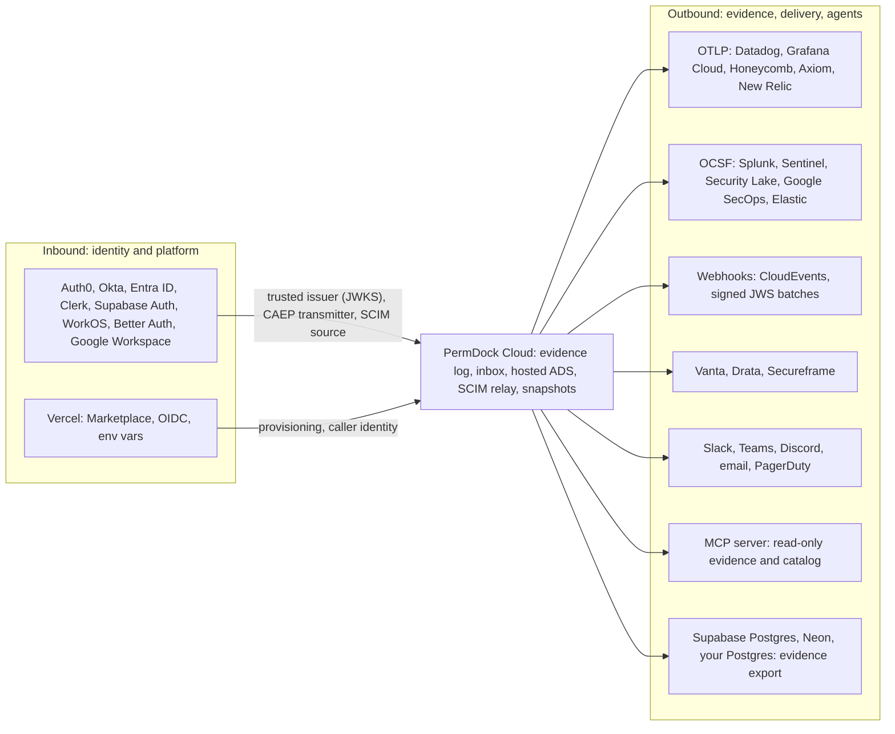

Status: planned
Phase: 2

PermDock Cloud has an Integrations page where an environment is connected to the platforms around it: identity providers, Vercel, observability backends, SIEMs, webhooks, compliance platforms, your own database, chat surfaces and an MCP host. This page is the contract for that UI. It fixes what each connector speaks; the `PermDock-Cloud` repository implements it. Two rules from the rest of the docs apply to every row ([ADR 0023](/docs/decisions/0023-compose-openapi-ecosystem), [ADR 0027](/docs/decisions/0027-governance-first-cloud), invariant 15):

- A connector is a standard wire format (AuthZEN, OCSF, CloudEvents, OTLP, SCIM, CAEP, JOSE, OIDC) or an existing PermDock interface (`ApprovalStore`, `DecisionSink`, `SnapshotSource`, `DirectoryStore`). There is no `permdock/auth0`, `permdock/datadog` or `permdock/vanta`, and connecting a platform never adds a dependency to your application.
- No connector sits on the decision path. Inbound connectors change who the Cloud authenticates and what your `DirectoryStore` contains; outbound connectors copy evidence and notifications out. Nothing any connector does is consulted by `can`, `decide`, `filter`, `where` or `simulate`.

Each table below has the same columns. **Connector** is what the Integrations page shows. **Standard or interface** is the only thing the connector speaks. **What it carries** is the data that crosses. **Never** is the thing the connector is not allowed to do, and each of those is a row in the [threat model](/docs/security/threat-model).

## Inbound: identity providers

One identity provider can be connected in up to three roles. They are independent: a tenant may use Okta as a SCIM source while its end users authenticate with Clerk.

| Connector | Standard or interface | What it carries | Never |
| --- | --- | --- | --- |
| Trusted issuer (Auth0, Okta, Entra ID, Clerk, Supabase Auth, WorkOS AuthKit, Better Auth, Google Identity, any JWKS-publishing issuer) | OIDC Discovery or RFC 8414 metadata, JWKS, RFC 9068 access tokens; verified by `permdock/jwt` with the same `discovery`, `accept`, `algorithms` and `profile` rules the application uses | Who the hosted ADS and the snapshot edge accept as an end user: `iss`, `sub`, `aud`, `roles`, `groups`, `org_id`, `act`, `cnf`, mapped to a `Subject` exactly as [`subjectFromJwt`](/docs/adapters/jwt) does in your app | Widen what the embedded engine decides; accept a token whose tenant claim has no onboarded connection (no tenant, never a default); read memberships from the provider's management API |
| CAEP transmitter (Okta, Entra ID, Google Workspace, Auth0, any SSF transmitter) | Shared Signals Framework: RFC 8935 push or RFC 8936 poll into the Cloud's SSF receiver; OIDC Back-Channel Logout as the alternative | `session-revoked`, `credential-change`, `assurance-level-change` events keyed on the subject; `logout_token` for Back-Channel Logout | Change a decision; the event invalidates signed snapshots served by the Cloud edge and nothing else ([Shared Signals](/docs/standards/shared-signals-caep), [SSF adapter](/docs/adapters/ssf)) |
| SCIM source (Okta, Entra ID, Google Workspace, WorkOS Directory Sync, any SCIM 2.0 client) | SCIM 2.0 (RFC 7643, RFC 7644, RFC 9865) into the hosted relay; RFC 7523 JWT bearer from the relay to your `scimHandler` | `User` and `Group` resources, the tenant's group-to-role mapping as the `urn:permdock:scim:schemas:extension:roles:1.0` attribute, one sync-log entry per operation | Hold an authoritative directory; implement `MembershipSource` or `RoleSource`; grant a role the policy did not declare `assignable` ([SCIM adapter](/docs/adapters/scim)) |

"Connect Supabase" on the identity side means Supabase Auth as a trusted issuer (its project JWKS, `role` and `app_metadata` handled as on the [Supabase adapter](/docs/adapters/supabase) page); the Cloud never reads your Supabase tables or RLS policies. "Connect Clerk", "Connect Auth0" and "Connect WorkOS" mean the same three roles with the provider's discovery URL, SSF transmitter and SCIM client.

## Inbound: Vercel

The Vercel connector is already specified on the [Cloud adapter](/docs/adapters/cloud) page ("Vercel Marketplace" and "Hosted Authorization Decision Service"); the Integrations page links those sections rather than duplicating them.

| Connector | Standard or interface | What it carries | Never |
| --- | --- | --- | --- |
| Vercel Marketplace | Marketplace provisioning API (install, resource, SSO, billing) | One PermDock environment per Vercel project and environment; `PERMDOCK_CLOUD_URL` and `PERMDOCK_CLOUD_KEY` written to the project | Write a `NEXT_PUBLIC_*` variable; share one environment between `preview` and `production` |
| Vercel OIDC | Vercel's OIDC federation token verified against Vercel's JWKS | ADS caller identity: `sub`, `project_id`, `environment` mapped to a workload principal | Accept a static shared secret in place of the token; accept a token for another environment |
| Vercel Chat SDK | Chat SDK `requestApproval` (below, delivery) | Approval cards on Slack and Teams with signature-verified responders | Resolve an approval from a message body |

## Outbound: observability (OTLP)

| Connector | Standard or interface | What it carries | Never |
| --- | --- | --- | --- |
| OTLP collector endpoint (Datadog, Grafana Cloud, Honeycomb, Axiom, New Relic, any OpenTelemetry Collector) | OTLP/HTTP log records and spans with the `permdock.*` attribute set from the [OpenTelemetry adapter](/docs/adapters/otel) (`permdock.outcome`, `permdock.permission`, `permdock.subject.id`, `permdock.actor.id`, `permdock.actor.kind`, `permdock.matched.role`, `permdock.denials.count`) | A copy of every event in the evidence log as an OTLP log record, and the hosted ADS's own `permdock.decide` spans | Be the evidence. Collectors sample and drop, retention is short, a span is not signed; the sink's log and its signed export are the evidence ([audit and observability](/docs/concepts/audit-and-observability) "OpenTelemetry is not the evidence path") |

Because the attribute names are the same set `permdock/otel` emits from inside your application, a backend cannot tell an app-side span from a Cloud-side log record, and one dashboard serves both.

## Outbound: SIEM (OCSF)

| Connector | Standard or interface | What it carries | Never |
| --- | --- | --- | --- |
| SIEM or security lake (Splunk HTTP Event Collector, Microsoft Sentinel data collector, AWS Security Lake, Google SecOps, Elastic ingest, Datadog Cloud SIEM) | The OCSF Authorization activity projection `toOcsf(event)` from [wire formats](/docs/concepts/wire-formats), posted over the destination's ingest HTTP API | Every decision and approval event, pinned to one OCSF version | Diverge from the projection a self-hosted `DecisionSink` recipe emits; the Cloud runs the documented projection, it does not own a private one |

## Outbound: webhooks

Webhooks are the generic escape hatch: anything not listed on this page receives CloudEvents over HTTP.

| Connector | Standard or interface | What it carries | Never |
| --- | --- | --- | --- |
| HTTP webhook | CloudEvents 1.0 structured mode over HTTPS; batches optionally signed as a compact JWS with `typ: permdock-decisions+jwt` ([wire formats](/docs/concepts/wire-formats) "Signed outputs") | Events of type `dev.permdock.decision`, `dev.permdock.approval`, `dev.permdock.directory` (a SCIM operation replayed) and `dev.permdock.catalog` (a policy publish or a drift finding); `source` is the emitting service, `subject` the permission key or resource id | Deliver an approval resolution: a webhook tells a receiver that an approval is pending or resolved, and the receiver cannot answer it |

A receiver in another trust domain verifies the JWS against `<PERMDOCK_CLOUD_URL>/.well-known/jwks.json` with `aud` equal to itself and `exp`, or the CloudEvents HTTP signature when batches are unsigned; `id` and `time` make replay detectable. Retries use exponential backoff with the same `id`, so a receiver deduplicates on it.

## Outbound: compliance evidence

| Connector | Standard or interface | What it carries | Never |
| --- | --- | --- | --- |
| Compliance platform (Vanta, Drata, Secureframe) | The Cloud export endpoint: a signed batch (`permdock-decisions+jwt`) or CSV pulled on the review window with a scoped API key | Access-review evidence with the columns from the [Evidence and governance](/docs/concepts/audit-and-observability) contract: `subject.principal`, `actor`, `permission`, `outcome`, `tenant`, `matched.role`, `via` | Return sampled data; the evidence log writes every event and the export is complete for its window |

## Outbound: data destinations

| Connector | Standard or interface | What it carries | Never |
| --- | --- | --- | --- |
| Your database (Supabase Postgres, Neon, any Postgres) | Either a scheduled pull of signed batches by a job you run, or a CloudEvents webhook into a function you own (a Supabase Edge Function, a route handler) that inserts rows | The same events, into a table with your schema; the [sink recipes](/docs/concepts/audit-and-observability) show the columns | Read from your database. The Cloud has no credential to your Postgres, never reads a table or an RLS policy, and never uses the `service_role` key |

This is how "connect Supabase" reads on the data side: Supabase is a destination that receives evidence, not a source the Cloud queries.

## Outbound: approval delivery

| Connector | Standard or interface | What it carries | Never |
| --- | --- | --- | --- |
| Slack, Microsoft Teams, Discord | Vercel Chat SDK `requestApproval`, the recipe from the [approvals adapter](/docs/adapters/approvals) "Delivery" section run by the Cloud | An approval card per `ApprovalRequest`; the platform signature identifies the responder, the Cloud maps the responder to an approver and applies the actor and distinct-approver rules | Take an approver identity from the message body; let the request's `actor` approve its own call |
| Email | A link to the authenticated inbox | Notification that an approval is pending | Resolve from the link alone; the approver signs in to the inbox (the signed-link question stays open on [approvals](/docs/security/approvals)) |
| Paging (PagerDuty, Opsgenie, any incident tool with an events API) | A CloudEvents webhook for `dev.permdock.approval` with `phase: requested` | The page; the on-call person resolves in the inbox or a chat card | Resolve an approval |

## Outbound: MCP

| Connector | Standard or interface | What it carries | Never |
| --- | --- | --- | --- |
| PermDock Cloud MCP server (connected from Claude, Cursor, ChatGPT or any MCP host) | MCP over streamable HTTP with OAuth 2.1 per [MCP authorization](/docs/standards/mcp-authorization); the Cloud is the resource server and its own identity is the authorization server | Read-only tools: query evidence (the review questions above), list pending approvals, read the published catalog and drift findings, all scoped to the token's subject and tenants | Resolve an approval, publish a policy or change a connector. Approver identity must come from the Cloud's own authentication, and an agent approving an agent's action defeats the human-in-the-loop guarantee ([approvals](/docs/security/approvals)) |

## What the page does not offer

- A connector that resolves memberships or roles from a provider API. That is a `MembershipSource` or `RoleSource` in your application, or SCIM into a `DirectoryStore` you own ([tenancy](/docs/concepts/tenancy), invariant 15).
- A connector that pushes a policy into the application. Policies are code in your bundle; `permdock cloud push` publishes a copy to the hosted ADS and the catalog, in one direction.
- Per-vendor npm entries or per-vendor OpenAPI extensions ([ADR 0023](/docs/decisions/0023-compose-openapi-ecosystem)).
- An authentication product or a gateway. Trusted issuers are how the Cloud consumes authentication, not how it provides it ([ADR 0018](/docs/decisions/0018-authentication-is-upstream), [ADR 0027](/docs/decisions/0027-governance-first-cloud)).

## Example app

No example app of its own: `apps/examples/eve-agent` (the Marketplace template) exercises the Vercel, Slack and evidence-export connectors against a Cloud environment; `apps/examples/scim` exercises the SCIM relay.

## Related standards

- [OpenID Connect](/docs/standards/openid-connect), [JOSE](/docs/standards/jose) and [JWT authorization claims](/docs/standards/jwt-authorization-claims): trusted issuers.
- [Shared Signals and CAEP](/docs/standards/shared-signals-caep): CAEP transmitters.
- [SCIM 2.0](/docs/standards/scim): SCIM sources and the relay.
- [MCP authorization](/docs/standards/mcp-authorization): the Cloud's MCP server.
- [Wire formats](/docs/concepts/wire-formats): CloudEvents types, the OCSF projection and `permdock-decisions+jwt`.
- [ADR 0023](/docs/decisions/0023-compose-openapi-ecosystem), [ADR 0027](/docs/decisions/0027-governance-first-cloud).

## Open questions

- Whether the webhook's unsigned mode should exist at all, or every batch should be a JWS so receivers have one verification path.
- Whether `dev.permdock.catalog` drift findings need their own data schema in [wire formats](/docs/concepts/wire-formats) before Phase 2, or can carry the `permdock collect --check` output as is.
- Whether the MCP server should expose an `explain` tool that renders `describe(decision)` for one event, given that the same text is in the UI.
