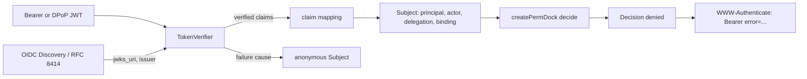

`permdock/jwt` is the one place in the `permdock` package that verifies a token. It exists because core cannot: core has no runtime dependency other than `@standard-schema/spec`, and signature verification needs a crypto library. `permdock/jwt` takes `jose` as an optional peer dependency, applies the RFC 8725 checklist from [JOSE](/docs/standards/jose), and maps the verified claims to a [subject](/docs/concepts/subject) following [OpenID Connect](/docs/standards/openid-connect). It is used by HTTP adapters that receive bearer tokens directly and by the MCP adapter when the SDK exposes the raw token. It also holds the package's `TokenVerifier` and `TokenSigner` implementations, so it is where JWS-signed snapshots are produced.

## Purpose

Most apps already have something that verifies tokens: a framework session, a provider SDK, the MCP SDK's bearer middleware. Those go through the [provider adapters](/docs/adapters/supabase) or the framework adapters. `permdock/jwt` covers the remaining cases: an API that accepts tokens from a generic OAuth 2.0 / OIDC issuer, a service that receives client-credentials or workload tokens, a transaction token inside a trust domain, or an MCP server that wants to read `authorization_details` and `cnf` the SDK does not surface. In each case the output is a `Subject` with `principal`, `actor`, `delegation` and `binding` filled from claims, so the rest of PermDock behaves exactly as with a session.



## API

```ts
import { subjectFromJwt, createJwtSubjectResolver, verifyDpopProof } from 'permdock/jwt'

const subject = await subjectFromJwt(token, {
  discovery: 'https://login.example.com',                              // OIDC Discovery, RFC 8414 fallback; supplies jwks_uri and issuer
  // jwks: new URL('https://login.example.com/.well-known/jwks.json'),  // alternative: URL | URL string | JSONWebKeySet | { secret: Uint8Array }
  // issuer: 'https://login.example.com',                               // required with any `jwks` but a secret; derived from the document with `discovery`
  audience: 'https://api.example.com',
  accept: 'access-token',                                              // default; 'id-token' for BFF patterns
  algorithms: ['ES256', 'PS256', 'Ed25519'],                           // default allow-list (+ 'RS256' outside fapi2); 'none' never
  clockTolerance: 5,                                                   // seconds
  claims: {
    id: 'sub',                                                         // dot paths, own-property lookups only
    roles: 'roles',                                                    // default; RFC 9068, global roles
    groups: 'groups',                                                  // default; RFC 9068, team memberships keyed on SCIM `value`
    entitlements: 'entitlements',                                      // default; RFC 9068, maps to principal.plans
    tenant: 'org_id',                                                  // no standard claim; vendor specific
    memberships: 'tenants',                                            // optional; a per-tenant object such as Descope `tenants`
    assurance: { acr: 'acr', amr: 'amr', authTime: 'auth_time', verified: 'verified_claims' },   // defaults; OIDC Core section 2, OIDC4IDA
    session: 'sid',                                                    // default; joins logout_token and CAEP events to the snapshot
  },
  groupRoles: { '9f2c': ['lead'] },                                    // group id -> declared team roles; ids, never display names
  schema: CustomClaims,                                                // optional Standard Schema for the remaining custom claims
  delegation: {
    scopes: 'scope',                                                   // space-separated string or array
    authorizationDetails: 'authorization_details',                     // RFC 9396
    access: 'access',                                                  // GNAP access array; JWT mapping per RFC 9767 section 2.1
  },
  actor: { from: 'act' },                                              // RFC 8693; or (claims) => Actor
  sender: 'dpop',                                                      // 'none' | 'dpop' | 'mtls'
  decryptionKeys: undefined,                                           // JWE accepted only when set; see "JWE posture"
  profile: 'fapi2',                                                    // optional; see below
  // verifier: myTokenVerifier,                                        // replaces the built-in jose verifier; see "TokenVerifier"
})
```

| Export | Role |
|---|---|
| `subjectFromJwt(token, options)` | Verifies one token and returns a `Subject`. `token` may be `undefined` or `null` (no header), in which case the result is anonymous without an audit event. Never throws. |
| `createJwtSubjectResolver(options)` | Returns `(token, request?) => Promise<Subject>` with a cached Discovery document and JWKS. Use one resolver per issuer for the life of the process; pass it as the `subject` option of a server adapter. |
| `verifyDpopProof(request, claims)` | Checks the `DPoP` header of `request` against `claims.cnf.jkt`: an asymmetric `alg` and a public `jwk` only, proof signature, `htm` / `htu` match, `iat` window, `ath` hash of the access token. Returns `{ ok: true }` or `{ ok: false, cause }`. Called automatically when `sender: 'dpop'`; exported for adapters that verify tokens elsewhere. |
| `joseTokenVerifier(options)` | The built-in `TokenVerifier`: `jwks` or `discovery`, `algorithms`, `typ`, `audience`, `clockTolerance`, `decryptionKeys`. Exported so `permdock/ssf`, `permdock/cloud` and your own code verify PermDock's signed outputs and SETs with the same rules ([extension interfaces](/docs/concepts/extension-interfaces)). |
| `joseTokenSigner({ key, alg, kid })` | The built-in `TokenSigner`: signs a payload as compact JWS with a registered `typ`. Used by `permdock.snapshot({ signer })`, `approvalsHandler({ signer })` and `permdock/cloud` ([wire formats](/docs/concepts/wire-formats)). |
| `subjectFromCapability(token, options)` | Verifies a `permdock-capability+jwt` share link and returns the `link` subject it acts as: one resource membership, narrowed by `delegation.scopes` when the capability lists permissions. `issuer` and `audience` are required. Never throws ([link capabilities](/docs/concepts/capabilities)). |
| `subjectFromIntrospection(response, options)` | Maps an RFC 7662 or RFC 9767 introspection response (`active`, `access` / `scope`, `key`, `sub`, `iss`, `instance_id` / `client_id`) to the same `Subject` shape; `active` other than `true` is anonymous. With `audience` set, `aud` must contain it; with `issuer` set, a response whose `iss` differs is anonymous, and a response without `iss` has no `principal.issuer`. The HTTP call to the introspection endpoint is yours ([GNAP](/docs/standards/watch-list#gnap), [delegation](/docs/security/delegation)). |

Option notes:

- `discovery` takes an issuer URL (or `{ issuer, metadata }` when the document is already loaded). The resolver fetches `<issuer>/.well-known/openid-configuration`, falls back to the RFC 8414 path `/.well-known/oauth-authorization-server/<path>`, requires the document's `issuer` to equal the configured one byte for byte, takes `jwks_uri` from it and caches both with the JWKS rules below. `discovery` and `jwks` are mutually exclusive; with `discovery`, `issuer` is derived (`joseTokenVerifier` checks every token's `iss` against it), and setting it explicitly is a configuration error unless it matches. With a `jwks` URL or key set, `issuer` is required: identity providers share key sets across tenants and issuers, so a signature alone does not say who issued the token. Fetching happens in the resolver, never in `decide`.
- `accept: 'access-token'` (default) verifies `typ` as `at+jwt` or `application/at+jwt` (RFC 9068 section 4) or `JWT`; under `profile: 'fapi2'` only `at+jwt`. A token that carries `nonce`, or whose `aud` is a client identifier rather than the configured `audience`, is an ID token and fails with cause `wrong-token-type`. `accept: 'id-token'` verifies an ID token per OpenID Connect Core section 3.1.3.7 (`aud` contains the client id, `azp` equals it when several audiences are present, `typ` absent or `JWT`) for backends-for-frontends that want its claims as the principal. One resolver accepts one kind.
- `algorithms` defaults to `['ES256', 'PS256', 'Ed25519', 'RS256']` and to `['ES256', 'PS256', 'Ed25519']` under `profile: 'fapi2'`. `Ed25519` is the RFC 9864 fully-specified name; a token with `alg: EdDSA` verifies only when the selected JWK is `kty: OKP` with `crv: Ed25519`, and `permdock doctor` reports issuers that still publish `EdDSA`. `HS256` is accepted only together with `{ secret }` of at least 256 bits. `none` and the JWE `RSA1_5` are never accepted.
- `claims.*` paths are resolved with own-property lookups; `__proto__`, `constructor` and `prototype` segments are rejected at configuration time (threat model invariant 4). A path that resolves to nothing leaves the field absent; a missing `id` path makes the subject anonymous.
- `principal.issuer` is always set from the verified `iss` (or the Discovery document's `issuer`). `principal.id` alone is not an identity across issuers; audit events carry both.
- `claims.kind` may name a claim or be a literal (`'workload'`) so client-credentials tokens produce `principal.kind: 'workload'` ([subject](/docs/concepts/subject), "Workload principals").
- `claims.roles`, `claims.groups` and `claims.entitlements` default to the RFC 9068 claim names and accept plain string arrays or SCIM complex values (`{ value, display, type }`), matching on `value` only. `roles` fill `principal.roles`; `entitlements` fill `principal.plans`. `groups` become `{ tenant, roles: groupRoles[value] ?? [], via: 'group:<value>' }` memberships of the active tenant (none without one): group roles hold in the tenant, and the group itself is only the `via`. A group id that has no `groupRoles` entry is a membership with no roles: visible to `permdock.memberships()`, contributing no grant ([JWT authorization claims](/docs/standards/jwt-authorization-claims)).
- `claims.tenant` names the active tenant claim (`org_id`, `tid`, `hd`, `org_code`); there is no standard. A missing or unexpected value yields a principal without a tenant, never a default. `claims.memberships` points at a per-tenant object or array (Descope `tenants`, Zitadel project roles) and maps each entry to a `{ tenant, roles }` membership (an entry already in the canonical `{ scope, id, within?, roles, via?, expiresAt? }` form is kept, with `via` and `expiresAt`); the [claims standard](/docs/standards/jwt-authorization-claims) lists the vendor shapes.
- `claims.assurance` fills `principal.assurance` as `{ acr, amr, authTime }` from the OIDC claims of the same name (`amr` as an RFC 8176 array, `authTime` in seconds). A string value (`'acr'`) is shorthand for `{ acr: 'acr' }`; provider adapters map Supabase `aal` into `acr`. Conditions compare `acr` as an opaque string and `amr` by membership; a denial on either has reason `insufficient-user-authentication` and renders as an RFC 9470 challenge (below). RFC 8176 values commonly seen: `pwd`, `otp`, `swk` (software key / passkey in a platform authenticator), `hwk` (hardware key), `mfa`.

### Verified material

| Claim | Trust | Becomes |
| --- | --- | --- |
| `acr`, `amr`, `auth_time` | Verified by `TokenVerifier` | `principal.assurance.acr`, `.amr`, `.authTime` |
| `verified_claims` | Verified by `TokenVerifier`; entries without `verification.trust_framework` and `claims` dropped | `principal.assurance.verified`, frozen and opaque |
- `claims.session` fills `subject.session` from `sid` so a later Back-Channel Logout `logout_token` or CAEP `session-revoked` event can be matched to the snapshot ([SSF adapter](/docs/adapters/ssf)).
- `schema` (any Standard Schema) validates the claims that are not covered by `claims.*` before they become `principal.claims`; an invalid claim set drops `claims`, never the subject, and reports cause `invalid-claims` on `on('auth')`.
- `memberships` (a `MembershipSource`) supplements the token with memberships from your tables for issuers that carry none; it runs after verification with the verified `sub`.
- `actor.from: 'act'` takes the innermost `act.sub` as `actor.id` and stores the full nesting as `delegation.chain`. A claimed `act` that is not an object, or whose nested `act` lacks a string `sub`, is anonymous with cause `invalid-chain`. `actor.kind` is `'oauth-client'` by default and `'mcp-client'` when the resolver runs inside `permdock/mcp`, the one value the MCP adapter uses for its own actors; there is no other `kind` for `act`-derived actors. A function receives the verified claims and returns an `Actor` or `undefined`.
- `delegation.access` reads the GNAP `access` claim as RFC 9767 section 2.1 defines it for JWT-formatted tokens (objects and reference strings, RFC 9635 section 8). Entries are stored on `delegation.access` and intersected with grants like `scopes`.
- `sender: 'dpop'` attaches `binding: { jkt: cnf.jkt }` and runs `verifyDpopProof` on the `request`; a call without a `request` cannot prove possession and resolves the anonymous subject with `dpop-proof-invalid`. `sender: 'mtls'` attaches `binding: { 'x5t#S256': cnf['x5t#S256'] }` and compares it to the certificate thumbprint the adapter passes in. `Binding` carries the RFC 7800 `cnf` members verbatim (`jkt`, `x5t#S256`, `jwk`, `kid`) so it round-trips into anything PermDock signs. The binding goes on `actor` when an `act` chain is present, otherwise on `principal`.
- `expiresAt` on the returned subject is `exp`, or `min(exp, session_expiry)` when the IPSIE / Enterprise Extensions claim is present; `snapshot()` copies it.
- `verifier` replaces the built-in `joseTokenVerifier` with any `TokenVerifier`: another JOSE library, a hardware-backed verifier, or one that calls an introspection endpoint. The claim mapping, `accept` logic and audit events are unchanged; only the "is this token genuine" step moves.

### Discovery and JWKS caching

`createJwtSubjectResolver` fetches the Discovery document (when `discovery` is set) and the JWKS lazily on first use and caches them:

- The Discovery document is fetched over HTTPS only; `http:` issuers are a configuration error. Its `issuer` must equal the configured issuer (Discovery 1.0 section 4.3); a mismatch is reported once by `permdock doctor` and every token resolves to anonymous with cause `discovery-mismatch` until it is fixed. The document is re-read on the JWKS refetch schedule.
- The JWKS cache honours `Cache-Control: max-age` on the JWKS response, with a configurable floor and ceiling (`jwksCache: { minTtl, maxTtl }`).
- An unknown `kid` triggers a refetch at most once per `jwksCache.cooldown` seconds (default 60), so a flood of tokens with bogus `kid` values cannot turn the resolver into a JWKS-fetch amplifier.
- A fetch error keeps the previous key set until it expires, then fails closed: tokens are rejected with cause `jwks-unavailable` (or `discovery-unavailable` when the document itself could not be fetched and none is cached). Nothing is ever verified against an empty or partially fetched set.
- Key rotation with a standby key (Supabase's standby / current / previously used / revoked model, or any issuer that publishes the next key ahead of time) needs no configuration: the new `kid` is found on the next refetch.

### Link capabilities

`subjectFromCapability(token, options)` verifies with the same `joseTokenVerifier` rules (or `verifier`) but accepts only `typ: permdock-capability+jwt`, and `subjectFromJwt` never accepts that `typ`, so a link and an access token cannot stand in for each other. It takes `jwks` or `discovery`, `issuer` and `audience` (both required), `algorithms`, `clockTolerance` and three options of its own:

- `revoked(id)` returns `true` for a link id (`sub`) the application revoked. A throw denies.
- `replay` is a `ReplayStore` ([SSF adapter](/docs/adapters/ssf)). A one-time capability claims `capability`, the issuer and the `jti` in it and is refused without one.
- `viewer` is the request's own verified subject, checked against the capability's `redeemer`; a link subject never satisfies it.
- `linkPolicy(capability)` returns the `LinkPolicy` (or several) of the scope instances the linked resource sits in: `maxLifetime` from `iat`, allowed `redeemers`, required `once`. Every one must hold. A throw denies.

The result is `{ principal: { id, kind: 'link', issuer, memberships: [{ on, roles, via: 'link', expiresAt }], capability }, delegation?, context: {}, expiresAt }`, with `expiresAt` the earlier of `exp` and `capability.expiresAt`. Failures report `source: 'capability'` on `on('auth')`, with the causes below in addition to the verification causes of the next table:

| Input | Result | `reason`, `cause` |
|---|---|---|
| `capability` claim is not a valid v1 object, its `id` is not `sub`, its `holder` is `key`, or a one-time capability arrives without `replay` or `jti` | anonymous | `invalid-token`, `invalid-claims` |
| `redeemer` is `signed-in`, a user or a scope instance the `viewer` does not satisfy | anonymous | `invalid-token`, `redeemer-mismatch` |
| A `linkPolicy` rule is broken (lifetime from `iat`, redeemer kind, one-time) | anonymous | `invalid-token`, `link-policy` |
| `revoked(id)` returned `true` | anonymous | `invalid-token`, `capability-revoked` |
| A one-time capability whose `jti` was already claimed | anonymous | `invalid-token`, `capability-replayed` |
| `linkPolicy`, `revoked` or `replay` threw | anonymous | `source-threw`, no cause |

`CapabilityFailureCause` is `TokenFailureCause` plus the four capability causes; a `TokenVerifier` never returns them.

## Behaviour on invalid tokens

Every failure produces the same outcome: the anonymous subject (`principal: null`, no actor, no delegation) and one `on('auth')` audit event with `reason: 'invalid-token'` (the RFC 6750 error name, hyphenated) and a `cause` naming what failed. `can` on the resulting `PermDock` returns `false`; `decide` returns `denied` with reason `anonymous`. Nothing throws.

| Input | Result | `cause` |
|---|---|---|
| Signature does not verify | anonymous | `invalid-signature` |
| `exp` in the past beyond `clockTolerance`, or `exp` absent (except on a `secevent+jwt` Security Event Token, which RFC 8417 lets omit `exp` and which must carry `iat` instead) | anonymous | `expired` |
| `nbf` or `iat` in the future beyond `clockTolerance` | anonymous | `not-yet-valid` |
| `aud` does not contain the configured audience | anonymous | `wrong-audience` |
| `iss` differs from the configured or discovered issuer | anonymous | `wrong-issuer` |
| `typ` not accepted for `accept`, or an ID token presented as an access token | anonymous | `wrong-token-type` |
| `alg` not in `algorithms`, or `EdDSA` on a key that is not `crv: Ed25519` | anonymous | `alg-not-allowed` |
| `alg: none` (with or without a signature) | anonymous | `alg-none` |
| `kid` absent from the JWKS after one refetch | anonymous | `unknown-kid` |
| Token carries `jku`, `x5u`, `jwk` or `x5c` headers | ignored; verification proceeds against the configured keys only | none (logged at debug) |
| `crit` names a header parameter the verifier does not understand | anonymous | `malformed` |
| Token is not a JWS or JWE (malformed) | anonymous | `malformed` |
| Token is a JWE and `decryptionKeys` is not configured, or uses `zip` or `RSA1_5` | anonymous | `encrypted-token` |
| `sender: 'dpop'` and the `DPoP` proof is missing or invalid | anonymous | `dpop-proof-invalid` |
| `sender: 'mtls'` and the certificate thumbprint differs from `cnf.x5t#S256` | anonymous | `mtls-binding-mismatch` |
| `profile: 'fapi2'` and no `cnf` claim | anonymous | `sender-constraint-required` |
| `profile: 'fapi2'` and the token arrived in a query parameter | anonymous | `token-in-query` |
| `schema` rejects the custom claims | principal without `claims` | `invalid-claims` |
| Claimed `act` is not a nestable object with a string `sub` | anonymous | `invalid-chain` |
| JWKS could not be fetched and no cached set remains | anonymous | `jwks-unavailable` |
| Discovery document could not be fetched and none is cached | anonymous | `discovery-unavailable` |
| Discovery document `issuer` differs from the configured issuer | anonymous | `discovery-mismatch` |

The audit event carries `reason`, `cause`, the `kid`, `alg` and `typ` seen, the issuer claimed and the request id when the adapter has one. It never carries the token. `on('auth')` is its own event, separate from `on('decision')`: a verification failure is not a decision, and the decision that follows is recorded on its own with reason `anonymous`.

## RFC 6750 and RFC 9470 error mapping

The resolver produces subjects, not HTTP responses; the HTTP adapters render the eventual `Decision`. Because `reason` values reuse the RFC 6750 error vocabulary, the rendering needs no second table:

| Situation | `Decision` | HTTP status | `WWW-Authenticate` | Problem Details `type` |
| --- | --- | --- | --- | --- |
| No token, permission some role could grant | `denied`, reason `anonymous` | 401 | `Bearer realm="<audience>"` | `.../unauthenticated` |
| Any row of the table above | `denied`, reason `anonymous`; the `on('auth')` event has reason `invalid-token` and a `cause` | 401 | `Bearer error="invalid_token", error_description="<generic text>"`; the `cause` is never sent | `.../unauthenticated` |
| Verified principal without a grant | `denied`, reason `no-grant` or `deny` | 403 | none | `.../denied` |
| Delegation does not cover the permission | `denied`, reason `not-delegated` | 403 | `Bearer error="insufficient_scope", scope="<permission.scope>"`; `alternatives` lists the permissions the token would allow | `.../denied` with `alternatives` |
| Actor without any delegation | `denied`, reason `no-delegation` | 403 | `Bearer error="insufficient_scope", scope="<permission.scope>"` | `.../denied` |
| The only conditions that failed read `subject.assurance` | `denied`, reason `insufficient-user-authentication` (a denial reason added by [subject](/docs/concepts/subject); any other failed condition keeps the ordinary `condition` reason) | 401 | `Bearer error="insufficient_user_authentication", acr_values="<required acr>", max_age=<seconds>` (RFC 9470) | `.../step-up-required` with `acrValues` and `maxAge` |
| Human gate | `approval-required` | 403 | none | `.../approval-required` with `token` |

RFC 6750 says the resource server "SHOULD NOT" describe the failure beyond the error code to an unauthenticated caller; the `cause` therefore stays on the audit event and the OpenTelemetry span. The two `insufficient_scope` lines take `scope` from `permission.scope`, the same string the MCP adapter puts in a `scopeChallenge`; `not-delegated` and `no-delegation` are the Decision reasons, `insufficient_scope` their one HTTP rendering. The RFC 9470 line takes `acr_values` and `max_age` from the condition that failed. [Problem Details](/docs/standards/problem-details) documents the bodies; the [adapter matrix](/docs/adapters) shows every runtime's rendering side by side.

## JWE posture

Encrypted tokens are accepted only when `decryptionKeys` is configured (a JWK Set or a single private JWK). The token must be a nested JWT: a JWE whose plaintext is a JWS, marked `cty: JWT` (RFC 7519 section 5.2). After decryption the inner JWS goes through every rule above unchanged; the JWE header's `alg` and `enc` must be in `decryptionAlgorithms` (default `RSA-OAEP-256`, `ECDH-ES`, `ECDH-ES+A256KW`, `dir`, with `A128GCM`, `A192GCM`, `A256GCM` as `enc`). `RSA1_5` is never accepted, `zip` is rejected, and a JWE with no inner signature is treated as unauthenticated (`encrypted-token`): encryption alone proves nothing about who issued the token. Without `decryptionKeys`, any JWE (five segments) is `encrypted-token`.

## What `profile: 'fapi2'` enforces

Setting `profile: 'fapi2'` applies the resource-server and cryptography requirements of the [FAPI 2.0 Security Profile](https://openid.net/specs/fapi-security-profile-2_0-final.html) as configuration defaults that cannot be loosened:

- **Token location** (5.3.4): the access token is accepted only from the `Authorization` header (RFC 6750 section 2.1) or the `DPoP` header scheme (RFC 9449 section 7.1). A token in a query parameter (RFC 6750 section 2.3) is rejected with `token-in-query`, even if it would otherwise verify.
- **Validity, integrity, expiration** (5.3.4): the full checklist above; `clockTolerance` is capped at a few seconds; `typ` must be `at+jwt`.
- **Sender constraint** (5.3.4): the token must be sender-constrained via mTLS (RFC 8705) or DPoP (RFC 9449); `sender: 'none'` is not accepted under this profile, and a token without `cnf` is rejected with `sender-constraint-required`.
- **Cryptography** (5.4.1): `algorithms` is restricted to `PS256`, `ES256` and `Ed25519` (RFC 9864; `EdDSA` accepted for `crv: Ed25519` keys only); RSA keys under 2048 bits and EC keys under 224 bits in the JWKS are skipped; `none` remains impossible.
- **Sufficient authorization** (5.3.4): the profile asks the resource server to verify that the token's authorization covers the requested access. That is PermDock's decision itself: the token's `scope` and `authorization_details` become `delegation`, and the permission is `denied` with reason `not-delegated` when they do not cover it. The FAPI 2.0 note recommending RFC 9396 when `scope` is not expressive enough is why `delegation.authorizationDetails` is a first-class field ([FAPI 2.0](/docs/standards/fapi-2)).

## TokenVerifier and TokenSigner

`permdock/jwt` implements the two JOSE interfaces core declares as types ([extension interfaces](/docs/concepts/extension-interfaces)):

```ts
import { joseTokenVerifier, joseTokenSigner } from 'permdock/jwt'

const verifier = joseTokenVerifier({ discovery: 'https://login.example.com', algorithms: ['ES256'], typ: 'at+jwt' })
const result = await verifier.verify(token, { audience: 'https://api.example.com' })
// { ok: true, claims, header } | { ok: false, reason: 'invalid-token', cause: 'expired' }

const signer = joseTokenSigner({ key: privateJwk, alg: 'Ed25519', kid: '2026-09' })
const jws = await signer.sign(payload, { typ: 'permdock-snapshot+jwt', expiresAt })
```

`verify` never throws; every failure is the same `{ ok: false, reason, cause }` shape the behaviour table lists. `sign` produces compact JWS with the header `alg`, `kid`, `typ` and nothing else. The conformance runner `testTokenVerifier` in `permdock/testing` checks a custom verifier against the behaviour table with the fixture tokens it ships.

### Signed outputs

Four PermDock artefacts can be signed with a `TokenSigner`; the payloads are specified on [wire formats](/docs/concepts/wire-formats):

```ts
const jws = await permdock.snapshot({ signer, audience: 'https://app.example.com' })   // typ: permdock-snapshot+jwt
approvalsHandler({ store, signer })                                                      // typ: permdock-approval+jwt on the resume token
cloud({ url, key }).sink                                                                 // typ: permdock-decisions+jwt on batch export
await signCapability(link, signer, { audience: 'https://app.example.com' })              // typ: permdock-capability+jwt, a share link
```

PermDock Cloud signs one more artefact, the hosted-grant policy document (`typ: permdock-policy+jwt`); the application only verifies it, through the `verifier` passed to `cloud()`.

A client in any language verifies a signed snapshot with its JOSE library and the signer's JWKS; in TypeScript, `joseTokenVerifier({ jwks, typ: 'permdock-snapshot+jwt' })`. The unsigned JSON form remains the default and the two carry the same snapshot object.

## Usage

### Inside a Hono route

```ts
import { Hono } from 'hono'
import { createPermDock } from 'permdock/hono'
import { createJwtSubjectResolver } from 'permdock/jwt'
import { policy } from './policy'
import { permissions } from './permissions'

const resolve = createJwtSubjectResolver({
  discovery: 'https://login.example.com',
  audience: 'https://api.example.com',
  algorithms: ['ES256'],
  claims: { id: 'sub', roles: 'app_metadata.roles' },
  delegation: { scopes: 'scope' },
  sender: 'dpop',
})

export const { permdock, protect } = createPermDock(policy, {
  subject: (c) => resolve(bearerFrom(c.req.raw.headers), c.req.raw),   // the request carries the DPoP proof
})

const app = new Hono()
app.use(permdock())
app.patch('/posts/:id', protect(permissions.post.update, (c) => loadPost(c.req.param('id'))), handler)
```

`bearerFrom` reads the `Authorization` header only; the resolver itself never looks at the URL. A request with no header resolves to anonymous, and `protect` answers `401` with `WWW-Authenticate` for permissions any role could grant, `403` otherwise ([server kernel](/docs/adapters/server-kernel)).

### Inside the MCP adapter

The MCP SDK verifies the bearer token and attaches `authInfo` with `scopes`, `clientId` and `expiresAt`. When the SDK also exposes `authInfo.token`, `permdock/jwt` can re-read the claims the SDK does not surface, such as `authorization_details`, `act` and `cnf`:

```ts
import { createPermDock } from 'permdock/mcp'
import { createJwtSubjectResolver } from 'permdock/jwt'

const resolve = createJwtSubjectResolver({ /* same options as above */ })

const { protectServer } = createPermDock(policy, {
  subject: async (authInfo) => {
    const subject = await resolve(authInfo.token)
    return subject.principal                       // the adapter still fills actor = clientId, delegation = scopes
  },
  delegation: async (authInfo) => (await resolve(authInfo.token)).delegation,   // adds authorization_details, access
})
```

The SDK's verification and the resolver's verification must agree on issuer and audience; the resolver's result is the one PermDock trusts for claims the SDK did not check. Resolver calls are memoised per token within one request, so the two lines above verify once.

## What it validates

- Signature, `alg`, `kid`, `typ`, `iss`, `aud`, `exp`, `nbf`, `iat` as listed in the behaviour table; the RFC 8725 checklist row by row is on [JOSE](/docs/standards/jose).
- DPoP proof (`sender: 'dpop'`) and mTLS thumbprint (`sender: 'mtls'`); without the request or certificate the token resolves anonymous. `verifyDpopProof` bounds proofs by the `iat` window and keeps no `jti` cache.
- The Discovery document's `issuer` and transport.
- Claim path safety at configuration time.
- Role names against the policy: unknown names are dropped with a development warning, unless a `customRoles` source resolves them for the token's tenant.
- Group and tenant identifiers are compared as opaque strings; `display` sub-attributes and email domains are never used ([tenancy](/docs/concepts/tenancy)).
- Nothing about the user beyond the token: no userinfo call, no revocation list. Revocation before `exp` is the job of the [SSF receiver](/docs/adapters/ssf) (CAEP events and OIDC `logout_token`) or of an introspection step you add through `verifier`.

## Not an authentication library

`permdock/jwt` does not log users in, redirect to an authorization server, issue, refresh or revoke tokens, manage sessions or cookies, or implement any OAuth grant. It consumes a token that a client obtained elsewhere and verifies it. If you need the client side of OAuth, use your provider's SDK or an OAuth client library and hand the resulting token to `subjectFromJwt` ([Authentication and PermDock](/docs/concepts/authentication)). Nonce handling therefore stays with the OAuth client that received the token; a token carrying `nonce` is an ID token and is refused as an access token. One resolver serves one issuer; a multi-issuer API picks a resolver by the unverified `iss` and lets that resolver verify. `groupRoles` is a static map from group id to roles; tenant-prefixed group ids go through a `MembershipSource`.

## How denials surface

The resolver produces subjects, not denials. A verification failure becomes an anonymous subject, and the adapter in use turns the subsequent decision into its normal denial: RFC 9457 `401` / `403` from HTTP adapters with the `WWW-Authenticate` value from the mapping above ([Problem Details](/docs/standards/problem-details)), an `isError` result from MCP. The `cause` is on the `on('auth')` audit event and in the `permdock/otel` span, never in the response body, so a caller cannot probe the verifier with crafted tokens.

## Example app

No example of its own. `permdock/jwt` is exercised inside `apps/examples/hono` (bearer tokens from a local issuer discovered through `/.well-known/openid-configuration`, DPoP on one route, one signed snapshot endpoint) and `apps/examples/mcp-server` (the fake authorization server issues tokens with `authorization_details`, which the resolver reads next to the SDK's `authInfo`).

## Bundle budget

`permdock/jwt` is server-only. `jose` is an optional peer dependency and is never bundled into the entry; client entries (`permdock/react`, `permdock/react-native`, `permdock/webmcp`, the client half of framework adapters) do not import `permdock/jwt`, and `tests/bundle` asserts it. The entry's own budget covers claim mapping, the Discovery and JWKS cache logic and the two interface implementations only.

## Related standards

- [OpenID Connect](/docs/standards/openid-connect): Discovery, ID token vs access token, the claim-to-Subject table, RFC 9470 step-up, Back-Channel Logout.
- [JOSE](/docs/standards/jose): the RFC 8725 checklist row by row, RFC 9864, the interoperability contract for signed outputs.
- [FAPI 2.0 Security Profile](/docs/standards/fapi-2): sections 5.3.4 and 5.4.1, enforced by `profile: 'fapi2'`.
- [JWT authorization claims](/docs/standards/jwt-authorization-claims): RFC 9068 `roles`, `groups`, `entitlements`, SCIM encoding, vendor tenant claims.
- [GNAP](/docs/standards/watch-list#gnap): the `access` claim (RFC 9767) mapped to `delegation.access` and intersected with grants; `subjectFromIntrospection` for RFC 7662 and RFC 9767 responses.
- [OAuth agent delegation](/docs/standards/oauth-agent-delegation): RFC 9396 `authorization_details`, RFC 8693 `act` chains.
- [Shared Signals (SSF / CAEP)](/docs/standards/shared-signals-caep): revocation before `exp`.
