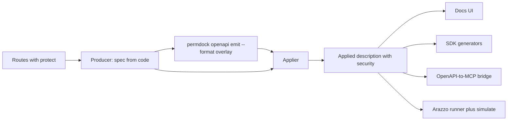

`permdock/openapi` works in both directions. Outbound, it derives `securitySchemes`, per-operation `security` and an `x-permdock-permissions` extension from the permission references attached to routes, targeting OpenAPI 3.2 with registered `x-oai-*` fallbacks (and `x-permdock-oauth2MetadataUrl`) for 3.1 documents, either in-process through a framework's generator hook or as an [Overlay](/docs/standards/openapi-overlay) applied to a document another tool produced. Inbound, `permdock openapi import` reads an OpenAPI document and generates a `definePermissions()` file from its operations and scopes.

## Purpose

No OpenAPI generator in the TypeScript ecosystem is fed by an authorization library; every one of them (`@hono/zod-openapi`, `hono-openapi`, `@orpc/openapi`, `trpc-to-openapi`, `@elysia/openapi`, `@fastify/swagger`, `@nestjs/swagger`, next-openapi-gen) expects `security` to be attached by hand per route. PermDock already knows the permission for each protected route (`protect(permissions.post.delete, ...)`), and each permission carries a `scope`. Emitting the security metadata from that knowledge keeps the document honest: a route cannot document a scope it does not enforce. OpenAPI 3.2 is the primary target because it adds the device authorization flow, `oauth2MetadataUrl`, `deprecated` on security schemes and security schemes referenced by URI ([OpenAPI 3.2 and 3.3](/docs/standards/openapi)). The `3.3` target is experimental and emits the pinned Security Profile draft next to the stable `x-permdock-securityProfile` extension.

## The pipeline

PermDock is one stage of a pipeline it does not own, and composes with every other stage through standard fields and an Overlay rather than wrapping any tool.



1. **Producer.** A framework plugin or a route-file scanner turns handlers into a description. Producers own paths, parameters, schemas and `operationId`s.
2. **PermDock.** Where there is an in-process hook, the fragments below are attached during generation. Otherwise `permdock openapi emit --format overlay` writes an Overlay that adds `securitySchemes`, per-operation `security` and `x-permdock-*`.
3. **Applier.** The project's existing Overlay applier merges it. PermDock ships none.
4. **Consumers.** Docs UIs, SDK generators, OpenAPI-to-MCP bridges, Arazzo runners, gateways and `permdock openapi import` read standard `security`; the ones that opt in also read `x-permdock-*`.

`operationId` is the join key across all four stages: producers generate it, the Overlay targets it, Arazzo steps reference it, and `--check` fails when it is missing.

## Works with

| Stage | Tools | How PermDock connects |
| --- | --- | --- |
| Producers with an in-process hook | `hono-openapi`, `@hono/zod-openapi`, `@orpc/openapi`, `trpc-to-openapi`, `@elysia/openapi`, `@fastify/swagger`, `@nestjs/swagger` | `describe()`, `security()`, `spec()` passed into the generator next to `protect` |
| Producers without a hook | [next-openapi-gen](https://github.com/tazo90/next-openapi-gen) (Next.js, TanStack Start, React Router, Remix, SvelteKit, Nuxt, Astro, Hono, Express), [TypeSpec](https://typespec.io), tsoa, ts-rest, Effect HttpApi, feTS, hand-written YAML or JSON | `overlay()` or `permdock openapi emit --format overlay`, applied by the producer or a CLI |
| Appliers | next-openapi-gen `overlay.apply`, Redocly CLI `join --overlay`, Bump.sh `bump overlay` and its GitHub Action, Speakeasy CLI, Zuplo CLI, `overlays-js`, `openapi-format`, `oas-patch` | Consume the Overlay |
| SDK generators | [Hey API](https://heyapi.dev), [Orval](https://orval.dev), [Kubb](https://kubb.dev), openapi-typescript, OpenAPI Generator, Kiota, Fern, Speakeasy, Redocly `generate-client` | Read standard `security`; no PermDock code |
| Docs UIs and hosts | [Scalar](https://scalar.com), Swagger UI, Redoc, Stoplight Elements, RapiDoc, fumadocs-openapi, Zudoku; hosted: Mintlify, Bump.sh, Fern docs, Redocly Realm, Docusaurus OpenAPI, GitBook, Postman | Read standard `security`; Scalar optionally renders the `x-badges` approval hint; PermDock never writes a host's own extensions |
| OpenAPI-to-MCP bridges | Orval and Kubb MCP output, Scalar, Speakeasy, Fern, Mintlify, Postman MCP Generator, Zuplo, Kong `openapi2mcp`, AWS AgentCore Gateway | Bind each generated tool's `permission` from `x-permdock-permissions` ([MCP adapter](/docs/adapters/mcp)) |
| Linters | Spectral, Redocly lint, vacuum | A PermDock ruleset file checks the document invariants |
| Testing and diff | Schemathesis `ignored_auth`, oasdiff, Prism, Microcks | Read `security`; turn PermDock's output into a runtime parity test and a breaking-change gate ([CLI: openapi](/docs/cli/openapi)) |
| Workflows | Arazzo runners, `permdock.simulate` | Read `operationId` and `x-permdock-permissions` from the applied description ([Arazzo](/docs/standards/arazzo)) |

Every tool here also has a row on the [ecosystem index](/docs/research/ecosystem-index).

## API

```ts
import { createPermDock } from 'permdock/openapi'

const { securitySchemes, security, describe, spec, overlay } = createPermDock(policy, {
  scheme: {
    name: 'oauth',
    type: 'oauth2',
    oauth2MetadataUrl: 'https://auth.example.com/.well-known/oauth-authorization-server',
    flows: { authorizationCode: {}, deviceAuthorization: {} },   // scopes filled from the catalog
  },
  target: '3.2',      // '3.1' | '3.2' | '3.3' ('3.1' emits the registered fallbacks; '3.3' is experimental and
                      // emits the pinned OpenAPI 3.3 Security Profile draft next to x-permdock-securityProfile)
  securityProfile: 'fapi2',          // optional; on '3.3' also emits the type: profile scheme
  profileScheme: 'permdockFapi2',    // optional; name of that scheme
})

// hono-openapi
app.delete('/posts/:id', describeRoute({ ...describe(permissions.post.delete) }), protect(permissions.post.delete, loadPost), handler)
// @hono/zod-openapi
createRoute({ method: 'delete', path: '/posts/{id}', security: security(permissions.post.delete), ... })
// oRPC: OpenAPI metadata on the procedure
const protectedProc = os
  .meta(orpcOpenapi({ spec: spec(permissions.post.delete) }))
  .use(protect(permissions.post.delete))
// trpc-to-openapi: `protect: true` plus x-permdock-permissions in meta
t.procedure.meta({ openapi: { method: 'DELETE', path: '/posts/{id}', protect: true, ...describe(permissions.post.delete) } })

// components.securitySchemes for the document
generateSpecs(app, { components: { securitySchemes: securitySchemes() } })
```

- `securitySchemes()` returns the scheme with every permission `scope` from `listPermissions(permissions)` listed under the configured flows, plus `description` from action metadata. Schemes can be referenced by URI in 3.2 (`$ref` to a shared security document) when `scheme.ref` is set.
- `security(permission | permission[])` returns the per-operation `security` array: `[{ oauth: ['post:delete'] }]`; multiple permissions produce one requirement object (AND) unless `anyOf` is passed (OR across objects).
- `describe(permission)` returns `security` plus `x-permdock-permissions: ['post.delete']` and, whenever the permission's grants have conditions, `x-permdock-conditions` in the portable JSON format so clients can explain what a scope allows. The conditions are policy shape, not data; an API that must not publish them uses `security()` instead of `describe()`.
- `spec(permission)` is the fragment passed as `spec` to oRPC's `openapi()` metadata helper: it extends the generated operation object.
- `scheme.deprecated: true` retires the scheme: `deprecated: true` on 3.2 and 3.3, `x-oai-deprecated: true` on 3.1. OpenAPI has no per-scope deprecation, so an action's `meta.deprecated` does not reach the document.
- `security()` returns `[]` (public) for a permission every subject is granted: an allow to `anyone()` with no condition, approval, limit or purpose, and no deny on it. With several permissions that takes all of them, or any one with `anyOf`.
- `securityProfile: 'fapi2'` writes `x-permdock-securityProfile: "fapi2"` on the scheme and on every described operation, so consumers know the resource server follows the [FAPI 2.0 Security Profile](/docs/standards/fapi-2) (bearer or DPoP tokens in the header only, sender-constrained tokens verified). The CLI equivalent is `--profile fapi2`.
- `target: '3.3'` with `securityProfile` set additionally emits the pinned Security Profile draft: `securitySchemes()` returns a second, `type: profile` scheme (`profileScheme`, default `permdockFapi2`) with `profileMetadata.name: fapi-20-security-profile`, `supportedParametersSchema` and `servers` from `scheme.oauth2MetadataUrl`; `describe()` and `spec()` are unchanged (operations keep `security` and the extension twin); `securityProfileRequirements(scopeSets?)` returns the `components.securityProfileRequirements` map, one entry per distinct scope set (one per permission without `scopeSets`), each naming the profile scheme, the FAPI 2.0 client authentication methods and the grant types of the configured flows; `overlay()` includes it. The root `x-permdock-catalog.drafts` records the pin. The shape follows the pinned draft until 3.3.0 is released, then switches to the released construct ([OpenAPI 3.2 and 3.3](/docs/standards/openapi)).
- `scheme.type: 'gnap'` is a reserved value that throws with a pointer to the [watch list](/docs/standards/watch-list); no GNAP scheme is emitted until the OpenAPI Initiative defines one.

## Registry and namespace

Every PermDock-specific field in a document is an OpenAPI extension under the `x-permdock-` prefix. PermDock registers the `permdock` namespace in the OAI [Namespace Registry](https://spec.openapis.org/registry/namespace/) (the pull request is described on [OpenAPI registries](/docs/standards/openapi-registry)). When the OpenAPI Initiative has already registered an extension for the same purpose (`x-oai-deprecated`, `x-oai-deviceAuthorization`, `x-oai-deviceAuthorizationUrl` for 3.1 targets) the adapter emits the registered name instead of inventing one; it never coins an `x-oai-*` name. The full extension table and the rules are on [OpenAPI registries](/docs/standards/openapi-registry).

## Overlay output

`overlay()` returns an Overlay 1.1.0 document whose `actions` target operations by `operationId` and `update` them with `security` and `x-permdock-*` fields, plus one action for `components.securitySchemes`. `overlay({ version: '1.2' })` returns the pinned Overlay 1.2 draft instead: the per-operation bodies become reusable actions under `components.actions`, one per distinct permission set, and each operation is a `$ref` reference with its own `target`; `x-permdock-catalog.drafts.overlay` names the pin ([OpenAPI Overlay](/docs/standards/openapi-overlay)). The source document stays untouched and owned by the API team. `permdock openapi emit --format overlay` (with `--overlay 1.2` for the draft) produces the same output from the CLI.

```ts
const doc = overlay({ extends: './openapi.json' })
// { overlay: '1.1.0', info: {...}, extends: './openapi.json', actions: [...] }

const draft = overlay({ extends: './openapi.json', version: '1.2' })
// { overlay: '1.2.0', info: {...}, extends: './openapi.json', components: { actions: {...} }, actions: [...] }
```

## Recipes

### A producer without a hook (Next.js and next-openapi-gen)

Next.js route handlers have no built-in spec generator, so `permdock/next` has no in-process hook. next-openapi-gen scans the route files, generates `operationId`s, applies Overlay files inside the same `generate` run before writing the spec, and scaffolds Scalar:

```ts
// openapi-gen.config.ts
export default defineConfig({
  openapi: '3.2.0',
  overlay: { apply: ['./permdock.overlay.json'] },
})
```

```bash
permdock openapi emit --doc public/openapi.json --format overlay --out permdock.overlay.json
pnpm exec openapi-gen generate      # applies the Overlay, writes the spec, scaffolds Scalar
```

The same two commands work for every producer without a hook: TypeSpec (the Overlay applies to the emitter output, never the `.tsp` source), tsoa, ts-rest, Effect HttpApi, feTS and hand-written descriptions. Where the producer does not apply Overlays, use Redocly CLI, Bump.sh (at docs deploy time), Speakeasy, Zuplo (before gateway import) or a vendor-neutral applier. The [Next.js adapter](/docs/adapters/next) page repeats the recipe in context.

### One owner per field

The one failure mode of composing is two tools writing `security` on the same operation: next-openapi-gen's `@auth` JSDoc tag and `authPresets`, hono-openapi's `security` option and hand-written `security` all compete with PermDock. On operations PermDock covers, PermDock owns `security` and the producer owns everything else. `permdock openapi emit --check` reports operations whose source already carries `security` that the Overlay would replace.

### SDK generators and docs UIs

Nothing to wire. Point Hey API, Orval, Kubb, Redocly `generate-client`, OpenAPI Generator or Kiota at the applied description; the generated SDK attaches credentials from `securitySchemes` with the right scopes per operation. openapi-typescript does not project `security` into types, so there is nothing to do. A denial arrives as the documented `403` Problem Details body, which generated SDKs surface as the typed error.

Optional, off by default: `docsHints: { badges: true }` adds `x-badges: [{ name: 'Approval required' }]` to operations whose permission carries `approval`, so portals that render `x-badges` (Scalar does) show the hint without understanding PermDock. It is a rendering hint with no semantics and the only field PermDock writes outside `x-permdock-*` and the registered set. Scalar's plugin API binds custom components to Info, Tag and Schema objects rather than operations, and Hey API's plugin API iterates operations, so a first-party plugin for either is considered only if these recipes prove insufficient.

### OpenAPI-to-MCP bridges

Bridges generate one MCP tool per operation. Without PermDock the generated tools have no `permission` binding, so `permdock/mcp`'s `list_tools` filtering and `approval-required` parking never run. Read each operation's `x-permdock-permissions` from the applied description and bind it as the tool's `permission`. Standard `security` is not enough here because the bridge needs the permission key, not the scope.

Bridges carry their own exposure extensions (Mintlify `x-mcp`, Zuplo `x-zuplo-route.mcp`, Kong `x-kong-mcp-tool-name`, Speakeasy `x-speakeasy-mcp`), which PermDock never writes. A consumer-side overlay may derive them from PermDock's fields so the tools agree with the policy: for example `x-speakeasy-mcp.scopes` from each operation's `permission.scope` (Speakeasy's `--scope` flags are a deploy-time filter, while `permdock/mcp` stays the per-caller check), or Mintlify's `x-mcp` opt-in from the presence of `x-permdock-permissions`. AWS AgentCore Gateway applies Cedar policies whose `context.toolName` is the `operationId`: when the MCP server runs in your process `protectServer` still applies; when Amazon hosts the target, the Cedar policy is the enforcement point and PermDock contributes the applied `security` and operation ids.

### Testing and diff

- Schemathesis `ignored_auth` sends each operation that declares `security` without credentials and fails unless the server answers `401` or `403`, so it catches a route that lost its `protect` after the description was published.
- oasdiff treats a removed or weakened `security` requirement as a breaking change; compare the previous and current applied descriptions in CI behind `permdock openapi --check`.
- Prism and Microcks mock servers answer `401` for secured operations without credentials, so client tests exercise the denied path.

### Linters

A ruleset file for Spectral, Redocly and vacuum ships with the CLI. It checks that every operation carrying `x-permdock-permissions` also carries `security`, that no `x-oai-*` name outside the registered three appears, and that an Overlay has no `remove` on `security`. `permdock openapi emit --check` stays the authoritative gate.

### Adjacent formats

AsyncAPI has no emitter. Overlay targets are JSONPath and not bound to OpenAPI, so if one is needed it is the same Overlay engine pointed at an AsyncAPI document, not a new adapter. Arazzo runners and `simulate({ arazzo, openapi })` must read the applied description so `x-permdock-permissions` is present.

## Request lifecycle

There is no request path: this adapter runs at document generation time and at import time.

Generation:

1. The framework hook (`describeRoute`, `createRoute`, oRPC `openapi({ spec })`, `meta.openapi`) receives the object returned by `describe` / `security` / `spec` next to the `protect` middleware for the same permission.
2. The document generator collects operations; `securitySchemes()` supplies the component with all scopes, inlined in each document rather than shared by URI reference, so every API in a monorepo carries its own scheme.
3. `permdock openapi --check` (CLI) compares the generated document against the routes registered with `protect` and fails when a protected route has no security entry or a documented scope has no enforcing route.

Import (`permdock openapi import ./openapi.json --out src/permissions.generated.ts`):

1. Operations are grouped by `tags` or path segments into resources; `operationId` or method and path derive action names (`GET /posts/{id}` becomes `post.read`, `POST /posts` becomes `post.create`).
2. `security` scopes and `x-permdock-permissions` are read back into keys and scopes; request and response schemas become resource schemas for the chosen validator (`--schema zod|valibot|arktype`).
3. A deterministic `definePermissions()` file with a `// @generated` header is written; it merges with hand-written definitions through `mergePermissions` like any feature file ([larger apps](/docs/getting-started/larger-apps)).

## What it validates

- Every permission referenced in `describe` / `security` exists in the catalog (type error at compile time; runtime throw for strings from `findPermission`).
- Scopes are unique across the catalog and match the `resource:action` convention; collisions after `mergePermissions` are reported.
- 3.1 target: 3.2-only fields are moved to extensions so the document stays valid 3.1: `deviceAuthorization` to `x-oai-deviceAuthorization` (with `x-oai-deviceAuthorizationUrl`), `deprecated` on schemes to `x-oai-deprecated`, `oauth2MetadataUrl` to `x-permdock-oauth2MetadataUrl` (no `x-oai-*` extension is registered for it), and URI-referenced schemes are inlined.
- Extension names: only registered `x-oai-*` names and `x-permdock-*` names appear in output; any other prefix is a bug.
- 3.3 target: the `type: profile` scheme and `securityProfileRequirements` validate against a PermDock-maintained patch of the 3.2 JSON Schema keyed by the draft pin, since no official 3.3 schema exists; the `x-permdock-securityProfile` twin is present on every scheme and operation that carries the native construct; `x-permdock-catalog.drafts` names the pin.
- Overlay 1.2: `overlay({ version: '1.2' })` output validates against the `schemas/v1.2-dev` JSON Schema at the pinned commit; references carry only `$ref`, `target` and `description`, and `components.actions` keys are RFC 6901-escaped in the `$ref`.
- Import: documents are validated against the OpenAPI 3.1 or 3.2 schema before generation; unknown security scheme types produce `opaque` scope entries rather than failing.

## How denials surface

The adapter emits metadata; enforcement and denials belong to the server adapters. What it contributes to the denial story:

- The `403` `application/problem+json` body produced by `protect` names the same `permission` key and `scope` that the document advertises, so a client can match a denial to a documented requirement.
- Documented response `403` entries are added to each protected operation with the Problem Details schema (`type`, `title`, `permission`, `denials`, `alternatives`), including the `.../approval-required` type variant.
- `WWW-Authenticate` step-up hints emitted by HTTP adapters use the same scope strings as `securitySchemes`.

## Example app

No dedicated app. `apps/examples/hono` generates a 3.2 document with `hono-openapi`, `apps/examples/orpc` uses oRPC `openapi()` metadata, `apps/examples/trpc` uses `trpc-to-openapi` `protect`, and `apps/examples/next` runs next-openapi-gen with `overlay.apply` and serves the result in Scalar. `apps/examples/monorepo` is the collect example: two feature packages, `mergePermissions` at the app root, and `permdock collect --check`.

## Related standards

- [OpenAPI 3.2 and 3.3](/docs/standards/openapi): security scheme additions, the 3.1 fallback table and the pinned Security Profile draft.
- [OpenAPI registries](/docs/standards/openapi-registry): the `x-permdock-*` namespace and registered names.
- [OpenAPI Overlay](/docs/standards/openapi-overlay): the `--format overlay` output and its threat model.
- [FAPI 2.0](/docs/standards/fapi-2): what `securityProfile: 'fapi2'` declares.
- [Standard Schema](/docs/standards/standard-schema): request and response schemas via Standard JSON Schema.
- [Problem Details](/docs/standards/problem-details): documented `403` body.
- [CLI: openapi](/docs/cli/openapi): `permdock openapi` emit, import, `--target`, `--format` and `--check`.
