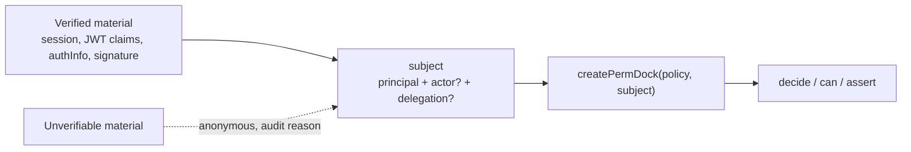
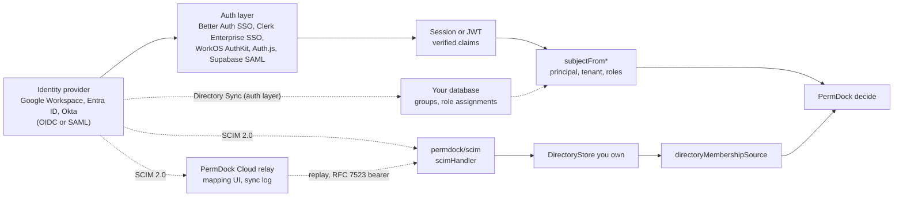

PermDock is an authorization library. It does not log anyone in, does not issue or refresh tokens, and does not store sessions. Every decision starts from **verified material**: a session your framework validated, a JWT whose signature and claims were checked against the issuer's keys, an `authInfo` object the MCP SDK attached after bearer verification, a signature the Web Bot Auth verifier accepted. PermDock's job begins where that verification ends: map the material to a [subject](/docs/concepts/subject), build a request-scoped `PermDock`, and answer `can` / `decide`.

The rule that follows from this is the one every adapter and provider on this site obeys: **if the material cannot be verified, the subject is anonymous.** Anonymous has no roles. The only selector that still matches is `anyone()`; every other `to:` fails closed. Nothing throws, nothing falls back to "trust the claims anyway", and the audit event says why.

## The pipeline



Verification happens to the left of the first box and is never PermDock core's job: core has no runtime dependency other than `@standard-schema/spec`, so it cannot verify a signature. Verification lives in three places instead:

- **Your framework or provider** verifies sessions and tokens and hands PermDock the result (Next.js, Better Auth, Supabase `getClaims()`, Clerk `auth()`, the MCP SDK's bearer middleware).
- **`permdock/jwt`** verifies bearer JWTs against a JWKS or secret with `jose` as an optional peer dependency and returns a subject ([JWT adapter](/docs/adapters/jwt)).
- **Provider adapters** (`permdock/supabase`, `permdock/clerk`, `permdock/better-auth`) reuse the provider SDK's verification and map its output.

Each of them exposes a `subjectFrom<Source>` function. The name says where the material came from; the return type is always a `Subject`; the function never throws.

## Sources of verified material

| Source | Verified by | Becomes | Adapter |
| --- | --- | --- | --- |
| Session cookie | The framework's session layer (Next.js, Better Auth server API) | `principal` from the session user | `permdock/next`, `permdock/better-auth` |
| OAuth 2.0 / OIDC access token (bearer or DPoP JWT, `typ: at+jwt` or `JWT`) | Signature, `iss`, `aud`, `exp`, `nbf`, `typ` against the JWKS named by [OIDC Discovery](/docs/standards/openid-connect) (`discovery`) or a configured `jwks` | `principal` from `sub` and `issuer` from `iss`; `assurance` from `acr` / `amr` / `auth_time`; `session` from `sid`; global roles from RFC 9068 `roles`, team memberships from `groups`, `principal.plans` from `entitlements` ([JWT authorization claims](/docs/standards/jwt-authorization-claims)); `tenant` from the configured claim; `delegation` from `scope`, `authorization_details`, GNAP `access`; `actor` from `act`; `binding` from `cnf` | `permdock/jwt` (`subjectFromJwt`) |
| OIDC ID token (`accept: 'id-token'`, explicit opt-in for BFF patterns) | As above, plus `aud` must equal the client id and `nonce` is verified by the RP, not by PermDock | Same principal fields; never `delegation` (an ID token carries no `scope` for a resource server) | `permdock/jwt` (`subjectFromJwt`) |
| GNAP or OAuth introspection response | The RS's own credential at the AS introspection endpoint (RFC 7662 / RFC 9767); the response is trusted as server-to-server material | `principal` from `sub`, `issuer` from `iss`; `delegation.access` from `access` or `delegation.scopes` from `scope`; `binding` from `key` | `permdock/jwt` (`subjectFromIntrospection`) |
| Supabase `getClaims()` output | `@supabase/supabase-js` against the project JWKS (asymmetric keys) or the Auth server (legacy secret) | `principal.id` from `sub`, `issuer` from `iss`, roles and `tenant` from `app_metadata` / hook claim, `assurance.acr` from `aal`; memberships from your tables through `memberships` | `permdock/supabase` (`subjectFromSupabase`) |
| Supabase `@supabase/server` `jwtClaims` (`withSupabase` context, the Hono / Elysia / NestJS / H3 adapters' context, or `withClaims` in a `@supabase/middleware` pipeline) | `@supabase/server` against the project JWKS; asymmetric keys only, HS256 rejected; `null` for no token or an API-key auth mode | Same fields as the `getClaims()` row; `null` is the anonymous subject | `permdock/supabase` (`subjectFromSupabase`) inside the adapter's `subject` callback, or `permdock/supabase/middleware` (`withPermDock`) in the pipeline |
| A verified Supabase session object shaped `{ kind, claims }` (for example better-supabase's `AuthSession`) | The session library, locally against the project JWKS | Same fields as the `getClaims()` row; any `kind` other than `user` is the anonymous subject | `permdock/supabase` (`subjectFromSupabaseSession`) |
| Supabase `@supabase/ssr` server client | The cookie-backed server client's `getClaims()` (never `getSession()` alone, which returns unverified material) | Same fields as the `getClaims()` row | `permdock/next`, `permdock/server` recipes with `subjectFromSupabase` |
| Clerk session claims | Clerk middleware and `auth()` | `principal` from `userId`; `tenant` from the active `orgId`; a membership `{ tenant: orgId, roles: [orgRole] }`; `fea` entitlement roles; custom claims through `schema` | `permdock/clerk` (`subjectFromClerk`) |
| Better Auth session | `auth.api.getSession` on the server | `principal` from the user; `tenant` from `activeOrganizationId`; memberships from `member` and `teamMember` rows; custom roles from `organizationRole` through a `RoleSource` | `permdock/better-auth` (`subjectFromBetterAuth`) |
| MCP `authInfo` | The MCP SDK's bearer verification (`requireBearerAuth`, RFC 9207 `iss` check) | `principal` from the token's user; `actor` from `clientId`; `delegation` from `scopes` | `permdock/mcp` (`subjectFromMcp`) |
| API key | Constant-time lookup in your key store | A **service principal**: `{ id: keyOwnerId, kind: 'service', roles }`, never an actor | Your `subject` resolver |
| Workload / service identity | Client-credentials token, WIMSE workload identity, SPIFFE ID presented over mTLS | `principal.kind: 'workload'`, `principal.id` the SPIFFE ID or client id | `permdock/jwt` or your resolver |
| Web Bot Auth signature | RFC 9421 HTTP Message Signature against the `Signature-Agent` directory | `actor` `{ id: keyId, kind: 'web-bot-auth' }`; the principal still comes from a token or session | Server kernel with `webBotAuth` |
| Transaction token | Signature by the Transaction Token Service, `aud` equal to your trust domain | `principal` from the token's subject, `principal.context` from `azd`, workload chain as `actor` | `permdock/jwt` |
| Anonymous | Nothing to verify, or verification failed | `principal: null` | Every adapter |

Two entries deserve a note. An **API key** identifies a caller that acts on its own behalf, so it is a principal with roles, not an actor: actors never hold grants, and a key modelled as an actor would be denied everything ([subject](/docs/concepts/subject), "Service principals"). A **Web Bot Auth signature** identifies who is asking, not whose authority applies, so it fills `actor` and leaves the principal to the token or session on the same request ([Web Bot Auth](/docs/standards/web-bot-auth)).

## Provider recipes

Four providers get an adapter (`permdock/supabase`, `permdock/better-auth`, `permdock/clerk`, `permdock/convex`) because each exposes a verification hook only in-process code can use. Every other provider is a recipe over `subjectFromJwt` or the framework session, following the rule that ecosystems are reached through wire formats rather than per-tool packages. Every mapper, PermDock's or yours, satisfies the `SubjectResolver` interface, exports a base principal type and takes a `schema` option for custom claims ([extension interfaces](/docs/concepts/extension-interfaces)); how each fills tenant, team and resource memberships is summarised on [tenancy](/docs/concepts/tenancy) and detailed in each provider page's "Memberships" section. The table records, per provider, where verification happens, which claim carries roles and organisation, and which fields are user-editable and therefore never feed grants. Claim names are the providers' defaults as documented in September 2026; confirm against the provider's current docs and pin them in the `claims` option.

| Provider | Verified by | Roles and organisation | User-editable, never grants | Recipe |
| --- | --- | --- | --- | --- |
| Auth.js (NextAuth v5) | `auth()` in the framework; the JWT session strategy uses an encrypted JWE under `AUTH_SECRET`, not a public-key JWT | None built in: add `role` and `orgId` in the `jwt` and `session` callbacks from your database, never from the OAuth profile | Everything the OAuth provider returned (`name`, `email`, `image`) | `subject: async () => (await auth())?.user` and map `user.role` in `definePolicy`'s `subject`; `permdock/jwt` does not apply because the token is not verifiable by a third party |
| WorkOS AuthKit, WorkOS Connect | `subjectFromJwt` against `https://api.workos.com/sso/jwks/<client_id>`; Connect (GA May 2026) is the OAuth 2.1 authorization server for MCP servers and issues access tokens from the same JWKS | `org_id`, `role` (organisation role slug), `permissions` array; managed in the WorkOS dashboard; Connect tokens carry `client_id` and `scope` | Profile fields | `claims: { id: 'sub', roles: 'role', tenant: 'org_id' }`; `permissions` can also feed `delegation.scopes` when your permission scopes match WorkOS permission slugs. Behind `permdock/mcp`, a Connect token is the `authInfo` the adapter consumes |
| Stytch Connected Apps (Twilio) | `subjectFromJwt` against `https://<project>.customers.stytch.com/.well-known/jwks.json`; Connected Apps is the OAuth 2.1 authorization server for MCP servers with dynamic and CIMD client registration | `https://stytch.com/organization` claim (`organization_id`, `slug`) and RBAC `roles` on B2B session and access tokens; `scope` for delegated apps | `trusted_metadata` is server-only, `untrusted_metadata` is member-editable | `claims: { id: 'sub', roles: 'roles', tenant: 'https://stytch.com/organization.organization_id' }`; never `untrusted_metadata`. In front of an MCP server the access token is consumed by `permdock/mcp` as `authInfo` with `client_id` as `actor.id` |
| Descope | `subjectFromJwt` against `https://api.descope.com/<project-id>/.well-known/jwks.json`; the Agentic Identity Hub issues tokens for MCP servers and holds outbound tokens in a vault | `roles`, `permissions`, and per-tenant `tenants.<id>.roles` on the session JWT | User-editable custom attributes if the app exposes them | `claims: { id: 'sub', roles: 'roles' }`, or `tenants.<id>.roles` for the active tenant; `permissions` can feed `delegation.scopes` |
| Scalekit | `subjectFromJwt` against `https://<env>.scalekit.com/keys`; sells the authorization-server half for MCP servers (scopes, consent, token exchange) | `oid` (organisation), `roles`; agent tokens carry `client_id` and `scope` | Profile fields | `claims: { id: 'sub', roles: 'roles', tenant: 'oid' }`; agent tokens fill `actor` and `delegation` through `permdock/mcp` |
| Okta (Workforce and Customer Identity), Okta Cross App Access | `subjectFromJwt` against `https://<domain>/oauth2/<server>/v1/keys`; Cross App Access (GA 24 August 2026) implements the Identity Assertion JWT Authorization Grant ([MCP authorization](/docs/standards/mcp-authorization), EMA) so an agent obtains a token for an MCP server on the user's behalf through the enterprise IdP | `groups` claim (must be added to the access token), custom claims via claim expressions | Profile attributes | `claims: { id: 'sub', roles: 'groups' }`. A Cross App Access token has the human as `sub` and the agent as `client_id`; `permdock/mcp` maps them to `principal` and `actor` unchanged, nothing PermDock-specific is required |
| Microsoft Entra ID, Entra Agent ID | `subjectFromJwt` against `https://login.microsoftonline.com/<tenant>/discovery/v2.0/keys` (validate `aud` and `tid`); Entra Agent ID gives agents directory identities and tokens of their own | `roles` (app roles), `groups` (or `_claim_names` overflow), `tid`; agent tokens carry the agent's `oid` and `azp` | None in the token; directory attributes are admin-set | `claims: { id: 'oid', roles: 'roles', tenant: 'tid' }`; when an agent acts on behalf of a user (OBO), `sub` is the human and `azp` the agent, which fill `principal` and `actor` |
| Frontegg | `subjectFromJwt` against `https://<subdomain>.frontegg.com/.well-known/jwks.json` | `roles`, `permissions`, `tenantId`; Frontegg ships its own RBAC and entitlements (feature flags and plans) | `metadata` if the app lets users write it | `claims: { id: 'sub', roles: 'roles', tenant: 'tenantId' }`; Frontegg entitlements are `principal.plans` or `context`, never grants. Overlapping product; consumed as claims, not competed with |
| PropelAuth | `subjectFromJwt` against `https://<auth-url>/.well-known/jwks.json` | `org_id_to_org_member_info` with `user_role` and `user_permissions` per organisation | `metadata` the user can edit through the hosted pages | Resolve the active organisation, then `roles: [user_role]`; `user_permissions` can feed `delegation.scopes` |
| SuperTokens, Hanko | `subjectFromJwt` against the self-hosted or cloud JWKS (`/auth/jwt/jwks.json` for SuperTokens) | SuperTokens `st-role` and `st-perm` claims from its UserRoles recipe; Hanko has no roles claim | Profile fields | SuperTokens `claims: { id: 'sub', roles: 'st-role.v' }`; Hanko resolves roles from your database in `context` |
| Auth0 | `subjectFromJwt` against `https://<tenant>/.well-known/jwks.json` | `permissions` (RBAC "add permissions in the access token"), `org_id` (Organizations), roles only through an Action writing a namespaced claim such as `https://example.com/roles` | `user_metadata`; `app_metadata` is server-only, the same split as Supabase | `claims: { id: 'sub', roles: 'https://example.com/roles', tenant: 'org_id' }`; never read `user_metadata` |
| Logto | `subjectFromJwt` against `https://<tenant>.logto.app/oidc/jwks` | `roles` for API-resource RBAC; organisation tokens carry `organization_id` and organisation roles; `custom_data` is admin-set | Profile and `custom_data` only if your app lets users write it | `claims: { id: 'sub', roles: 'roles', tenant: 'organization_id' }` with the organisation token as the bearer |
| Kinde | `subjectFromJwt` against `https://<domain>.kinde.com/.well-known/jwks` | `permissions` array, `org_code`, `roles` when enabled in token customisation, `feature_flags` | Profile fields | `claims: { id: 'sub', roles: 'roles', tenant: 'org_code' }`; treat `feature_flags` as `context`, not grants ([policies](/docs/concepts/policies)) |
| Neon Auth | Better Auth hosted by Neon; JWKS published for Neon RLS | Same as `permdock/better-auth`: `user.role` from the admin plugin, organisation plugin membership | Profile fields | Use `subjectFromBetterAuth` server-side; for the database, the same JWT feeds `auth.user_id()` in generated RLS ([RLS](/docs/adapters/rls) `neon` dialect) |
| Stack Auth | `subjectFromJwt` against `https://api.stack-auth.com/api/v1/projects/<project-id>/.well-known/jwks.json` | Team membership and team permissions from the server SDK; `serverMetadata` is server-only | `clientMetadata`; `clientReadOnlyMetadata` is server-written but client-visible | Resolve roles from `serverMetadata` or team permissions in `context`, not from the token alone |
| Firebase Authentication | `subjectFromJwt` against Google's securetoken JWKS, `iss` `https://securetoken.google.com/<project>`, `aud` the project id | Custom claims set by the Admin SDK (`setCustomUserClaims`), for example `roles`, `tenant` | `displayName`, `photoURL`, `email` until verified | `claims: { id: 'sub', roles: 'roles', tenant: 'tenant' }`; custom claims are server-only by construction |
| Google Identity (Sign in with Google, Google Workspace as OIDC IdP) | `subjectFromJwt` against `https://www.googleapis.com/oauth2/v3/certs`, `iss` `https://accounts.google.com`, `aud` your OAuth client id; in practice the ID token is terminated by Better Auth, Auth.js, Clerk or WorkOS and PermDock reads their session | No roles claim at all; `hd` (hosted domain) is present only for Workspace accounts and is the tenant; group membership is not in the token and comes from the Admin SDK Directory API or Cloud Identity Groups | `name`, `picture`, `email` when `email_verified` is false | `claims: { id: 'sub', tenant: 'hd' }`, roles from your database or a directory lookup in `context`; never the domain of `email` ([single sign-on](#single-sign-on-and-directories)) |
| Amazon Cognito | `subjectFromJwt` against `https://cognito-idp.<region>.amazonaws.com/<userPoolId>/.well-known/jwks.json` | `cognito:groups` in ID and access tokens; `custom:*` attributes in the ID token | Standard attributes and any `custom:*` attribute the app client is allowed to write | `claims: { id: 'sub', roles: 'cognito:groups' }`; only use a `custom:*` attribute for tenant if the app client has no write permission on it |
| Keycloak | `subjectFromJwt` against `<realm>/protocol/openid-connect/certs` | `realm_access.roles`, `resource_access.<client>.roles`; groups through a mapper | User attributes the account console lets users edit | `claims: { id: 'sub', roles: 'resource_access.<client>.roles' }`; Keycloak also speaks AuthZEN and SSF, so it can be a PDP or a CAEP transmitter for the same deployment |
| Ory (Kratos, Hydra) | Kratos `whoami` session in the framework; Hydra access tokens with `subjectFromJwt` against Hydra's `/.well-known/jwks.json` | `metadata_admin` on the identity (server-only); Ory Permissions is a separate relation graph reached through `permdock/pdp` if used | Identity `traits`; `metadata_public` is server-written but client-visible | Map `metadata_admin.roles` in the session resolver; never `traits` |

Three patterns recur. Every provider has a server-only bucket (`app_metadata`, custom claims, `serverMetadata`, `metadata_admin`, `trusted_metadata`) and a user-writable one; only the first feeds grants. Organisation-scoped roles ride in the token for the org the session is currently in, so multi-org checks need either a token per org or a `context` lookup. And a provider's own permission or feature-flag arrays are `delegation.scopes` or `context` inputs, not PermDock grants: the policy stays the single place that says who may do what.

Two groups of rows concern agents. Providers that sell the OAuth 2.1 authorization server for MCP servers (WorkOS Connect, Stytch Connected Apps, Descope, Scalekit, Auth0 Token Vault, Supabase's OAuth server) issue the access tokens `permdock/mcp` receives as `authInfo`; `client_id` becomes `actor.id` and `scope` becomes `delegation.scopes` with no provider-specific code ([MCP authorization](/docs/standards/mcp-authorization)). Enterprise agent identity (Okta Cross App Access, Microsoft Entra Agent ID) produces tokens with the human as `sub` and the agent as the client, which is the two-principal subject as-is ([delegation](/docs/security/delegation)). Billing and entitlement claims are server-written plan and feature inputs, never grants: RFC 9068 `entitlements` and Clerk Billing `pla` become `principal.plans`, Clerk `fea` becomes roles through the `features` map, and Frontegg entitlements and Kinde `feature_flags` are `principal.plans` or `context` ([Clerk provider](/docs/adapters/clerk)).

## Claim trust rules

Verification tells you a token is genuine. It does not tell you which claims inside it may drive grants. PermDock's providers apply these rules, and your own `subject` resolver should too:

- **`sub` is the principal id.** Nothing else (an `email`, a display name) identifies the principal, because those can change or be reused.
- **Server-set claims are trusted; user-editable claims are never used for grants.** Supabase separates `app_metadata` (written by service code and Auth Hooks) from `user_metadata` (writable by the user through the client SDK). `subjectFromSupabase` reads roles and tenant from `app_metadata` or from a hook-injected top-level claim and never looks at `user_metadata`. The same split exists elsewhere under other names: Clerk public metadata set through the backend API versus anything the client can write; Better Auth `user.role` managed by the admin plugin versus profile fields.
- **Roles from claims or roles from the database.** A role claim is cheap and offline-checkable but stale until the token is refreshed. A database lookup in the policy's `context` function is fresh but costs a query per `createPermDock`. Prefer claims when the token lifetime is short or a [Shared Signals receiver](/docs/adapters/ssf) invalidates on change; prefer `context` when role changes must take effect on the next request and tokens live for hours.
- **Tenant from claims.** A `tenant_id` or `orgId` that RLS also filters on belongs in the principal, sourced from a server-set claim, so the in-process condition and the generated `(select auth.jwt()) ->> 'tenant_id'` read the same value. With scoped roles the claim fills `principal.tenant` (the active tenant) and a membership; it is never defaulted when absent ([tenancy](/docs/concepts/tenancy)).
- **Memberships are verified material too.** A team id, a resource share or a per-tenant role list comes from the provider's session, a server-set claim, a `MembershipSource` over your tables or the policy's own functions; never from a request body, a model argument, an unsigned header or a CLI flag. Team and group identifiers are ids (SCIM `value`, Entra object id), never display names.
- **Unknown role names are dropped.** A claim naming a role the policy does not declare contributes nothing (fewer grants, never more) and is reported in development. On a membership the name is first offered to the tenant's `RoleSource` as a custom role; if it resolves, the declared roles it includes apply.

## MFA and passkeys as policy input

`assurance()` on a grant reads `principal.assurance`. Providers fill that object from verified claims; they never invent an `amr` value the token did not carry.

| Source | Claim | Maps to | Notes |
| --- | --- | --- | --- |
| RFC 8176 | `amr` values `pwd`, `otp`, `swk`, `hwk`, `mfa` | `principal.assurance.amr` | `hwk` is a hardware key / passkey; `mfa` means more than one factor was used |
| OIDC Core | `acr`, `auth_time` | `principal.assurance.acr`, `.authTime` | Compared as an opaque string and a NumericDate |
| Supabase | `aal` (`aal1`, `aal2`) | `principal.assurance.acr` | `aal2` is MFA completed. Supabase `amr` is an array of `{ method, timestamp }` objects and is not copied into `assurance.amr` |
| Clerk | session `fva` / `factorVerificationAge` | Recipe: second element `>= 0` means a second factor was verified | Clerk does not emit RFC 8176 `amr`. `subjectFromClerk` does not invent one |
| Better Auth | `user.twoFactorEnabled` plus a completed session | Recipe: a session exists only after TOTP / OTP / backup-code verify | The two-factor plugin stores no `amr` on the session. `subjectFromBetterAuth` does not invent one |

```ts
allow(permissions.filing.pay, {
  to: [roles.admin, assurance({ amr: ['hwk'], maxAge: 300 })],
})
```

A subject that lacks `hwk` or whose `authTime` is older than 300 seconds is `denied` with reason `insufficient-user-authentication`. HTTP adapters render Problem Details `type` ending in `/step-up-required` and `WWW-Authenticate: Bearer error="insufficient_user_authentication"`.

## Single sign-on and directories

"Log in with Google Workspace", "log in with Microsoft" and SAML SSO through Okta are authentication, and PermDock stays out of them. The auth layer (Better Auth's SSO plugin, Clerk Enterprise SSO, WorkOS AuthKit, Auth.js providers, Supabase SAML) terminates the SAML assertion or the IdP's ID token and issues its own session or JWT; that is what `subjectFrom*` reads. A SAML assertion never reaches PermDock, and a Google or Entra ID token only does when your API accepts it directly as a bearer (the Google and Entra rows above).



SSO nevertheless touches PermDock in three places, and each has a trap worth naming.

**Tenant.** The organisation a user logged in through is the natural `principal.tenant`, and every IdP carries it differently: Google Workspace in `hd` (hosted domain), Entra ID in `tid`, Okta in the authorization server's issuer or a custom claim, WorkOS and Clerk in `org_id` / `orgId` after they have mapped the connection to an organisation. Two rules apply. `hd` is absent for consumer Google accounts and `tid` is the personal-accounts tenant when the `common` endpoint is used, so a missing or unexpected tenant claim must produce a subject with no tenant (which tenant-scoped conditions then deny), never a default tenant; compare the claim against the connections you have onboarded, or restrict the issuer to your own Entra tenant and pass `hd` as an OAuth parameter to Google so the IdP filters first. And the domain of `email` is never a tenant: `email_verified` may be false, and a consumer IdP lets a user change the address. `permdock doctor` flags a `claims.tenant` that points at `email` ([PD010](/docs/cli/doctor)) or at an optional tenant claim under a multi-tenant issuer ([PD011](/docs/cli/doctor)).

**Groups to roles.** This is the permission-adjacent part and the IdPs differ most here:

| IdP | Where groups are | Recommended path to PermDock roles |
| --- | --- | --- |
| Google Workspace | Not in the ID token. Membership comes from the Admin SDK Directory API or the Cloud Identity Groups API, or from an auth layer that syncs it (WorkOS Directory Sync, Better Auth's SSO plugin with a provisioning hook) | A role assignment table in your database populated by the sync, read in the policy's `context` or the session resolver; `hd` for the tenant |
| Microsoft Entra ID | `groups` as object ids in the token; above roughly 200 groups the claim is replaced by a `_claim_names` / `_claim_sources` overflow that must be resolved through Microsoft Graph; app roles (`roles`) carry admin-assigned role names instead | App roles: the admin maps groups to roles in Entra and the token carries role names, so `claims: { roles: 'roles' }` is the whole mapping. Use `groups` only when app roles are not available, and map object ids, never display names |
| Okta | `groups` only when a groups claim filter is configured on the custom authorization server; otherwise absent | Configure the filter to emit the groups your policy declares, then `claims: { roles: 'groups' }`; unknown names are dropped by the trust rules above |
| SAML through the auth layer (any IdP) | SAML attributes the auth layer maps to its own user or organisation fields | Read the auth layer's role or membership field (Clerk `orgRole`, WorkOS `role`, Better Auth organization membership), never a raw attribute |

The pattern that fits PermDock is to map groups to roles in the IdP or the auth layer, not in the policy: the policy declares roles, the token or session names them, and a directory group is one more server-set source of a role name. When the token only carries group ids, the mapping is a lookup in `definePolicy`'s `subject` function and needs no PermDock API:

```ts
const rolesByGroupId: Record<string, string> = {
  'f2a1c0c8-1d5b-4b7e-9c0a-0d5b8a7c6e21': 'editor',   // Entra group object id, not the display name
  '0e6f5c1a-3b2d-4a9e-8f7c-1a2b3c4d5e6f': 'admin',
}

export const policy = definePolicy(permissions, {
  roles: [editor, admin],
  subject: (claims: EntraClaims | null) =>
    claims && {
      id: claims.oid,
      orgId: claims.tid,
      roles: (claims.groups ?? []).flatMap((id) => rolesByGroupId[id] ?? []),
    },
})
```

Group ids rather than display names, because names are editable by any group owner and are not unique across tenants. Directory Sync and SCIM are the third path: the IdP provisions users and groups into your database, and roles come from a row you control. Two ways to get there: an auth layer's Directory Sync (WorkOS, Better Auth's provisioning hook) writing rows your `context` or `MembershipSource` reads, or [`permdock/scim`](/docs/adapters/scim), an RFC 7644 receiver you mount that writes to a `DirectoryStore` you own and exposes it as `directoryMembershipSource`; group-to-role mapping is a `groupRoles` map or the `roles` attribute of the PermDock SCIM extension, set by the IdP or by the PermDock Cloud relay's mapping UI. The Cloud relays; it never resolves memberships (invariant 15). In Cloud-native directory mode the Cloud is the directory of record instead, and memberships reach your app only as the `memberships`, `roles`, `entitlements` and `tenant` claims of a Cloud-issued access token that `subjectFromJwt` verifies ([PermDock Cloud](/docs/adapters/cloud)). [IPSIE AL1](/docs/standards/watch-list) is the checklist for the receiver's authentication.

With [scoped roles](/docs/concepts/tenancy) the same lookup produces memberships instead of flat roles, which keeps the team visible to audit and to team-scoped roles: `groups` become `{ tenant: claims.tid, team: id, roles: rolesByGroupId[id] ?? [], via: 'group:' + id }` entries, and `subjectFromJwt` does this by default for the RFC 9068 `groups` claim with a `groupRoles` option holding the id-to-roles map ([JWT authorization claims](/docs/standards/jwt-authorization-claims)).

**Lifecycle.** Deprovisioning a user in Google Workspace or Entra ID must reach cached snapshots. Entra, Okta and Auth0 transmit CAEP `session-revoked` and `credential-change` events today, which the [SSF receiver](/docs/adapters/ssf) turns into snapshot invalidation; for IdPs without a transmitter, the bound is `exp` and `session_expiry` as described under [staleness](#staleness-and-revocation), and SCIM deprovisioning (`active: false` or `DELETE` received by `scimHandler`, or a Directory Sync row) takes effect on the next `directoryMembershipSource` or `context` lookup, which is the next request when memberships are read per request and the next refetch when a snapshot is cached; `scimHandler`'s `onChange` callback is where to invalidate the cache. "We disabled the account and they can still see the page" is answered by whichever of these three you wired, so the SSO section of your runbook should name it.

### Enterprise SSO

OIDC enterprise SSO is `subjectFromJwt({ discovery })` against the IdP or the auth layer's issuer. SAML is terminated upstream: Better Auth's SSO plugin, Clerk Enterprise SSO, WorkOS AuthKit, Auth.js, Supabase SAML, or the Cloud gateway of [PermDock Cloud](/docs/adapters/cloud). A SAML assertion is never a PermDock input, and there is no `permdock/saml` entry ([ecosystem index](/docs/research/ecosystem-index)).

## JWT validation checklist

`permdock/jwt` implements the RFC 8725 checklist: keys and issuer from Discovery or explicit configuration, an explicit algorithm allow-list that never includes `none`, keys never chosen by the token, `iss`, `aud`, `typ`, `exp` and `nbf` checked, signature before claims, and every failure mapped to the anonymous subject with `on('auth')` reason `invalid-token`. If you verify tokens yourself before calling a `subjectFrom*` function, or plug a custom `TokenVerifier` in through the `verifier` option ([extension interfaces](/docs/concepts/extension-interfaces)), your verifier must follow the same list. The full checklist with its RFC mapping is on [JOSE](/docs/standards/jose); the `cause` values are on the [JWT adapter](/docs/adapters/jwt).

## Token to delegation and sender constraint

A token often carries authority that was delegated to the bearer, not the bearer's own authority. `subjectFromJwt` maps `scope` (RFC 6749 / RFC 8693) to `delegation.scopes`, `authorization_details` (RFC 9396) to `delegation.authorizationDetails`, GNAP `access` (RFC 9635) to `delegation.access`, and the RFC 8693 `act` claim to `actor` with the full nesting as `delegation.chain`; `may_act` is recorded for audit and never grants. A sender-constrained token's `cnf` member (`jkt` for DPoP, `x5t#S256` for mTLS) becomes `binding` on the principal or, for an `act` chain, on the actor. The shapes and the intersection rule are on [subject](/docs/concepts/subject).

Two rules belong to verification. A token with an `act` claim and no `scope` or `authorization_details` yields an actor with no delegation, so every check is `denied` with reason `no-delegation`. And checking a binding needs the request, so it is an adapter concern: `verifyDpopProof(request, claims)` in `permdock/jwt` compares the `DPoP` proof's JWK thumbprint to `cnf.jkt`, the mTLS check compares the forwarded client certificate to `cnf.x5t#S256`, and under `profile: 'fapi2'` a token without `cnf` is rejected ([FAPI 2.0](/docs/standards/fapi-2)).

## Staleness and revocation

A verified token is a statement about the past. Three signals bound how long PermDock treats it as current:

- **`exp`.** The subject built from a token inherits its expiry, and `snapshot()` sets `expiresAt` to it so a client stops trusting cached grants when the token would have expired.
- **`session_expiry`.** The IPSIE SL1 profile and OpenID Connect Enterprise Extensions add a `session_expiry` claim to ID tokens and require re-authentication after it ([IPSIE SL1 profile](https://openid.github.io/ipsie-openid-sl1/draft-openid-ipsie-sl1-profile.html)). When present it is the earlier bound: `expiresAt = min(exp, session_expiry)`.
- **CAEP events and Back-Channel Logout.** `session-revoked`, `credential-change` and `assurance-level-change` delivered through the Shared Signals Framework, and an OpenID Connect `logout_token` (`typ: logout+jwt`) delivered by the OP, invalidate the subject's cached snapshots immediately, matched by `issuer` + `principal.id` or by `session` (`sid`), so revocation is bounded by the identity provider rather than by a timer ([SSF adapter](/docs/adapters/ssf), [OpenID Connect](/docs/standards/openid-connect)).

None of these make a stale token *verify* differently: an expired token is rejected by the checklist above, and a revoked but unexpired token is only caught by CAEP or by an introspection call your resolver chooses to make.

## Authenticating the decision endpoint

The AuthZEN endpoint served by `permdock/authzen` answers "may this subject do this" for remote policy enforcement points. Two callers exist, and both must authenticate as themselves:

- **A PEP asking for the subject it authenticated** (the browser's `PermDockProvider` endpoint, a gateway). The endpoint resolves the subject from the caller's own session or token and ignores any `subject` field in the request body. A browser can only ask about itself.
- **A trusted PEP asking on behalf of many subjects** (an API gateway, a sidecar). It authenticates with client credentials or mTLS; the identity in that token must be in the endpoint's allow-list before the request body's `subject` is honoured.

A model, a tool argument or a page's JavaScript is never a trusted PEP: the [threat model](/docs/security/threat-model) invariant "never trust model-supplied subjects" applies to the decision endpoint exactly as it does to MCP tools. A shared static secret in client code is obfuscation, not authentication ([AuthZEN adapter](/docs/adapters/authzen)).

## Agent-run processes

CLIs, workers and agent runtimes are the place where verification is most tempting to skip. A command like `mytool deploy --actor=ci-bot` is a claim, not an identity. The [terminal adapter](/docs/adapters/terminal) therefore refuses to build a subject from flags or environment variables that name a principal or actor; it requires a verified token (device authorization grant, client credentials, or a workload identity) and derives the actor from it. Tokens stored on disk are treated like session cookies: short-lived, scoped, and invalidated by CAEP where the issuer supports it. An agent-run CLI that cannot present a token runs as anonymous and gets exactly the anonymous grants.

## Example: a JWT into a decision

```ts
import { createPermDock } from 'permdock'
import { subjectFromJwt } from 'permdock/jwt'
import { policy } from './policy'
import { permissions } from './permissions'

const token = request.headers.get('authorization')?.replace(/^Bearer /, '')

const subject = await subjectFromJwt(token, {
  jwks: new URL('https://login.example.com/.well-known/jwks.json'),
  issuer: 'https://login.example.com',
  audience: 'https://api.example.com',
  algorithms: ['ES256'],
  claims: { id: 'sub', roles: 'app_metadata.roles', tenant: 'app_metadata.tenant' },
  delegation: { scopes: 'scope', authorizationDetails: 'authorization_details' },
  actor: { from: 'act' },
})
// subject = {
//   principal: { id: 'user_42', issuer: 'https://login.example.com', kind: 'user', roles: ['editor'], tenant: 'acme' } | null,
//   actor?:    { id: 'https://agent.example/cimd.json', kind: 'oauth-client' },   // from `act`, RFC 8693
//   delegation?: { scopes: ['post:read', 'post:update'], authorizationDetails: [...] },
//   expiresAt: 1757164800,
// }

const permdock = await createPermDock(policy, subject)
const decision = permdock.decide(permissions.post.update, post)
// granted: editor role allows it AND 'post:update' is in delegation.scopes
// denied { reason: 'not-delegated' }: the role allows it but the token did not delegate it
// denied { reason: 'anonymous' }: the token failed verification; the audit event carries the reason code
```

`subjectFromJwt` returned a full `Subject`, so `createPermDock` takes it as the second argument with no third; the actor and delegation are already inside it. When verification fails, `subject.principal` is `null` and the same two lines produce a denial rather than an exception.

## Related

- [Subject](/docs/concepts/subject): the shape the verified material becomes.
- [JWT adapter](/docs/adapters/jwt): `subjectFromJwt`, `createJwtSubjectResolver`, `verifyDpopProof`.
- [Supabase provider](/docs/adapters/supabase): asymmetric signing keys, `getClaims()`, the Custom Access Token Hook.
- [Delegation](/docs/security/delegation): the attenuation invariants that the `delegation` mapping feeds.
- [SSF adapter](/docs/adapters/ssf): CAEP events from Entra, Okta and Auth0 that invalidate snapshots after SSO deprovisioning.
- [SCIM adapter](/docs/adapters/scim): the RFC 7644 receiver that provisions users and groups into a `DirectoryStore` you own and exposes them as memberships.
- [doctor](/docs/cli/doctor): `PD010` and `PD011`, the checks for role and tenant claims sourced from unverified or optional claims.
- [Threat model](/docs/security/threat-model): token-handling threats and their mitigations.

## Sources

- [FAPI 2.0 Security Profile](https://openid.net/specs/fapi-security-profile-2_0-final.html), sections 5.3.4 (resource servers) and 5.4.1 (cryptography).
- [RFC 9635, Grant Negotiation and Authorization Protocol](https://datatracker.ietf.org/doc/html/rfc9635), section 8 (resource access rights).
- [OAuth Transaction Tokens](https://datatracker.ietf.org/doc/draft-ietf-oauth-transaction-tokens/) and the [WIMSE architecture](https://datatracker.ietf.org/doc/html/draft-ietf-wimse-arch) for workload principals and context propagation.
- [IPSIE SL1 OpenID Connect Profile](https://openid.github.io/ipsie-openid-sl1/draft-openid-ipsie-sl1-profile.html) for `session_expiry` and sender-constrained tokens.
- [Supabase JWT signing keys](https://supabase.com/docs/guides/auth/signing-keys) for the `app_metadata` / `user_metadata` split and `getClaims()`.
- [Google Identity: OpenID Connect](https://developers.google.com/identity/openid-connect/openid-connect) for the `hd` claim, the `hd` authorization parameter and the certificate endpoint.
- [Microsoft Entra: configure group claims](https://learn.microsoft.com/en-us/entra/identity-platform/optional-claims#configure-groups-optional-claims) and [app roles](https://learn.microsoft.com/en-us/entra/identity-platform/howto-add-app-roles-in-apps) for the `groups` overflow behaviour and the app-roles alternative.
- [Okta: add a groups claim](https://developer.okta.com/docs/guides/customize-tokens-groups-claim/main/) for the groups claim filter on custom authorization servers.
