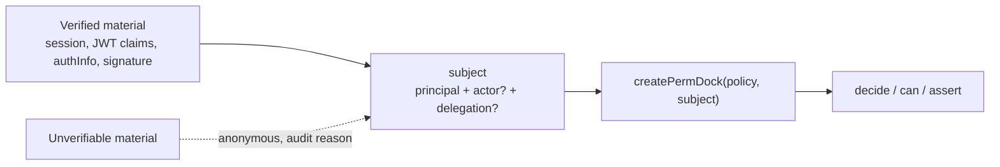

PermDock is an authorization library. It does not log anyone in, does not issue or refresh tokens, and does not store sessions. Every decision starts from **verified material**: a session your framework validated, a JWT whose signature and claims were checked against the issuer's keys, an `authInfo` object the MCP SDK attached after bearer verification, a signature the Web Bot Auth verifier accepted. PermDock's job begins where that verification ends: map the material to a [subject](/docs/concepts/subject), build a request-scoped `PermDock`, and answer `can` / `decide`.

The rule that follows from this is the one every adapter and provider on this site obeys: **if the material cannot be verified, the subject is anonymous.** Anonymous has no roles and therefore no grants. Nothing throws, nothing falls back to "trust the claims anyway", and the audit event says why ([ADR 0018](/docs/decisions/0018-authentication-is-upstream)).

## The pipeline



Verification happens to the left of the first box and is never PermDock core's job: core has no runtime dependency other than `@standard-schema/spec` ([ADR 0015](/docs/decisions/0015-no-runtime-deps-in-core)), so it cannot verify a signature. Verification lives in three places instead:

- **Your framework or provider** verifies sessions and tokens and hands PermDock the result (Next.js, Better Auth, Supabase `getClaims()`, Clerk `auth()`, the MCP SDK's bearer middleware).
- **`permdock/jwt`** verifies bearer JWTs against a JWKS or secret with `jose` as an optional peer dependency and returns a subject ([JWT adapter](/docs/adapters/jwt)).
- **Provider adapters** (`permdock/supabase`, `permdock/clerk`, `permdock/better-auth`) reuse the provider SDK's verification and map its output.

Each of them exposes a `subjectFrom<Source>` function. The name says where the material came from; the return type is always a `Subject`; the function never throws.

## Sources of verified material

| Source | Verified by | Becomes | Adapter |
| --- | --- | --- | --- |
| Session cookie | The framework's session layer (Next.js, Better Auth server API) | `principal` from the session user | `permdock/next`, `permdock/better-auth` |
| Bearer JWT | Signature, `iss`, `aud`, `exp`, `nbf` against a JWKS or shared secret | `principal` from `sub`; `delegation` from `scope`, `authorization_details`; `actor` from `act` | `permdock/jwt` (`subjectFromJwt`) |
| Supabase `getClaims()` output | `@supabase/supabase-js` against the project JWKS (asymmetric keys) or the Auth server (legacy secret) | `principal.id` from `sub`, roles from `app_metadata` / hook claim, `assurance` from `aal` | `permdock/supabase` (`subjectFromSupabase`) |
| Clerk session claims | Clerk middleware and `auth()` | `principal` from `userId`, `orgId`, `orgRole`, custom claims | `permdock/clerk` (`subjectFromClerk`) |
| MCP `authInfo` | The MCP SDK's bearer verification (`requireBearerAuth`, RFC 9207 `iss` check) | `principal` from the token's user; `actor` from `clientId`; `delegation` from `scopes` | `permdock/mcp` (`subjectFromMcp`) |
| API key | Constant-time lookup in your key store | A **service principal**: `{ id: keyOwnerId, kind: 'service', roles }`, never an actor | Your `subject` resolver |
| Workload / service identity | Client-credentials token, WIMSE workload identity, SPIFFE ID presented over mTLS | `principal.kind: 'workload'`, `principal.id` the SPIFFE ID or client id | `permdock/jwt` or your resolver |
| Web Bot Auth signature | RFC 9421 HTTP Message Signature against the `Signature-Agent` directory | `actor` `{ id: keyId, kind: 'web-bot-auth' }`; the principal still comes from a token or session | Server kernel with `webBotAuth` |
| Transaction token | Signature by the Transaction Token Service, `aud` equal to your trust domain | `principal` from the token's subject, `principal.context` from `azd`, workload chain as `actor` | `permdock/jwt` |
| Anonymous | Nothing to verify, or verification failed | `principal: null` | Every adapter |

Two entries deserve a note. An **API key** identifies a caller that acts on its own behalf, so it is a principal with roles, not an actor: actors never hold grants, and a key modelled as an actor would be denied everything ([subject](/docs/concepts/subject), "Service principals"). A **Web Bot Auth signature** identifies who is asking, not whose authority applies, so it fills `actor` and leaves the principal to the token or session on the same request ([Web Bot Auth](/docs/standards/web-bot-auth)).

## Provider recipes

Four providers get an adapter (`permdock/supabase`, `permdock/better-auth`, `permdock/clerk`, `permdock/convex`) because each exposes a verification hook only in-process code can use. Every other provider is a recipe over `subjectFromJwt` or the framework session, following the rule that ecosystems are reached through wire formats rather than per-tool packages ([ADR 0023](/docs/decisions/0023-compose-openapi-ecosystem)). The table records, per provider, where verification happens, which claim carries roles and organisation, and which fields are user-editable and therefore never feed grants. Claim names are the providers' defaults as documented in September 2026; confirm against the provider's current docs and pin them in the `claims` option.

| Provider | Verified by | Roles and organisation | User-editable, never grants | Recipe |
| --- | --- | --- | --- | --- |
| Auth.js (NextAuth v5) | `auth()` in the framework; the JWT session strategy uses an encrypted JWE under `AUTH_SECRET`, not a public-key JWT | None built in: add `role` and `orgId` in the `jwt` and `session` callbacks from your database, never from the OAuth profile | Everything the OAuth provider returned (`name`, `email`, `image`) | `subject: async () => (await auth())?.user` and map `user.role` in `definePolicy`'s `subject`; `permdock/jwt` does not apply because the token is not verifiable by a third party |
| WorkOS AuthKit | `subjectFromJwt` against `https://api.workos.com/sso/jwks/<client_id>` | `org_id`, `role` (organisation role slug), `permissions` array; managed in the WorkOS dashboard | Profile fields | `claims: { id: 'sub', roles: 'role', tenant: 'org_id' }`; `permissions` can also feed `delegation.scopes` when your permission scopes match WorkOS permission slugs |
| Auth0 | `subjectFromJwt` against `https://<tenant>/.well-known/jwks.json` | `permissions` (RBAC "add permissions in the access token"), `org_id` (Organizations), roles only through an Action writing a namespaced claim such as `https://example.com/roles` | `user_metadata`; `app_metadata` is server-only, the same split as Supabase | `claims: { id: 'sub', roles: 'https://example.com/roles', tenant: 'org_id' }`; never read `user_metadata` |
| Logto | `subjectFromJwt` against `https://<tenant>.logto.app/oidc/jwks` | `roles` for API-resource RBAC; organisation tokens carry `organization_id` and organisation roles; `custom_data` is admin-set | Profile and `custom_data` only if your app lets users write it | `claims: { id: 'sub', roles: 'roles', tenant: 'organization_id' }` with the organisation token as the bearer |
| Kinde | `subjectFromJwt` against `https://<domain>.kinde.com/.well-known/jwks` | `permissions` array, `org_code`, `roles` when enabled in token customisation, `feature_flags` | Profile fields | `claims: { id: 'sub', roles: 'roles', tenant: 'org_code' }`; treat `feature_flags` as `context`, not grants ([policies](/docs/concepts/policies)) |
| Neon Auth | Better Auth hosted by Neon; JWKS published for Neon RLS | Same as `permdock/better-auth`: `user.role` from the admin plugin, organisation plugin membership | Profile fields | Use `subjectFromBetterAuth` server-side; for the database, the same JWT feeds `auth.user_id()` in generated RLS ([RLS](/docs/adapters/rls) `neon` dialect) |
| Stack Auth | `subjectFromJwt` against `https://api.stack-auth.com/api/v1/projects/<project-id>/.well-known/jwks.json` | Team membership and team permissions from the server SDK; `serverMetadata` is server-only | `clientMetadata`; `clientReadOnlyMetadata` is server-written but client-visible | Resolve roles from `serverMetadata` or team permissions in `context`, not from the token alone |
| Firebase Authentication | `subjectFromJwt` against Google's securetoken JWKS, `iss` `https://securetoken.google.com/<project>`, `aud` the project id | Custom claims set by the Admin SDK (`setCustomUserClaims`), for example `roles`, `tenant` | `displayName`, `photoURL`, `email` until verified | `claims: { id: 'sub', roles: 'roles', tenant: 'tenant' }`; custom claims are server-only by construction |
| Amazon Cognito | `subjectFromJwt` against `https://cognito-idp.<region>.amazonaws.com/<userPoolId>/.well-known/jwks.json` | `cognito:groups` in ID and access tokens; `custom:*` attributes in the ID token | Standard attributes and any `custom:*` attribute the app client is allowed to write | `claims: { id: 'sub', roles: 'cognito:groups' }`; only use a `custom:*` attribute for tenant if the app client has no write permission on it |
| Keycloak | `subjectFromJwt` against `<realm>/protocol/openid-connect/certs` | `realm_access.roles`, `resource_access.<client>.roles`; groups through a mapper | User attributes the account console lets users edit | `claims: { id: 'sub', roles: 'resource_access.<client>.roles' }`; Keycloak also speaks AuthZEN and SSF, so it can be a PDP or a CAEP transmitter for the same deployment |
| Ory (Kratos, Hydra) | Kratos `whoami` session in the framework; Hydra access tokens with `subjectFromJwt` against Hydra's `/.well-known/jwks.json` | `metadata_admin` on the identity (server-only); Ory Permissions is a separate relation graph reached through `permdock/pdp` if used | Identity `traits`; `metadata_public` is server-written but client-visible | Map `metadata_admin.roles` in the session resolver; never `traits` |

Three patterns recur. Every provider has a server-only bucket (`app_metadata`, custom claims, `serverMetadata`, `metadata_admin`) and a user-writable one; only the first feeds grants. Organisation-scoped roles ride in the token for the org the session is currently in, so multi-org checks need either a token per org or a `context` lookup. And a provider's own permission or feature-flag arrays are `delegation.scopes` or `context` inputs, not PermDock grants: the policy stays the single place that says who may do what.

## Claim trust rules

Verification tells you a token is genuine. It does not tell you which claims inside it may drive grants. PermDock's providers apply these rules, and your own `subject` resolver should too:

- **`sub` is the principal id.** Nothing else (an `email`, a display name) identifies the principal, because those can change or be reused.
- **Server-set claims are trusted; user-editable claims are never used for grants.** Supabase separates `app_metadata` (written by service code and Auth Hooks) from `user_metadata` (writable by the user through the client SDK). `subjectFromSupabase` reads roles and tenant from `app_metadata` or from a hook-injected top-level claim and never looks at `user_metadata`. The same split exists elsewhere under other names: Clerk public metadata set through the backend API versus anything the client can write; Better Auth `user.role` managed by the admin plugin versus profile fields.
- **Roles from claims or roles from the database.** A role claim is cheap and offline-checkable but stale until the token is refreshed. A database lookup in the policy's `context` function is fresh but costs a query per `createPermDock`. Prefer claims when the token lifetime is short or a [Shared Signals receiver](/docs/adapters/ssf) invalidates on change; prefer `context` when role changes must take effect on the next request and tokens live for hours.
- **Tenant from claims.** A `tenant_id` or `orgId` that RLS also filters on belongs in the principal, sourced from a server-set claim, so the in-process condition and the generated `(select auth.jwt()) ->> 'tenant_id'` read the same value.
- **Unknown role names are dropped.** A claim naming a role the policy does not declare contributes nothing (fewer grants, never more) and is reported in development.

## JWT validation checklist

`permdock/jwt` implements this list; if you verify tokens yourself before calling a `subjectFrom*` function, your verifier must too. It follows RFC 8725 (JSON Web Token Best Current Practices) and its successor draft, `rfc8725bis`, which is in the RFC Editor queue.

1. **Allowed algorithms are an explicit list.** Configure `algorithms: ['ES256', 'PS256', 'EdDSA']` (or the subset your issuer uses). A token whose `alg` is not in the list is rejected before any key lookup.
2. **`none` is never allowed**, whatever the list says.
3. **The token never picks the key.** `jku`, `x5u` and embedded `jwk` headers are ignored; keys come only from the configured JWKS URL, key set or secret. This closes key-confusion attacks where an RSA public key is fed to an HMAC verifier.
4. **`kid` must resolve in the JWKS.** An unknown `kid` triggers at most one refetch per configured interval; if it still does not resolve, the token is rejected.
5. **`iss` equals the configured issuer.** Exact string comparison.
6. **`aud` contains this resource.** A token issued for another API is rejected even when the signature is valid.
7. **`exp` and `nbf` are checked** with a small, explicit clock tolerance (seconds, not minutes). `iat` in the future is rejected under the same tolerance.
8. **Signature before claims.** Claims are parsed only after the signature verified; an attacker cannot make the verifier branch on unverified data.
9. **Bearer tokens come from the `Authorization` header** (RFC 6750 section 2.1) or the `DPoP` scheme (RFC 9449 section 7.1). Tokens in query strings are rejected under `profile: 'fapi2'` and discouraged everywhere.

## Token to delegation

A token often carries authority that was delegated to the bearer, not the bearer's own authority. PermDock maps the standard carriers to `delegation` so that the [intersection rule](/docs/concepts/subject) applies:

| Claim | Standard | Becomes |
| --- | --- | --- |
| `scope` (space-separated) | RFC 6749 / RFC 8693 | `delegation.scopes`, matched against `permission.scope` |
| `authorization_details` | RFC 9396 Rich Authorization Requests | `delegation.authorizationDetails`, matched per permission by `type` |
| `access` (array of objects and reference strings) | GNAP, RFC 9635 section 8 | `delegation.access`; objects match by `type`, `actions`, `identifier`; strings behave like scopes ([GNAP](/docs/standards/gnap)) |
| `act` (nested actor claim) | RFC 8693 section 4.1 | `actor` from the innermost `act.sub`; the full nesting as `delegation.chain` |
| `may_act` | RFC 8693 section 4.4 | Recorded on the decision for audit; not a grant |

A token with an `act` claim and no `scope` or `authorization_details` yields an actor with no delegation, and every check is `denied` with reason `no-delegation`. This is deliberate: a delegated token that says nothing about what was delegated grants nothing.

## Sender constraint

FAPI 2.0 and the IPSIE profiles ask resource servers to accept sender-constrained tokens: a token bound to a key the client must prove it holds. The binding lives in the `cnf` claim and PermDock surfaces it on the subject so adapters can check it:

| `cnf` member | Standard | On the subject |
| --- | --- | --- |
| `cnf.jkt` | DPoP, RFC 9449 | `binding: { method: 'dpop', thumbprint }` |
| `cnf.x5t#S256` | OAuth 2.0 mTLS, RFC 8705 | `binding: { method: 'mtls', thumbprint }` |

The binding is attached to `principal` when the token identifies a user or workload acting for itself, and to `actor` when the token carries an `act` chain (the key belongs to the agent that presented it). Core stores it and puts it on audit events; **checking** it is an adapter concern, because proof-of-possession needs the request: `verifyDpopProof(request, claims)` in `permdock/jwt` compares the `DPoP` header's JWK thumbprint to `cnf.jkt`, and the mTLS check compares the client certificate the TLS terminator forwarded to `cnf.x5t#S256`. Under `profile: 'fapi2'` a token without `cnf` is rejected outright ([FAPI 2.0](/docs/standards/fapi-2)).

## Staleness and revocation

A verified token is a statement about the past. Three signals bound how long PermDock treats it as current:

- **`exp`.** The subject built from a token inherits its expiry, and `snapshot()` sets `expiresAt` to it so a client stops trusting cached grants when the token would have expired.
- **`session_expiry`.** The IPSIE SL1 profile and OpenID Connect Enterprise Extensions add a `session_expiry` claim to ID tokens and require re-authentication after it ([IPSIE SL1 profile](https://openid.github.io/ipsie-openid-sl1/draft-openid-ipsie-sl1-profile.html)). When present it is the earlier bound: `expiresAt = min(exp, session_expiry)`.
- **CAEP events.** `session-revoked`, `credential-change` and `assurance-level-change` delivered through the Shared Signals Framework invalidate the subject's cached snapshots immediately, so revocation is bounded by the identity provider rather than by a timer ([SSF adapter](/docs/adapters/ssf)).

None of these make a stale token *verify* differently: an expired token is rejected by the checklist above, and a revoked but unexpired token is only caught by CAEP or by an introspection call your resolver chooses to make.

## Authenticating the decision endpoint

The AuthZEN endpoint served by `permdock/authzen` answers "may this subject do this" for remote policy enforcement points. Two callers exist, and both must authenticate as themselves:

- **A PEP asking for the subject it authenticated** (the browser's `PermDockProvider` endpoint, a gateway). The endpoint resolves the subject from the caller's own session or token and ignores any `subject` field in the request body. A browser can only ask about itself.
- **A trusted PEP asking on behalf of many subjects** (an API gateway, a sidecar). It authenticates with client credentials or mTLS; the identity in that token must be in the endpoint's allow-list before the request body's `subject` is honoured.

A model, a tool argument or a page's JavaScript is never a trusted PEP: the [threat model](/docs/security/threat-model) invariant "never trust model-supplied subjects" applies to the decision endpoint exactly as it does to MCP tools. A shared static secret in client code is obfuscation, not authentication ([AuthZEN adapter](/docs/adapters/authzen)).

## Agent-run processes

CLIs, workers and agent runtimes are the place where verification is most tempting to skip. A command like `mytool deploy --actor=ci-bot` is a claim, not an identity. The [terminal adapter](/docs/adapters/terminal) therefore refuses to build a subject from flags or environment variables that name a principal or actor; it requires a verified token (device authorization grant, client credentials, or a workload identity) and derives the actor from it. Tokens stored on disk are treated like session cookies: short-lived, scoped, and invalidated by CAEP where the issuer supports it. An agent-run CLI that cannot present a token runs as anonymous and gets exactly the anonymous grants.

## Example: a JWT into a decision

```ts
import { createPermDock } from 'permdock'
import { subjectFromJwt } from 'permdock/jwt'
import { policy } from './policy'
import { permissions } from './permissions'

const token = request.headers.get('authorization')?.replace(/^Bearer /, '')

const subject = await subjectFromJwt(token, {
  jwks: new URL('https://login.example.com/.well-known/jwks.json'),
  issuer: 'https://login.example.com',
  audience: 'https://api.example.com',
  algorithms: ['ES256'],
  claims: { id: 'sub', roles: 'app_metadata.roles', tenant: 'app_metadata.tenant' },
  delegation: { scopes: 'scope', authorizationDetails: 'authorization_details' },
  actor: { from: 'act' },
})
// subject = {
//   principal: { id: 'user_42', kind: 'user', roles: ['editor'], tenant: 'acme' } | null,
//   actor?:    { id: 'https://agent.example/cimd.json', kind: 'oauth-actor' },
//   delegation?: { scopes: ['post:read', 'post:update'], authorizationDetails: [...] },
//   expiresAt: 1757164800,
// }

const permdock = await createPermDock(policy, subject)
const decision = permdock.decide(permissions.post.update, post)
// granted: editor role allows it AND 'post:update' is in delegation.scopes
// denied { reason: 'not-delegated' }: the role allows it but the token did not delegate it
// denied { reason: 'anonymous' }: the token failed verification; the audit event carries the reason code
```

`subjectFromJwt` returned a full `Subject`, so `createPermDock` takes it as the second argument with no third; the actor and delegation are already inside it. When verification fails, `subject.principal` is `null` and the same two lines produce a denial rather than an exception.

## Related

- [Subject](/docs/concepts/subject): the shape the verified material becomes.
- [JWT adapter](/docs/adapters/jwt): `subjectFromJwt`, `createJwtSubjectResolver`, `verifyDpopProof`.
- [Supabase provider](/docs/adapters/supabase): asymmetric signing keys, `getClaims()`, the Custom Access Token Hook.
- [Delegation](/docs/security/delegation): the attenuation invariants that the `delegation` mapping feeds.
- [Threat model](/docs/security/threat-model): token-handling threats and their mitigations.
- [ADR 0018: Authentication is upstream](/docs/decisions/0018-authentication-is-upstream).

## Sources

- [FAPI 2.0 Security Profile](https://openid.net/specs/fapi-security-profile-2_0-final.html), sections 5.3.4 (resource servers) and 5.4.1 (cryptography).
- [RFC 9635, Grant Negotiation and Authorization Protocol](https://datatracker.ietf.org/doc/html/rfc9635), section 8 (resource access rights).
- [OAuth Transaction Tokens](https://datatracker.ietf.org/doc/draft-ietf-oauth-transaction-tokens/) and the [WIMSE architecture](https://datatracker.ietf.org/doc/html/draft-ietf-wimse-arch) for workload principals and context propagation.
- [IPSIE SL1 OpenID Connect Profile](https://openid.github.io/ipsie-openid-sl1/draft-openid-ipsie-sl1-profile.html) for `session_expiry` and sender-constrained tokens.
- [Supabase JWT signing keys](https://supabase.com/docs/guides/auth/signing-keys) for the `app_metadata` / `user_metadata` split and `getClaims()`.
