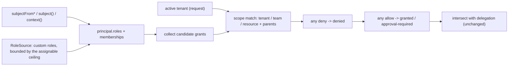

A role in a real SaaS application is rarely global. Alice is an admin of Acme and a viewer of Globex; the design team edits everything in the design folder; Bob shared one document with Carol; Acme's admin invented a "Billing Manager" role nobody coded. PermDock models all four with one addition to the [subject](/docs/concepts/subject): a list of **memberships**, each naming a scope and the roles held there. Roles declared with `role()` say where they apply; grants stay exactly as they are; the tenant condition you used to repeat on every grant becomes part of the role. Authentication, tenant objects, invitations and membership storage stay with your auth provider; PermDock reads the result. [Why this model](#why-this-model) compares it with authorization engines and auth providers.

## Memberships

```ts
type Membership = {
  tenant?: string                        // tenant or organisation id
  team?: string                          // team or group id, inside `tenant` when both are set
  on?: { resource: string; id: string }  // a resource-scoped role: "editor on document d_123"
  roles: string[]                        // declared role names, or tenant-defined custom role names
  via?: string                           // 'team:t_1' or 'group:<scim id>' when inherited; audit only
  expiresAt?: number                     // Unix seconds; time-bound access
}

type Principal = {
  id: string
  kind?: 'user' | 'service' | 'workload'
  roles?: string[]                       // global roles, unchanged
  memberships?: Membership[]
  tenant?: string                        // the active tenant for this request
  issuer?: string                        // `iss`; identity is issuer + id
  assurance?: { acr?: string; amr?: string[]; authTime?: number }
  binding?: Binding                      // RFC 7800 `cnf` members
  [k: string]: unknown
}
```

- `roles` on the principal keeps meaning global roles, so every existing sample and every single-tenant app is unchanged.
- A membership with only `tenant` is a tenant role; with `tenant` and `team` a team role; with `on` a resource role. Exactly one of the three shapes applies per entry; a membership with none is ignored (fail-closed, reported by `permdock doctor`).
- `tenant` on the principal is the **active tenant**: the one this request is about, taken from the URL, a header the server resolved, or the provider's active organisation. A value with no matching membership makes tenant-scoped roles contribute nothing. There is never a default tenant; an absent value means "no tenant", and tenant-scoped grants do not match ([threat model](/docs/security/threat-model)).
- Memberships come only from verified material: a `subjectFrom*` provider, the policy's `subject` or `context` function, or a `MembershipSource`. Never from a model argument, an unsigned header, a request body or a CLI flag. This is invariant 13 extended to memberships.
- Identifiers, never display names. A team id is the provider's or SCIM group `id`; a display name is editable by any group owner and not unique across tenants ([JWT authorization claims](/docs/standards/jwt-authorization-claims)).

```ts
// what a provider produces for Alice
{
  id: 'u_alice',
  roles: [],                                             // no global roles
  tenant: 'o_acme',                                      // active for this request
  memberships: [
    { tenant: 'o_acme',   roles: ['admin'] },
    { tenant: 'o_globex', roles: ['viewer'] },
    { tenant: 'o_acme', team: 't_design', roles: ['lead'], via: 'group:9f2c' },
    { on: { resource: 'document', id: 'd_123' }, roles: ['editor'], expiresAt: 1789000000 },
  ],
}
```

## Scoped role declarations

`role()` gains a third argument that says where the role applies:

```ts
import { definePolicy, role, allow, deny, subject } from 'permdock'

const viewer = role('viewer', [allow([permissions.post.read, permissions.post.list])], { on: 'tenant' })
const admin  = role('admin',  [...viewer.grants, allow(permissions.post.delete), allow(permissions.member.invite)], { on: 'tenant' })
const lead   = role('lead',   [allow(permissions.post.publish)], { on: 'team' })
const editor = role('editor', [allow(permissions.document.update)], { on: permissions.document })
const owner  = role('owner',  [allow(permissions.org.delete, { approval: 'human' })], { on: 'tenant', assignable: false })
const support = role('support', [allow(permissions.post.read)])                     // global, unchanged

export const policy = definePolicy(permissions, {
  roles: [viewer, admin, lead, editor, owner, support],
  scopes: {
    tenant: { key: 'orgId' },          // the field on every tenant-scoped resource
    team:   { key: 'teamId' },
  },
  subject: subjectFromClerk,           // or your own mapper; see "Where memberships come from"
})
```

| `on` | The role applies when | The grant's row must |
| --- | --- | --- |
| omitted | The name is in `principal.roles` | Nothing extra: global |
| `'tenant'` | A membership with that `tenant` holds the role and the tenant is the active one | Have `scopes.tenant.key` equal to the membership's `tenant` |
| `'team'` | A membership with that `team` holds the role, inside the active tenant | Have `scopes.team.key` equal to the membership's `team` |
| a resource reference | A membership `on` that resource holds the role | Be that row (`id` equal), or a descendant through a declared `parent` |

Two more options:

- `assignable` (default `true` for scoped roles, `false` for global roles) marks a role a tenant admin may hand out and compose into custom roles. `owner` above is held but never handed out.
- `exclusiveWith: ['approver']` is data on `role()` / `RoleBinding` (INCITS 359 static separation of duty). Evaluation does not change. `permdock doctor` check PD018 and `separationConflicts(policy, memberships)` report conflicts.

### Scope keys and typing

`scopes.tenant.key` must be a field of `StandardSchemaV1.InferOutput` for every resource a tenant-scoped grant references; a missing field is a compile error on the grant, the same way `id` is checked. A resource without the key is global by construction (a `plan` catalogue everyone reads), and `permdock doctor` warns when tenant roles exist and a resource that looks tenant-owned lacks the key. Collection actions (`post.create`, `post.list`) have no row, so they require the active tenant to be one of the subject's memberships holding the role; that is what stops "create in a tenant I can see but do not belong to".

The `where: { orgId: principal.orgId }` convention still works and still compiles; scoped roles are the shorter, un-forgettable form of the same condition. A grant may carry both (a tenant admin may only publish unpublished posts: `allow(permissions.post.publish, { where: { published: false } })` on a tenant-scoped role).

### Resource roles and parents

A resource role follows a declared parent chain:

```ts
export const permissions = definePermissions({
  project:  resource(Project,  { id: 'id', actions: ['read', 'update'] }),
  folder:   resource(Folder,   { id: 'id', actions: ['read', 'update'], parent: { field: 'projectId', resource: 'project' } }),
  document: resource(Document, { id: 'id', actions: ['read', 'update', 'share'], parent: { field: 'folderId', resource: 'folder' } }),
})

const editor = role('editor', [allow([permissions.document.update, permissions.folder.update])], { on: [permissions.folder, permissions.document] })
```

An `editor` membership on folder `f_1` matches `document.update` for a document whose `folderId` is `f_1`. Matching is keyed by the membership's resource: the row's own id field identifies it only when the row is of that resource, and a descendant row matches through the parent field of that resource on its chain, so a document whose `id` happens to be `f_1` does not match. A membership on the role's resource or one of its ancestors counts (a project editor edits the documents of its folders when the document row carries `projectId`); a membership on an unrelated resource never does. The chain is finite because it is typed: document to folder to project, three hops, declared once. `parent.resource` is the parent **name string**, not a reference; a resource declares at most one parent; the name is resolved at `definePolicy` after any `mergePermissions`. Self-referential parents (folders in folders) are deliberately not expressible; that is the Zanzibar case and the [pdp adapter](/docs/adapters/pdp) bridges it ([roadmap](/docs/roadmap) non-goals). The row must carry the parent field; a missing parent field is a non-match, never a walk-up query.

### Grants over several references

`allow` and `deny` accept an array of references so a role does not repeat a condition per action:

```ts
allow([permissions.post.read, permissions.post.list, permissions.comment.read])
allow(listPermissions(permissions.post))            // everything on one resource
allow([permissions.post.update, permissions.post.delete], { where: { authorId: principal.id } })
```

Each reference becomes its own grant in the normalised policy, the catalog and the snapshot; the array is declaration sugar only, and `permdock collect` sees the individual leaves. Strings never appear; `listPermissions` returns references.

## Evaluation

The [policy rules](/docs/concepts/policies) gain one step between collecting grants and applying deny-overrides:

1. Collect candidate grants: every grant of every global role in `principal.roles`, plus every grant of every scoped role held by a membership, plus the grants that custom roles resolve to (below).
2. **Scope match.** Drop a grant whose role is scoped unless the membership's scope matches the request: the row's tenant key equals the membership `tenant` and the tenant is active; the row's team key equals the membership `team`; the row is the membership's resource or a descendant through declared parents. Expired memberships (`expiresAt` in the past) contribute nothing. For collection actions, the active tenant must be one of the membership tenants holding the role.
3. Any matching `deny` wins. Deny overrides allow across scopes: a global `deny` beats a tenant `allow`; a tenant `deny` beats a team `allow`.
4. Any matching `allow` grants (or `approval-required`). Allows OR together across scopes.
5. Nothing matched: `denied`. Reasons gain `tenant-mismatch` (the row belongs to another tenant), `no-membership` (the active tenant is not one of the subject's), `scope` (the role is held but not for this row) and `expired-membership`.
6. Intersect with delegation, unchanged.



`can()` still never throws and a subject with memberships and no active tenant is simply denied everything tenant-scoped. `simulate` accepts `{ roles, memberships, tenant }` so a test or a "view as" screen can ask "what would a Globex viewer see" without a real membership ([UI](/docs/concepts/ui)).

## Tenant-defined custom roles

A tenant admin wants a "Billing Manager" role. The policy did not declare it and must not have to. A custom role is data, composed from declared roles, from single permissions, or both:

```ts
type CustomRole = {
  tenant: string
  team?: string                // a team-scoped custom role
  name: string                 // 'billing-manager'; unique within the tenant
  includes?: string[]          // declared roles: ['billing-viewer', 'invoice-payer']
  grants?: { permission: string; effect?: 'allow' | 'deny' }[]   // declared permission keys
  meta?: Record<string, unknown>
}
```

- A custom role never exceeds its **ceiling**: the allows of the declared roles marked `assignable` in its scope (tenant, or team when `team` is set). Its effective grants are its included roles' grants plus its own allows, minus its own denies, intersected with the ceiling. Anything outside is dropped (fewer grants, never more), and `validateCustomRole` and `permdock doctor` PD023 name each dropped key.
- A custom-role grant carries no condition, approval or limit of its own. It inherits those of the declared grant it comes from, so every condition was reviewed in code.
- `RoleSource.assignable(tenant)` may return a subset of the declared assignable roles: a Starter plan without `billing-manager`, a regulated tenant without `data-exporter`. This is Clerk's role-set idea and the entitlements-are-roles rule applied to assignability; the plan is an input, PermDock never reads billing.
- Who may hand out which role is itself a permission (`permissions.member.assignRole`) plus the rule that you cannot hand out what you do not hold: `permdock.assignableRoles()` and `permdock.assignablePermissions()` intersect the ceiling (narrowed by `RoleSource.assignable`) with what the subject holds there. Holding a role or a permission marked `meta.manageRoles: true` lifts that intersection.

[Custom roles](/docs/concepts/custom-roles) has the resolution rules, the ceiling, the matrix-editor recipe and how snapshots carry the result.

### Interfaces

```ts
interface RoleSource {
  rolesFor(tenant: string): CustomRole[] | Promise<CustomRole[]>
  assignable?(tenant: string): string[] | Promise<string[]>   // defaults to every declared assignable role
}

interface MembershipSource {
  membershipsFor(principal: { id: string; kind?: string }, options: { tenant?: string }): Membership[] | Promise<Membership[]>
}
```

Both are **subject inputs**, the same trust class as the policy's `subject` and `context` functions: they run once per `createPermDock`, their results are frozen into the subject, and they are the only two interfaces on the [extension interfaces](/docs/concepts/extension-interfaces) page that may influence an outcome. Neither is a store: PermDock never writes a membership or a custom role. `memoryRoleSource(customRoles)` and the default membership source (whatever `subject` and `context` returned) ship in the package. `permdock/cloud` does not implement either, so the Cloud never joins the decision path (invariant 15). Provider role sources: Better Auth `organizationRole` (`dynamicAccessControl`), a Supabase `role_permissions` table, WorkOS organization roles, Clerk custom roles and role sets, Auth0 Organization Roles, your own table; each is a `RoleSource` whose conformance the [testing](/docs/adapters/testing) runners check.

Every adapter's `createPermDock` accepts `memberships` (a `MembershipSource`) and `customRoles` (a `RoleSource`) next to `store`, `sink` and `snapshots`; core takes `createPermDock(policy, user, { tenant, memberships, customRoles, actor, delegation })`.

## Where memberships come from

| Source | Tenant and active tenant | Roles per tenant | Teams | Notes |
| --- | --- | --- | --- | --- |
| [Clerk](/docs/adapters/clerk) | Organizations; the session's active organization | `org_role` (and `org_permissions`) mapped to declared roles | None | One membership for the active organization from the session; all organizations through the Backend API when `memberships: 'all'` |
| [Better Auth](/docs/adapters/better-auth) | `organization` plugin; `activeOrganizationId` | `member.role`; `organizationRole` rows resolve through `RoleSource` | `teamMember` rows become team memberships | `subjectFromBetterAuth` is async because it reads the member and team rows |
| [Supabase](/docs/adapters/supabase) | A hook-injected `tenant_id` claim; the active tenant from the URL compared against the claim | A hook-injected role claim, or a `user_roles` table read in `context` | Your tables | Never `user_metadata`; RLS reads the same claim |
| [JWT issuers](/docs/adapters/jwt) | `claims.tenant` (`org_id`, `tid`, `hd`, ...) | RFC 9068 `roles`; per-tenant objects such as Descope `tenants.<id>.roles` through a claim path | RFC 9068 `groups` become `{ team: value }` memberships | Keyed on SCIM `value`, never `display` |
| [PermDock Cloud](/docs/adapters/cloud) (Cloud-native directory) | The `tenant` claim on the Cloud-issued token, kept only with a matching membership | The `memberships` claim, `[{ tenant, roles, team? }]`, minted from declared `assignable` roles | `team` on a membership, or `groups` | Read through `subjectFromJwt` with `claims: { tenant: 'tenant', memberships: 'memberships' }`; never a `MembershipSource` |
| Your own tables | Whatever you store | `context` or a `MembershipSource` | Same | The common case for resource roles (`document_members`) |

The [authentication](/docs/concepts/authentication) page carries the full provider table; each provider page has a "Memberships" section.

## Instance methods for tenancy

The instance stays frozen and request-scoped; tenancy adds derived instances and read-only introspection:

```ts
await permdock.tenant('o_globex').assert(permissions.post.update, post)   // a derived instance with another active tenant
permdock.team('t_design').can(permissions.post.publish)                    // scope a team for collection actions

permdock.memberships()             // Membership[]           for org lists and role chips
permdock.tenants()                 // string[]               tenants the subject belongs to
permdock.heldRoles({ tenant: 'o_acme' })  // Role[]        roles held there, custom roles resolved
permdock.heldRoles({ tenant })     // Role[]                roles held in a tenant
permdock.assignableRoles()         // Role[]                roles the subject may hand out in the active tenant
permdock.assignablePermissions()   // Permission[]          the custom-role ceiling the subject may hand out there
```

`tenant()` and `team()` return new frozen instances (invariant 7); they never mutate the original and they re-run nothing, because memberships were loaded once. Switching a tenant the subject does not belong to yields an instance where every tenant-scoped check is `denied` with `no-membership`. On the client the same methods exist on the snapshot-backed instance and back `useTenant`, `useMemberships`, `useRoles`, `useAssignableRoles` and `useAssignablePermissions` ([UI](/docs/concepts/ui)).

## Portable compilation

Scope matching is data, so it compiles like any other condition (invariant 6). One node is added to the condition AST:

```json
{ "op": "memberOf", "scope": "tenant", "field": "orgId", "roles": ["admin", "viewer"] }
{ "op": "memberOf", "scope": "team",   "field": "teamId", "roles": ["lead"] }
{ "op": "memberOf", "scope": "resource", "resource": "folder", "field": "folderId", "roles": ["editor"], "parents": [{ "field": "projectId", "resource": "project" }] }
```

A `parents` entry is either keyed (`{ field, resource }`: only a membership on that resource matches the field) or a bare field name (a membership on any resource whose id equals the field). Prefer the keyed form; the bare form exists for conditions written before it and matches the older behaviour. Membership `expiresAt` is Unix seconds, in memory and in a mapped `expires_at` column.

| Target | Compilation |
| --- | --- |
| In memory, `filter`, snapshot | The row's scope field is compared against the subject's memberships holding one of `roles`; expired memberships excluded |
| Drizzle, Prisma, Kysely `toWhere` | Active-tenant-only: `eq(orgId, <active tenant>)`; with no active tenant, tenant- and team-scoped grants contribute nothing, so only unscoped grants match; team and resource scopes as `inArray` over the ids the subject holds, keyed parents over the ids held on that resource. With a memberships table (Drizzle, Kysely), an `exists` join with the role list, `expires_at > now` in bound Unix seconds, the active tenant, and the `resource` column when the table stores several resources |
| RLS `supabase` | Tenant: `org_id = ((select auth.jwt()) ->> 'tenant_id')::uuid` when the active tenant is a claim; otherwise `exists (select 1 from <membership table> m where m.tenant_id = org_id and m.user_id = (select auth.uid()) and m.role = any(...))` |
| RLS `neon`, `guc` | Same shape over `auth.session()` or `current_setting('app.tenant_id', true)`; Nile's tenant session variable is the `guc` dialect with a fixed name |
| RLS, team and resource | `exists (select 1 from <membership table> ...)`; a resource role ORs one join per mapped resource on the chain (the role's resource and each ancestor), each keyed by the row field that holds that resource's id |

Membership checks have a dedicated `memberOf` AST node, and the membership table is a per-scope mapping on the [RLS adapter](/docs/adapters/rls), one table per scope and one per mapped resource (`tables: { tenant: 'org_member', team: 'team_member', resource: 'document_member' }`). `permdock rls import` recognises both `IN (select ...)` and `EXISTS (select 1 ...)` forms as `memberOf` when the subquery matches a declared mapping. Custom roles compile through the same node after resolution: the declared role names are what reach SQL, never the tenant-defined name, so RLS stays a closed vocabulary.

## Snapshots, decisions and the catalog

- **The snapshot** carries `subject.memberships`, `subject.tenant`, `vocabulary.roles` / `vocabulary.plans`, and per grant `to` plus `scope` (`'tenant' | 'team' | { resource }`) and the membership it came from. A snapshot is scoped to the active tenant by default, so a member of ten organisations ships the grants of one; `snapshot({ tenants: 'all' })` opts into every membership for a local tenant switcher. `simulated: true` marks a snapshot produced by `simulate` so the decision endpoint refuses to act on its tokens ([snapshots](/docs/concepts/snapshots), [wire formats](/docs/concepts/wire-formats)).
- **Decision events** gain `tenant`, `membership` (the matching entry) and `via`, so a sink can answer "which team grant let this happen" and a tenant-scoped audit log is a filter on `tenant` ([audit](/docs/concepts/audit-and-observability)).
- **Catalog** entries gain `scope` and `assignable`, and the catalog lists the scope kinds a policy uses. `permdock usage` reports a scoped role that no membership source could ever fill (a team role with no team source configured).
- **AuthZEN**: memberships travel under `subject.properties.memberships`, the active tenant under `context.tenant`; the `authzen` adapter and the hosted ADS publish per-tenant metadata at `/.well-known/authzen-configuration/<tenant>` ([AuthZEN](/docs/standards/authzen)).

## Validation and trust classes

| Data | Class | Validation |
| --- | --- | --- |
| Memberships and custom roles returned by a provider, `subject`, `context`, `MembershipSource` or `RoleSource` | Trusted server data, like a database row | None; malformed entries are dropped and reported by `permdock doctor` |
| A membership or custom-role edit arriving from a form, an API body or a model | Boundary data | Your validator, against the Standard JSON Schema PermDock publishes for `Membership` and `CustomRole`; `permdock.assignableRoles()` is the live `Role[]` so `z.enum` of those keys types the `includes` array |
| The requested active tenant (URL segment, header) | Boundary data | Resolved server-side to a membership before it becomes `principal.tenant`; an unmatched value is no tenant |
| Custom claims on a provider token | Verified but shaped by the issuer | The provider's `schema` option validates and types them ([extension interfaces](/docs/concepts/extension-interfaces)) |

## Adjacent SaaS features

| Feature | Where it lives | Recipe |
| --- | --- | --- |
| Invitations, default role per tenant, role priority, seat counting, tenant creation | Upstream: the auth provider or your tables | PermDock reads the resulting membership |
| SSO and SCIM group-to-role | Upstream: IdP, auth layer or Directory Sync; or [`permdock/scim`](/docs/adapters/scim) writing a `DirectoryStore` you own (the PermDock Cloud relay feeds the same handler) | Group ids arrive as `groups` claims, synced rows or SCIM `Group` resources and become team memberships `{ tenant, team: group.id, roles, via: 'group:<id>' }` through `subjectFromJwt` or `directoryMembershipSource` ([authentication](/docs/concepts/authentication)) |
| Impersonation and support access | Recipe | The customer is the `principal`, the support engineer the `actor` with a time-bound `delegation` naming the allowed scopes; every decision records both; the UI shows a banner from `useSubject()` |
| Tenant-scoped service accounts and API keys | Recipe | A `kind: 'service'` principal with one tenant membership; the key store is yours ([subject](/docs/concepts/subject) service principals). A key attenuated below its owner is the owner as principal plus a `delegation` naming the key's scopes; `delegation` narrows a subject with or without an `actor` |
| Platform super-admin | Recipe | A global role; document the blast radius, pair it with `deny` rows for destructive actions and `approval: 'human'` for the rest |
| Time-bound and just-in-time access | In scope | `Membership.expiresAt`; break-glass is `approval: 'human'` on the elevated role |
| Tenant-scoped audit | In scope | `DecisionSink` events carry `tenant`; filter by it |
| Plan-gated roles | In scope | `RoleSource.assignable(tenant)`; the plan is an input, the roles are declared |
| Cross-tenant guests | In scope | A guest is a principal with a membership in the host tenant. There is no home tenant: snapshots and RLS treat the guest membership like any other |
| Nested groups, arbitrary-depth trees, cross-tenant graphs | Not in core | `permdock/pdp` to OpenFGA or SpiceDB |
| Role-editing UI | Recipe | `permdock catalog` plus `useAssignableRoles` ([UI](/docs/concepts/ui)); a hosted editor is a Cloud candidate |

## Vocabulary for reviewers

For teams that audit against INCITS 359-2012 (the NIST RBAC standard): a request-scoped `PermDock` with an active tenant is a *session* with an *activated role set*; grant spread (`...viewer.grants`) is a *limited role hierarchy* (no general hierarchy is offered on purpose); memberships are *user assignments* with a scope; custom roles are administrator-composed roles constrained to *permission assignments* the code declared; *static separation of duty* is reported by PD018 and `separationConflicts`, never enforced at evaluation, and *dynamic separation of duty* (two roles not active in one session) is not planned. On the token side, roles and groups follow RFC 9068 and SCIM ([JWT authorization claims](/docs/standards/jwt-authorization-claims)).

## Why this model

Authorization engines converge on the same shape. Permit.io, Oso Cloud (`has_role(user, "admin", org)`), OpenFGA and SpiceDB (`organization#admin`, `team#member` usersets) and Cerbos (scoped policies) all treat a role as a relation between a subject and a scope, never a bare string. Tenant-defined roles are always composed from a vocabulary the code declared (Oso `grants_permission` facts, an OpenFGA `role` type, Better Auth `dynamicAccessControl`), and parent derivation is declared one hop at a time (Permit role derivation, Oso `role if role on "parent"`). PermDock takes all three: a `Membership` names the scope, `role(name, grants, { on })` puts the scope on the role instead of on every grant, a custom role composes and never widens, and `parent` is typed so the chain is finite. Repeating the tenant condition on every grant, not the declaration syntax, is where cross-tenant bugs come from; scoping the role removes the repetition without a fluent builder.

Auth providers own the rest. Clerk, Auth0, WorkOS, Stytch, Kinde, Descope and Better Auth all own the tenant object, membership rows, invitations, the active-tenant selection and the group-to-role mapping, and expose the result as claims or a session; none evaluates a condition on a row. Clerk's role sets (which roles an organization or plan may assign) map to `RoleSource.assignable(tenant)`, and Better Auth's "cannot grant a role you do not hold" rule maps to `permdock.assignableRoles()`. Entitlement platforms such as Stigg and Schematic answer "may this tenant use this capability" and are an input to `subject` and `assignable`, not a role model.

No standard tenant claim exists: Entra uses `tid`, Auth0, WorkOS and Clerk `org_id`, Google `hd`, Supabase deployments conventionally `tenant_id`, and Descope a `tenants` object keyed by tenant id. The mapping stays configuration (`claims.tenant`), and an absent tenant claim means no tenant, never a default. SCIM groups have no tenant attribute either, and nested groups are provider-specific (Entra does not expand them in `members.value` filters).

PermDock deliberately leaves out storing memberships, invitations or tenant objects (a hosted store would sit on the decision path); nested groups, arbitrary-depth trees and cross-tenant graphs, which `permdock/pdp` hands to a Zanzibar engine with one tuple per resource membership; and global module augmentation or a `$Infer` accessor for provider principal types, which generics filled from a Standard Schema replace.
