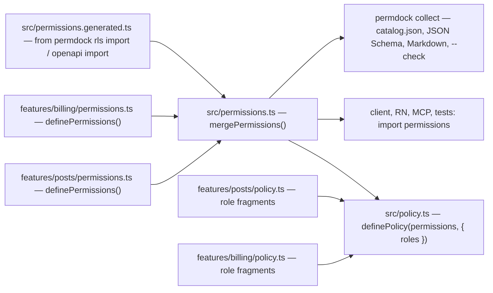

A permission definition starts as one file. In a larger app it becomes many colocated files, a generated file from the database or an OpenAPI document, and a catalog that CI checks. PermDock treats all three sources the same way: one registry shape, identity by `key`, and one set of merge rules.



## Three ways to define

### Define once, use anywhere

`src/permissions.ts` holds a single `definePermissions()` call. Because it contains no rules and no secrets, any page, client component, React Native screen, MCP tool or test imports it and uses `permissions.post.update`. Leaves are plain JSON, so RSC props and wire transport work. This is the right shape until several teams own different resources.

### Define per feature, collect centrally

Each feature colocates its definition next to its code, and the app merges them:

```ts
// features/posts/permissions.ts
export const postPermissions = definePermissions({
  post: resource(Post, { id: 'id', actions: ['read', 'update', 'delete'], collection: ['create', 'list'] }),
})

// features/billing/permissions.ts
export const billingPermissions = definePermissions({
  billing: {
    invoice: resource(Invoice, { actions: ['read', 'pay'] }),
    plan: resource({ collection: ['view', 'change'] }),
  },
})

// src/permissions.ts
import { mergePermissions } from 'permdock'
export const permissions = mergePermissions(postPermissions, billingPermissions)
```

`mergePermissions`:

- Preserves leaf identity. `permissions.post.update === postPermissions.post.update` is true, and both carry `key: 'post.update'`. Feature code keeps importing its local `postPermissions`; app code imports the merged registry; grants, snapshots and caches resolve by `key`, so it never matters which one you hold.
- Deep-merges nested groups. `billing.invoice` and `billing.plan` can come from different files as long as no leaf key repeats.
- Makes a duplicate key a type error and a runtime throw. Two features defining `post.read` is a bug, not a last-one-wins.

Nested groups are the namespace mechanism. A shared package in a monorepo ships a client-safe `permissions.ts` next to its code under its own top-level group (`acmeUi.dialog.open`), and the app merges it like any local feature. This is the same advice next-intl gives for message namespaces in monorepo packages.

Roles compose the same way. Each feature exports role fragments, `definePolicy` receives all of them, and roles with the same name merge their grants:

```ts
// features/posts/policy.ts
export const postRoles = [
  role('member', [allow(postPermissions.post.read), allow(postPermissions.post.update, { where: { authorId: principal.id } })]),
  role('admin', [allow(postPermissions.post.delete)]),
]

// features/billing/policy.ts
export const billingRoles = [
  role('member', [allow(billingPermissions.billing.plan.view)]),
  role('admin', [allow(billingPermissions.billing.invoice.pay)]),
]

// src/policy.ts
export const policy = definePolicy(permissions, {
  roles: [...postRoles, ...billingRoles], // 'member' and 'admin' each merge into one role
  subject: (user: User | null) => user && { id: user.id, roles: user.roles },
})
```

A grant that references a leaf outside `permissions` is a type error. See [policies](/docs/concepts/policies) for merge semantics when the same role grants and denies the same permission.

### Generate, then use everywhere

`permdock rls import` and `permdock openapi import` emit `src/permissions.generated.ts`: a deterministic `definePermissions()` call with a `// @generated` header. Resource schemas are emitted for the validator detected in `package.json` (`--schema zod|valibot|arktype`) or reference existing Drizzle tables through `drizzle-zod` (`--from drizzle`). Conditions that fit the portable subset become `where` / `check` data; everything else becomes an `opaque` condition that keeps its SQL and fingerprint.

The generated file merges with hand-written definitions like any other feature file. `permdock rls verify` runs parity tests in both directions so the two never drift silently. See the [RLS CLI](/docs/cli/rls) and the [RLS adapter](/docs/adapters/rls).

## The catalog is a compile output

The model is next-intl's `useExtracted` ([docs](https://next-intl.dev/docs/usage/extraction), [announcement](https://next-intl.dev/blog/use-extracted)): declarations are colocated where they are used, a build step collects them into a catalog, the catalog is an output rather than something you edit, and namespaces keep packages from colliding. PermDock applies each part:

| next-intl | PermDock |
| --- | --- |
| `useExtracted()` messages declared inline | `definePermissions()` colocated per feature |
| Build loader or `unstable_extractMessages` fills `messages/*.json` | `permdock collect` fills `permissions.catalog.json`, JSON Schema, Markdown |
| Sync target locales, fail CI on drift | `permdock collect --check` fails CI on drift |
| Namespaces per package | Nested groups per package, merged with `mergePermissions` |
| `useTranslations` on the client, `getTranslations` on the async server | `usePermission` on the client, `getPermission` on the async server |
| Pass one message namespace to the client | `snapshot({ include: [permissions.post] })` |
| Works uncompiled in tests | The runtime definition is already the catalog; `listPermissions(permissions)` needs no build |

### permdock collect

```bash
pnpm permdock collect --src ./src ../ui/src './node_modules/@acme/*'
pnpm permdock collect --check   # CI: exit 1 when the committed catalog is stale
```

`collect` scans the given paths with `oxc-parser` for `definePermissions()` calls and `permissions.x.y` usages, then writes the catalog and, optionally, a generated barrel. It also feeds `permdock usage`, which reports defined-but-unused, used-but-ungranted and granted-by-no-role permissions. See [collect](/docs/cli/collect).

In a Next.js app the same step can run automatically during `next dev` and `next build`:

```ts
// next.config.ts
import { createPermDockPlugin } from 'permdock/next/plugin'

const withPermDock = createPermDockPlugin({
  collect: { srcPath: ['./src', '../ui/src', './node_modules/@acme/*'] },
})

export default withPermDock({ /* next config */ })
```

`createPermDockPlugin` is a build hook only. It never wires the API, never augments modules and never creates a `PermDock`; that stays in the explicit `src/permdock/server.ts` factory file described in the [quick start](/docs/getting-started/quick-start). See [next-plugin](/docs/cli/next-plugin) and [ADR 0006](/docs/decisions/0006-explicit-factory-not-plugin).

## Scoped snapshots

A snapshot of a large policy can be big. `snapshot({ include: [...] })` limits it to the groups a route needs, the equivalent of sending one message namespace to the client:

```ts
const snapshot = permdock.snapshot({ include: [permissions.post, permissions.billing.plan] })
```

Permissions outside the included groups report `status: 'server-only'` on the client and fall back to the decision endpoint. See [snapshots](/docs/concepts/snapshots).

## Checklist for a monorepo

1. Every package that owns resources ships `permissions.ts` under a unique top-level group. No rules in that file.
2. The app merges them once in `src/permissions.ts` and passes the merged registry to `definePolicy`.
3. Role fragments live next to the permissions they grant; the app spreads them into `roles`.
4. `permdock collect --check` runs in CI; the committed `permissions.catalog.json` is the review surface for permission changes.
5. Generated definitions are regenerated, never edited; `permdock rls verify` runs against a database in integration tests.
6. Routes call `snapshot` with an `include` option so clients only receive the grants they can use.

The `monorepo` example app under `apps/examples/monorepo` covers steps 1 to 4: colocated `definePermissions` in `packages/posts` and `packages/billing`, `mergePermissions` at the app root, role fragments spread into `definePolicy`, and `permdock collect --check` against a committed catalog.

## Open questions

- Whether `collect` should also emit the `mergePermissions` barrel or only the catalog.
- Whether `snapshot` should ship full grants or per-permission booleans for very large policies.
