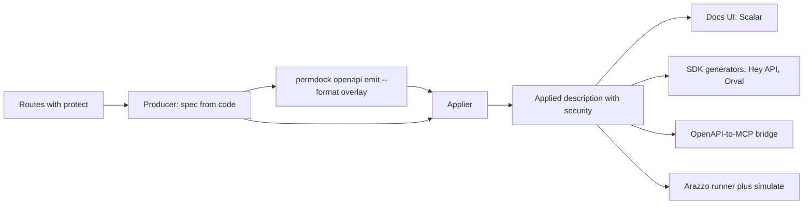

Source: a review run in September 2026 of the tools a TypeScript team already has in its OpenAPI pipeline, asking what PermDock must emit so each of them works without knowing PermDock exists, and where a recipe is enough versus where an adapter would be needed. Sources were the tools' documentation and repositories linked below. The review produced [ADR 0023](/docs/decisions/0023-compose-openapi-ecosystem) and the recipes on the [OpenAPI adapter](/docs/adapters/openapi), [Next.js adapter](/docs/adapters/next), [MCP adapter](/docs/adapters/mcp), [CLI: openapi](/docs/cli/openapi) and [Overlay](/docs/standards/openapi-overlay) pages.

## The pipeline

Every TypeScript OpenAPI setup, whatever the framework, reduces to the same four stages. PermDock occupies one of them.

1. **Producer.** Something turns route handlers into an OpenAPI description: a framework plugin (`hono-openapi`, `@hono/zod-openapi`, `@orpc/openapi`, `trpc-to-openapi`, `@elysia/openapi`, `@fastify/swagger`, `@nestjs/swagger`) or a scanner that reads route files (next-openapi-gen). Producers own paths, parameters, schemas and `operationId`s.
2. **PermDock.** `permdock openapi emit --format overlay` reads the catalog and the description and writes an [Overlay](/docs/standards/openapi-overlay) that adds `securitySchemes`, per-operation `security` and `x-permdock-*`. Where PermDock has an in-process hook (Hono, oRPC, tRPC, Elysia, Fastify, Nest) the same fields are attached during generation and the Overlay is optional.
3. **Applier.** An Overlay 1.x applier merges the Overlay into the description. PermDock does not ship one ([0019](/docs/decisions/0019-openapi-extensions-and-overlay)); the project's existing tool does it.
4. **Consumers.** Docs UIs, SDK generators, OpenAPI-to-MCP bridges, Arazzo runners, gateways and `permdock openapi import` read the applied description. They see standard `security`; the ones that opt in also read `x-permdock-*`.

The join key across all four stages is `operationId`. Producers generate it, the Overlay targets it, Arazzo steps reference it, and `--check` fails when it is missing.

## Producers

| Tool | Frameworks | Security input | PermDock path | Notes |
| --- | --- | --- | --- | --- |
| [next-openapi-gen](https://github.com/tazo90/next-openapi-gen) | Next.js, TanStack Start, React Router, Remix, SvelteKit, Nuxt, Astro, Hono, Express | JSDoc `@auth`, `authPresets`; `overlay.apply` | Overlay | Scans route files; targets 3.0 to 3.2; scaffolds Scalar; compiles Arazzo. The Next.js recipe |
| [hono-openapi](https://github.com/rhinobase/hono-openapi) | Hono | `describeRoute({ security })` | In-process `describe()` | Already a hook on the [Hono adapter](/docs/adapters/hono) |
| [@hono/zod-openapi](https://github.com/honojs/middleware/tree/main/packages/zod-openapi) | Hono | `createRoute({ security })` | In-process `security()` | Same |
| [@orpc/openapi](https://orpc.unnoq.com/docs/openapi/getting-started) | oRPC | `oo.spec()` | In-process `spec()` | [oRPC adapter](/docs/adapters/orpc) |
| [trpc-to-openapi](https://github.com/mcampa/trpc-to-openapi) | tRPC | `meta.openapi.protect: true` | In-process `describe()`, Overlay for per-scope | Boolean `protect` only; the Overlay adds the scopes ([tRPC adapter](/docs/adapters/trpc)) |
| [@elysia/openapi](https://elysiajs.com/plugins/openapi) | Elysia | `detail.security` | In-process | Scalar is the default UI ([Elysia adapter](/docs/adapters/elysia)) |
| [@fastify/swagger](https://github.com/fastify/fastify-swagger), [@nestjs/swagger](https://docs.nestjs.com/openapi/introduction) | Fastify, Nest | Schema `security`, decorators | In-process | [Fastify](/docs/adapters/fastify), [Nest](/docs/adapters/nest) |
| Hand-written YAML or JSON | Any | Author writes `security` | Overlay | Design-first teams; the Overlay keeps PermDock's contribution separate |

next-openapi-gen matters most because it is the only producer for Next.js route handlers, which is where `permdock/next` lives. Its `overlay.apply` option means the Overlay is applied inside the same `generate` run, so the recipe is two commands and no glue code.

## Appliers

| Tool | Where it runs | Overlay versions | Notes |
| --- | --- | --- | --- |
| next-openapi-gen `overlay.apply` | Inside `openapi-gen generate` | 1.0, 1.1, 1.2 | Applies before writing the spec, so Scalar and Arazzo see the applied result |
| [Redocly CLI](https://redocly.com/docs/cli/commands) `join --overlay` | Lint, bundle, `generate-client` pipelines | 1.x | Experimental flag; `redocly lint` also validates Overlay documents. Common in design-first teams |
| [Scalar CLI](https://github.com/scalar/cli) | Docs and registry pipelines | none yet | Overlay support is on Scalar's roadmap; apply with one of the above before `scalar registry publish` |

PermDock emits Overlay 1.1.0. Overlay 1.2 adds reusable actions and `targetFormat` (including `asyncapi`); it is tracked on the [watch list](/docs/standards/watch-list) and adopted when a 1.2 feature is needed, not before.

## Consumers

| Tool | Role | Reads | What PermDock must do | Recipe or adapter |
| --- | --- | --- | --- | --- |
| [Hey API](https://heyapi.dev) (`@hey-api/openapi-ts`) | Typed SDKs, TanStack Query hooks, validators | `security`, `securitySchemes` | Emit standard fields | Recipe: point it at the applied description. A plugin reading `x-permdock-*` is Phase 4 at earliest |
| [Orval](https://orval.dev) | Clients, TanStack Query, MSW mocks, MCP servers | `security` | Emit standard fields; `x-permdock-permissions` for the MCP output | Recipe; see bridges below |
| [Redocly `generate-client`](https://redocly.com/docs/cli/commands/generate-client) | Clients | `security` | Emit standard fields | Recipe |
| [Scalar API Reference](https://scalar.com/products/api-references/openapi) | Docs UI, Try-it client | `security`, OAuth scopes, `x-badges`, several vendor code-sample extensions | Standard fields; optional `x-badges` approval hint | Recipe; an operation-level plugin for `x-permdock-*` needs upstream plugin API support first |
| Swagger UI, Redoc, Stoplight Elements, RapiDoc, fumadocs-openapi | Docs UIs | `security` | Standard fields | Nothing to do |
| API gateways (Kong, Envoy, Tyk, Zuplo) | Enforcement from the description or from AuthZEN | `security`; AuthZEN | Standard fields; `permdock/authzen` | Already covered on [AuthZEN](/docs/standards/authzen) |
| [Spectral](https://stoplight.io/open-source/spectral), [Redocly lint](https://redocly.com/docs/cli/commands/lint), [vacuum](https://quobix.com/vacuum/) | Linters | Whole document | Ship a ruleset file | Phase 2 artefact, not a package |
| `permdock openapi import` | PermDock's own consumer | `security`, `x-permdock-*` | Round-trips its own output | [CLI: openapi](/docs/cli/openapi) |
| Arazzo runners, `permdock.simulate` | Workflow pre-flight | `operationId`, `x-permdock-permissions` | Run on the applied description | [Arazzo](/docs/standards/arazzo) |

### OpenAPI-to-MCP bridges

Orval, Scalar, Speakeasy and several smaller tools generate an MCP server from an OpenAPI description, one tool per operation. Agents then call the API through that server. Without PermDock in the loop the generated tools have no `permission` binding and `permdock/mcp`'s `list_tools` filtering and `approval-required` elicitation never run. The recipe on the [MCP adapter](/docs/adapters/mcp): read the operation's `x-permdock-permissions` from the applied description and bind it as the generated tool's `permission`. Standard `security` is not enough here because the bridge needs the permission key, not the scope; this is the one consumer for which the extension carries information the standard field cannot.

### Scalar specifics

Scalar owns the registered `scalar` namespace; PermDock never writes into it ([registries](/docs/standards/openapi-registry)). Scalar renders `x-badges` (unregistered, rendering-only) on operations, which is enough to show "Approval required" next to a `publishPost` operation without Scalar understanding PermDock. Scalar's plugin API has historically bound custom `x-*` components to Info, Tag and Schema objects rather than operations ([plugins](https://github.com/scalar/scalar/blob/main/documentation/plugins.md)); an operation-level PermDock plugin waits for that to change upstream.

### Hey API specifics

Hey API clients attach credentials from the description's security schemes ([clients](https://heyapi.dev/openapi-ts/clients)), so a PermDock-annotated description produces SDKs whose calls carry the right scopes with no PermDock code. Its custom plugin API iterates operations (`plugin.forEach('operation', ...)`, [custom plugins](https://heyapi.dev/openapi-ts/plugins/custom)), which is where a later plugin would read `x-permdock-permissions` and emit a typed `permissions` map beside each SDK function. Recorded as Phase 4, only if the recipe proves insufficient.

## Two sources of truth

The one failure mode of composing is two tools writing `security` on the same operation. next-openapi-gen's `@auth` JSDoc tag and `authPresets`, hono-openapi's `security` option and hand-written `security` in a YAML file all compete with the Overlay. The rule: on operations PermDock covers, PermDock owns `security` and the producer owns everything else. `permdock openapi emit --check` reports operations whose source already carries `security` that the Overlay would replace, so the conflict is caught in CI rather than in a published description.

## Adjacent formats

- **AsyncAPI.** Arazzo 1.1 accepts AsyncAPI sources and Overlay 1.2 can target AsyncAPI documents. PermDock has no AsyncAPI emitter; if one is ever needed it is the same Overlay engine with `targetFormat: asyncapi`, not a new adapter. Tracked.
- **Problem Details.** The `403` body PermDock documents on protected operations ([Problem Details](/docs/standards/problem-details)) is what generated SDKs surface as the typed error, and what MSW fixtures in `@permdock/testing` return ([testing](/docs/adapters/testing)).
- **Arazzo.** next-openapi-gen's `arazzo` block compiles workflow files against the generated `operationId`s after the spec write; `simulate({ arazzo, openapi })` must read the applied description so `x-permdock-permissions` is present ([Arazzo](/docs/standards/arazzo)).

## Adopt / adapt / avoid

Adopt:

- The Overlay as the hand-off between PermDock and every producer it has no in-process hook for; `operationId` as the join key.
- Standard `security` and `securitySchemes` as the contract with SDK generators, docs UIs and gateways, so Hey API, Orval, Redocly and Scalar work with no PermDock code.
- next-openapi-gen `overlay.apply` as the Next.js applier and Scalar as the default docs UI it scaffolds.
- The existing appliers (next-openapi-gen, Redocly CLI) instead of shipping one.
- An existing OpenAPI parser for `permdock openapi` rather than a hand-rolled AST.

Adapt:

- `x-badges` as an opt-in approval hint for docs UIs that render it; no semantics, off by default.
- A Spectral / Redocly / vacuum ruleset expressing PermDock's document invariants, shipped as a file.
- `x-permdock-permissions` as the binding OpenAPI-to-MCP bridges read, documented as a recipe on the MCP adapter page.
- Later first-party plugins (Hey API operation plugin, Scalar operation plugin) only if recipes fail, and only after upstream plugin APIs support the operation level.
- Overlay 1.2 when a 1.2 feature is needed.

Avoid:

- Wrapping a producer, generator or docs UI in a PermDock package.
- Two sources of `security` on one operation.
- Writing into `x-scalar-*`, `x-stainless-*`, `x-readme` or any `x-oai-*` name that is not registered.
- Making the Overlay the CLI default before the document form is unnecessary.
- Moving Arazzo `simulate` earlier than Phase 4 because a producer happens to compile Arazzo.

## Decisions informed

- [ADR 0023: compose with the OpenAPI toolchain](/docs/decisions/0023-compose-openapi-ecosystem)
- [ADR 0019: extensions and Overlay](/docs/decisions/0019-openapi-extensions-and-overlay) (the Overlay-applier deferral is confirmed)
- [ADR 0014: OpenAPI 3.2](/docs/decisions/0014-openapi-3-2)
- Pages shaped: [OpenAPI adapter](/docs/adapters/openapi), [Next.js adapter](/docs/adapters/next), [MCP adapter](/docs/adapters/mcp), [CLI: openapi](/docs/cli/openapi), [OpenAPI Overlay](/docs/standards/openapi-overlay), [Arazzo](/docs/standards/arazzo), [OpenAPI 3.2](/docs/standards/openapi-3-2), [landscape](/docs/research/landscape)
