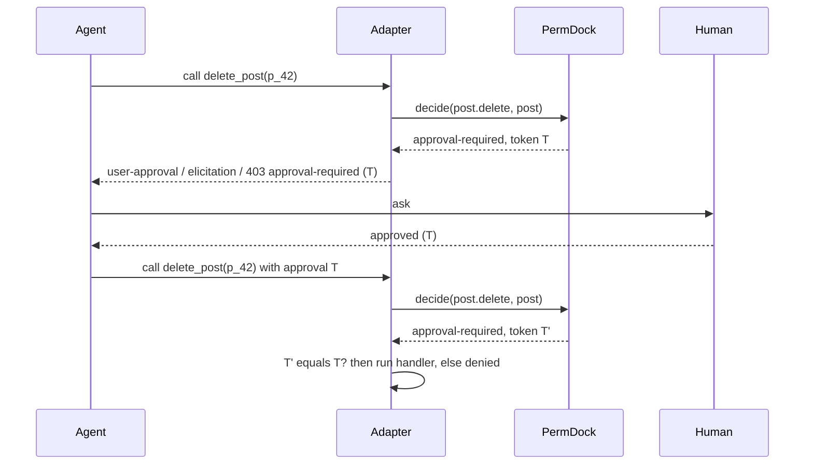

Some actions should be permitted in principle but confirmed by a person each time: refunds, deletions, publishing, anything an agent might do a thousand times before anyone notices. PermDock models this as a third decision outcome rather than a denial with a note, so every adapter can translate it into the runtime's own approval vocabulary and resume safely once a human says yes. See [decisions](/docs/concepts/decisions) and [ADR 0013](/docs/decisions/0013-three-outcome-decision).

## The grant

```ts
const member = role('member', [
  allow(permissions.post.delete, { where: { authorId: subject.id }, approval: 'human' }),
])
```

`approval: 'human'` marks the grant. When the grant matches (role applies, condition holds), `decide` returns:

```ts
{ outcome: 'approval-required', grant, reason, token }
```

If the grant does not match, the outcome is `denied` as usual; approval is never offered for something the subject could not do even with approval. If a `deny` grant applies, it wins. `can` returns `false` for `approval-required` because a boolean caller cannot ask anyone; only `decide` and the adapters see the third outcome.

## The replay-safe token

`Decision.token` is a hash of the permission key, the resource id (from the resource's `id` field), the subject and the actor. It exists so an approval given for one call cannot be attached to another: approving "delete post p_42 for user u_123 via agent A" must not authorise deleting p_43, or deleting p_42 as a different user, or the same action by a different agent. This is the problem the AI SDK's `experimental_toolApprovalSecret` addresses for its own approval replies; PermDock computes the binding itself so the guarantee holds in every runtime.

Properties:

- Deterministic for the same inputs, so a resumed request can recompute and compare.
- Includes `actor`, so an approval obtained by one agent cannot be spent by another.
- Does not include a timestamp; expiry, if wanted, is the runtime's or the application's concern (open question below).
- Carries no secret material and reveals nothing beyond what the caller already knows.

On resume, the adapter recomputes the token from the actual call being made and compares it with the approved token. A mismatch is `denied` with a reason of kind `approval`.

## Surfaces

| Runtime | How `approval-required` is surfaced | How it resumes |
| --- | --- | --- |
| AI SDK 7 `generateText` / `streamText` / `ToolLoopAgent` | `toolApproval` returns `'user-approval'` | Approval response is re-checked against `token` before the tool runs |
| AI SDK 7 `WorkflowAgent` | `needsApproval(permissions.post.delete)` suspends the durable workflow | Workflow resumes; the adapter recomputes and compares `token` |
| Claude Agent SDK | `canUseTool` returns the ask outcome; `permissionRequestHook` receives the decision | The user's answer is bound to the pending call's `token` |
| MCP | Elicitation request carrying the reason and `token` (stateless, multi-round-trip) | Client replies with the token; server re-runs `decide` and compares |
| HTTP adapters | `403` Problem Details with `type` `.../approval-required`, `permission`, `token` | Open question: how a plain HTTP client resumes (see below) |
| A2A | Skill returns a structured "approval required" result with `token` | Caller retries with the token; open question whether to use task states |
| WebMCP | Tool handler returns a structured refusal with `token`; page renders its own approval UI | Page re-invokes the guarded route with the token |
| React / Next.js UI | `usePermission` reports `allowed: false`; `decide` on the server shows `approval-required` for rendering an approval button | Server action re-checks with the token |

The AI SDK adapter fails closed: `denied` maps to `'denied'`, `approval-required` maps to `'user-approval'`, and `'not-applicable'` is never returned, in contrast to `@ai-sdk/policy-opa`, which executes tools on unrecognised decisions ([vercel/ai#19978](https://github.com/vercel/ai/issues/19978)).

## Resume flow



The second `decide` matters: the policy, the resource and the subject are re-evaluated at resume time, so a revocation between the ask and the answer (a CAEP `session-revoked`, a role change, the post being reassigned) turns the approval into a denial. The token proves the human approved *this* call; the re-check proves the call is still permitted.

## What an approval does not do

- It does not grant a permission the subject lacks. Approval sits on top of a matching grant.
- It does not persist. Each call needs its own approval unless the application stores approvals keyed by token.
- It does not identify the approver. Who may approve is the runtime's or application's concern; PermDock records the resumed decision through `on('decision')` with the token so the two events can be joined.

## Sources

- [AI SDK 7 tool approvals](https://ai-sdk.dev/docs/agents/tool-approvals): `toolApproval` outcomes and `WorkflowAgent` `needsApproval`.
- [AI SDK `needsApproval` deprecation commit](https://github.com/vercel/ai/commit/04585590ff9e93f6823ad550d59a69dc4039cdbf).
- [AI SDK policy-based tool approvals](https://ai-sdk.dev/docs/agents/policy-tool-approvals) and the [fail-open issue](https://github.com/vercel/ai/issues/19978).
- [MCP 2026-07-28 release](https://blog.modelcontextprotocol.io/posts/2026-07-28/): stateless elicitation via multi-round-trip requests.
- Product plan, "Decision" section: `token` as a hash of permission key, resource id, subject and actor.

## Open questions

- **Plain HTTP resume.** A 403 with a token tells the client what to do, but there is no standard header or body field for "here is the approval". Candidates: a request header carrying the token, a body field on the retried request, or treating approval as an application concern and only documenting the pattern. This is the open question the plan records as "how `approval-required` should surface over plain HTTP".
- Whether `token` should include an expiry or nonce, trading replay-within-window protection against the determinism that lets a resumed request recompute it.
- Whether PermDock should ship a small `ApprovalStore` interface (parallel to `LimitStore`) for applications that want approvals to persist across requests, or leave storage entirely to the runtime.
- Whether approvals can be granted in bulk for a `simulate()` plan (approve the whole plan once) and how the per-call tokens relate to a plan-level token.
