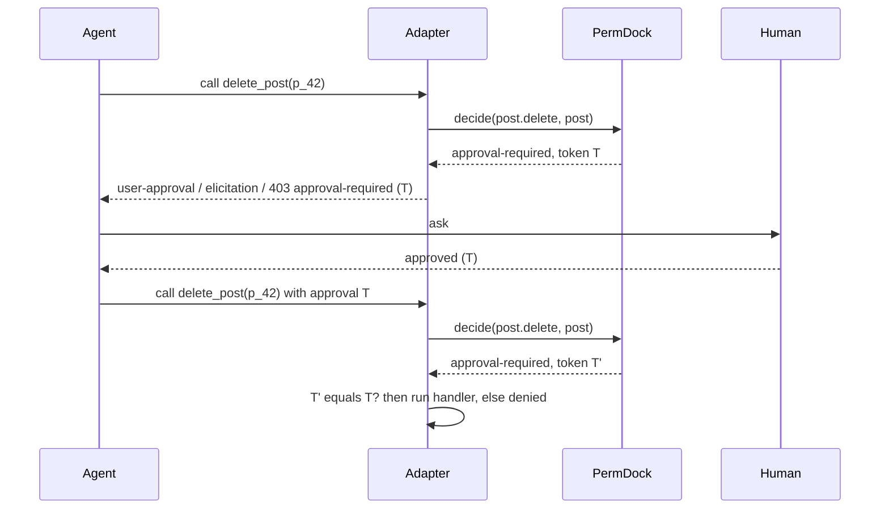

Some actions should be permitted in principle but confirmed by a person each time: refunds, deletions, publishing, anything an agent might do a thousand times before anyone notices. PermDock models this as a third decision outcome rather than a denial with a note, so every adapter can translate it into the runtime's own approval vocabulary and resume safely once a human says yes. See [decisions](/docs/concepts/decisions); the API and the resolve flow are on the [approvals adapter](/docs/adapters/approvals). Who may approve lives on the grant.

## The grant

```ts
const clerk = role('clerk', [
  allow(permissions.filing.pay, {
    approval: { by: [roles.admin, assurance({ amr: ['mfa'] })], distinct: true },
  }),
])
```

`approval: 'human'` marks a grant that any authenticated person other than the requester may resolve: neither the actor nor the principal can approve. `{ by }` names the eligible approvers with the same grantee selectors as `to` (`role`, `assurance`, `authenticated`, an array as intersection) and refuses the principal and the actor the same way. `distinct` defaults to `true`; `{ distinct: false }` lets the principal approve their own request (a user confirming their own agent's call), and `permdock doctor` PD024 lists every grant that sets it. The actor is refused either way. When the grant matches, `decide` returns:

```ts
{ outcome: 'approval-required', grant, reason, token }
```

If the grant does not match, the outcome is `denied` as usual; approval is never offered for something the subject could not do even with approval. If a `deny` grant applies, it wins. `can` returns `false` for `approval-required` because a boolean caller cannot ask anyone; only `decide` and the adapters see the third outcome.

## The replay-safe token

`Decision.token` is a hash of the permission key, the resource id (from the resource's `id` field), the principal's `id`, `tenant` and `issuer`, the actor's `id` and `kind`, and the fingerprint of the matched grant's conditions. Roles, memberships, assurance and claims are not hashed: the resume re-runs `decide`, so a role lost in between is a denial. It exists so an approval given for one call cannot be attached to another: approving "delete post p_42 for user u_123 via agent A" must not authorise deleting p_43, or deleting p_42 as a different user, or the same action by a different agent. This is the problem the AI SDK's `experimental_toolApprovalSecret` addresses for its own approval replies; PermDock computes the binding itself so the guarantee holds in every runtime.

Properties:

- Deterministic for the same inputs, so a resumed request can recompute and compare.
- Includes `actor`, so an approval obtained by one agent cannot be spent by another.
- Does not include a timestamp; expiry lives on the `ApprovalRequest` record in the store, not in the token.
- Includes the row's `version` field only for a grant with `approval: { staleOn: 'resource-change' }` (below).
- Carries no secret material and reveals nothing beyond what the caller already knows.

On resume, the adapter recomputes the token from the actual call being made and compares it with the approved token. A mismatch is `denied` with a reason of kind `approval`. A signed `permdock-approval+jwt` never replaces this comparison: it proves who resolved the request, the token proves what was approved.

## Approvals that go stale

By default the token binds the row's id, not its content: an approval for "pay invoice inv_1" stays valid if the amount changes between the ask and the resume. For actions where the approver approves the content (a payment amount, a contract text, a deploy target), the grant binds the approval to the row's version:

```ts
const permissions = definePermissions({
  invoice: resource(Invoice, { actions: ['pay'], version: 'updatedAt' }),
})

allow(permissions.invoice.pay, { approval: { by: roles.finance, staleOn: 'resource-change' } })
```

- `version` on `resource()` names the row field that changes whenever the row does: an `updatedAt` timestamp or a revision counter. Its value (a `Date` as ISO text, a string, a number) joins the token input; a row without the field hashes as `null`.
- `staleOn: 'resource-change'` needs an instance action on a resource that declares `version`. `definePolicy` throws otherwise, and a hosted grant that sets it on such a resource is dropped as `invalid`.
- On resume, `decide` runs on the current row, so a changed version recomputes a different token and the approval no longer applies. When the presented token names a pending or approved request for the same permission, resource and principal, the resume is `denied` with reason `stale-approval`, and the old record is not consumed. The next call without that token is a new `approval-required` with a new token, and the approver sees the row as it is now.
- Grants without `staleOn` hash exactly what they hashed before, so their tokens do not change.

## The store

Between the ask and the answer, the pending approval is an `ApprovalRequest` record in an `ApprovalStore`; the API is on the [approvals adapter](/docs/adapters/approvals) and the record shape on [wire formats](/docs/concepts/wire-formats#approval-request). An adapter without a `store` denies every resume (Eve and the OpenAI Agents SDK adapter default to `memoryApprovalStore()`). Rules the store and the adapters hold:

- The approver comes from authentication, never from the resume request, and is never the request's actor: an agent cannot approve its own call. Nor is it the request's principal, unless the grant sets `distinct: false`; `requireDistinctApprover` on the handler refuses the principal even then.
- Only `pending` becomes `approved` or `rejected`; `expired` is terminal. A resume against anything but `approved` is `denied`.
- An approval is spent once. A resume that enforces the call (`protect`, agent tool execution, MCP) calls the store's atomic `consume`, which sets `consumedAt`; a second resume is `denied` with detail `approval-consumed`. A store without `consume` cannot resume. The decision endpoint only inspects, so a UI check does not spend the approval.
- `create` is idempotent per token: a pending, approved or rejected record is kept until it expires, so a consumed or rejected call cannot be asked again before `expiresAt`.
- A request with a tenant is resolvable only by an approver with a membership in that tenant.
- A `simulate()` plan produces one request per `approval-required` step; approving the plan approves each token, and each step is still re-checked at execution.
- The ask, the answer and the resumed decision are three `on('decision')` records sharing `token`.

Applications that need approvals to survive a restart implement the interface over their database (a Drizzle recipe is on the adapter page). PermDock Cloud implements the same interface with an inbox UI and delivery ([Cloud adapter](/docs/adapters/cloud)).

## Surfaces

| Runtime | How `approval-required` is surfaced | How it resumes |
| --- | --- | --- |
| AI SDK 7 `generateText` / `streamText` / `ToolLoopAgent` | `toolApproval` returns `'user-approval'` | The SDK's re-check of the same `toolCallId` is `denied` unless the store holds an approved, unconsumed record for the recomputed `token`; the record is consumed before the tool runs |
| AI SDK 7 `WorkflowAgent` | `needsApproval(permissions.post.delete)` suspends the durable workflow | Workflow resumes; the adapter recomputes and compares `token` |
| Claude Agent SDK | `canUseTool` denies with the reason and `token` and records the request in the store; `permissionRequestHook` answers the SDK's own prompt with the same decision | A reviewer resolves the request in the store; the agent's retry recomputes `token` and consumes the approved record once |
| Eve | `approval.request` returns `"user-approval"`; the session parks at `session.waiting` | `approval.response` checks the responder against the store and `approvers`; on resume the adapter recomputes and compares `token` ([Eve adapter](/docs/adapters/eve)) |
| OpenAI Agents SDK | `needsApproval` returns `true`; the run returns `interruptions` and a serialisable `RunState` | `resolveInterruptions` applies the store's verdict with `state.approve` / `state.reject`; the token is recomputed before `execute` ([OpenAI adapter](/docs/adapters/openai)) |
| MCP | Structured tool result (`isError`) carrying the reason, `token` and an `elicitation: { mode: 'approval', token }` hint; the adapter sends no `elicitation/create` request | A reviewer resolves the request in the store; the retried call re-runs `decide`, compares and consumes |
| HTTP adapters | `403` Problem Details with `type` `.../approval-required`, `permission`, `token` | Client retries the same request with a `PermDock-Approval: <token>` header; the kernel requires an `approved` record, re-runs `decide` and compares |
| Terminal (`permdock/terminal`) | Interactive prompt in a TTY; `denied` in a non-TTY | The prompt writes to and reads from the same store, so a CLI approval leaves the same audit record |
| A2A | Skill returns a structured "approval required" result with `token` | The task enters `input-required`; the caller retries with the token |
| WebMCP | Tool handler returns a structured refusal with `token`; page renders its own approval UI | Page re-invokes the guarded route with the token |
| React / Next.js UI | `usePermission` reports `allowed: false`; `decide` on the server shows `approval-required` for rendering an approval button | Server action re-checks with the token |
| Chat UIs over AG-UI | The backend emits the approval request (reason, `token`, what to ask) as an AG-UI human-in-the-loop or custom event; the UI renders the control | The answer flows back on the same stream; the adapter in the backend recomputes and compares `token` ([agent frameworks](/docs/research/ecosystem-index)) |
| Slack, Microsoft Teams, Discord through the Vercel Chat SDK | The store's `approval` event triggers `requestApproval` from a `chat/workflow` step; the card carries the reason and names the approvers | The Chat SDK verifies the platform signature and returns the responder's `user.id`; the app maps it to a `Subject` and calls `store.resolve`, which applies the actor rule; the resumed call recomputes `token` ([approvals adapter](/docs/adapters/approvals), Delivery) |
| Other frameworks (LangGraph.js, Mastra, Inngest AgentKit, Google ADK) | Recipes, not adapters: `decide` in the framework's before-tool hook; `approval-required` parks as an `interrupt`, `suspend` or waiting step | The durable step resumes with the token; the same store and token check apply ([agent frameworks](/docs/research/ecosystem-index)) |

The AI SDK adapter fails closed: `denied` maps to `'denied'`, `approval-required` maps to `'user-approval'`, and `'not-applicable'` is never returned, in contrast to `@ai-sdk/policy-opa`, which executes tools on unrecognised decisions ([vercel/ai#19978](https://github.com/vercel/ai/issues/19978)).

## Resume flow



The second `decide` matters: the policy, the resource and the subject are re-evaluated at resume time, so a revocation between the ask and the answer (a CAEP `session-revoked`, a role change, the post being reassigned) turns the approval into a denial. The token proves the human approved *this* call; the re-check proves the call is still permitted.

## What an approval does not do

- It does not grant a permission the subject lacks. Approval sits on top of a matching grant.
- It does not outlive its request. Each call needs its own approval, which is consumed on use; the record expires at `expiresAt`, and a `simulate()` plan is approved step by step with no plan-level token.
- It is not remembered. A rejection applies to one call; the next call asks again, and the OpenAI SDK's `alwaysReject` is never set.
- It does not decide who may approve beyond the grant and the actor rule. `approval.by` and `approval.distinct` on the grant are copied to the `ApprovalRequest` as `approvers` and enforced by `ApprovalStore.resolve` and `approvalsHandler`. Adapter `approvers` lists (Eve, OpenAI, Chat SDK) are an extra restriction; both must pass. `requireDistinctApprover` on the handler is an application-wide floor: with it on, `distinct: false` on a grant no longer lets the principal approve.
- It is never given by a link alone. An emailed or chat link carries only the token and opens a page where the approver authenticates; the verdict goes through `approvalsHandler` with that session's subject. A link that approves without a session would make possession of the message the approver's identity ([approvals](/docs/adapters/approvals)).

## Why

- **Approvals can bind content, not only identity.** An approval is a person's judgement about what they saw. When the row can change between the ask and the resume, someone could get a small refund approved and then raise the amount before the retry. The version field is the cheapest stable signal of "the row changed" that every database already has, and putting it in the token reuses the existing comparison instead of adding a second check. It is opt-in per grant because most approvals are about the action on a row ("delete this post"), and forcing re-approval on every unrelated edit would train approvers to click yes. The resume says `stale-approval` rather than a generic mismatch, so the client can tell the user to ask again instead of retrying the same token.
- **Four eyes is the default, not an option.** A user who can approve their own request turns an approval into a confirmation dialog: the person who wants the refund is the person who says yes. So the principal is refused unless the grant opts out. Where a confirmation is what the product wants (the user approving their own agent's call in a chat), `approval: { distinct: false }` says so on the grant and PD024 keeps the list visible in review. Separation between the agent and its user was already guaranteed by the actor rule; this closes the one between the user and themselves.

## Sources

- [AI SDK 7 tool approvals](https://ai-sdk.dev/docs/agents/tool-approvals): `toolApproval` outcomes and `WorkflowAgent` `needsApproval`.
- [AI SDK `needsApproval` deprecation commit](https://github.com/vercel/ai/commit/04585590ff9e93f6823ad550d59a69dc4039cdbf).
- [AI SDK policy-based tool approvals](https://ai-sdk.dev/docs/agents/policy-tool-approvals) and the [fail-open issue](https://github.com/vercel/ai/issues/19978).
- [MCP 2026-07-28 release](https://blog.modelcontextprotocol.io/posts/2026-07-28/): stateless elicitation via multi-round-trip requests.
- [Eve human-in-the-loop](https://eve.dev/docs/human-in-the-loop): `approval` request and response policies, `session.auth.initiator` and `current`.
- [OpenAI Agents SDK human-in-the-loop](https://openai.github.io/openai-agents-js/guides/human-in-the-loop/): `needsApproval`, `interruptions`, `RunState` serialisation.
- [Vercel Chat SDK `requestApproval`](https://chat-sdk.dev) (6 August 2026): durable approval cards for Slack, Teams and Discord with signature-verified responders.
