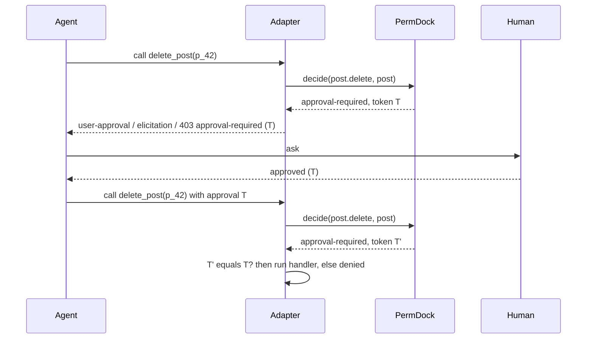

Some actions should be permitted in principle but confirmed by a person each time: refunds, deletions, publishing, anything an agent might do a thousand times before anyone notices. PermDock models this as a third decision outcome rather than a denial with a note, so every adapter can translate it into the runtime's own approval vocabulary and resume safely once a human says yes. See [decisions](/docs/concepts/decisions) and [ADR 0013](/docs/decisions/0013-three-outcome-decision).

## The grant

```ts
const member = role('member', [
  allow(permissions.post.delete, { where: { authorId: subject.id }, approval: 'human' }),
])
```

`approval: 'human'` marks the grant. When the grant matches (role applies, condition holds), `decide` returns:

```ts
{ outcome: 'approval-required', grant, reason, token }
```

If the grant does not match, the outcome is `denied` as usual; approval is never offered for something the subject could not do even with approval. If a `deny` grant applies, it wins. `can` returns `false` for `approval-required` because a boolean caller cannot ask anyone; only `decide` and the adapters see the third outcome.

## The replay-safe token

`Decision.token` is a hash of the permission key, the resource id (from the resource's `id` field), the subject and the actor. It exists so an approval given for one call cannot be attached to another: approving "delete post p_42 for user u_123 via agent A" must not authorise deleting p_43, or deleting p_42 as a different user, or the same action by a different agent. This is the problem the AI SDK's `experimental_toolApprovalSecret` addresses for its own approval replies; PermDock computes the binding itself so the guarantee holds in every runtime.

Properties:

- Deterministic for the same inputs, so a resumed request can recompute and compare.
- Includes `actor`, so an approval obtained by one agent cannot be spent by another.
- Does not include a timestamp; expiry lives on the `ApprovalRequest` record in the store, not in the token ([ADR 0022](/docs/decisions/0022-approvals-are-pluggable)).
- Carries no secret material and reveals nothing beyond what the caller already knows.

On resume, the adapter recomputes the token from the actual call being made and compares it with the approved token. A mismatch is `denied` with a reason of kind `approval`.

## The store

Between the ask and the answer, the pending approval is an `ApprovalRequest` record in an `ApprovalStore` ([approvals adapter](/docs/adapters/approvals)). Every adapter that can surface `approval-required` takes a `store` option and uses `memoryApprovalStore()` when none is given, so nothing here needs infrastructure. The record carries the `token`, the permission key, the resource id, a subject summary, the model-readable `detail`, `createdAt`, `expiresAt` (default one hour) and `status`; on resolution it gains `resolvedBy`, the approver's principal id, and `resolvedAt`. Rules the store and the adapters hold:

- The approver comes from authentication, never from the resume request, and is never the request's actor: an agent cannot approve its own call. `requireDistinctApprover` additionally excludes the principal for true four-eyes flows.
- Only `pending` becomes `approved` or `rejected`; `expired` is terminal. A resume against anything but `approved` is `denied`.
- A `simulate()` plan produces one request per `approval-required` step; approving the plan approves each token, and each step is still re-checked at execution.
- The ask, the answer and the resumed decision are three `on('decision')` records sharing `token`.

Applications that need approvals to survive a restart implement the interface over their database (a Drizzle recipe is on the adapter page). PermDock Cloud implements the same interface with an inbox UI and delivery ([Cloud adapter](/docs/adapters/cloud)).

## Surfaces

| Runtime | How `approval-required` is surfaced | How it resumes |
| --- | --- | --- |
| AI SDK 7 `generateText` / `streamText` / `ToolLoopAgent` | `toolApproval` returns `'user-approval'` | Approval response is re-checked against `token` before the tool runs |
| AI SDK 7 `WorkflowAgent` | `needsApproval(permissions.post.delete)` suspends the durable workflow | Workflow resumes; the adapter recomputes and compares `token` |
| Claude Agent SDK | `canUseTool` returns the ask outcome; `permissionRequestHook` receives the decision | The user's answer is bound to the pending call's `token` |
| Eve | `approval.request` returns `"user-approval"`; the session parks at `session.waiting` | `approval.response` checks the responder against the store and `approvers`; on resume the adapter recomputes and compares `token` ([Eve adapter](/docs/adapters/eve)) |
| OpenAI Agents SDK | `needsApproval` returns `true`; the run returns `interruptions` and a serialisable `RunState` | `resolveInterruptions` applies the store's verdict with `state.approve` / `state.reject`; the token is recomputed before `execute` ([OpenAI adapter](/docs/adapters/openai)) |
| MCP | Elicitation request carrying the reason and `token` (stateless, multi-round-trip) | Client replies with the token; server re-runs `decide` and compares |
| HTTP adapters | `403` Problem Details with `type` `.../approval-required`, `permission`, `token` | Client retries the same request with a `PermDock-Approval: <token>` header; the kernel requires an `approved` record, re-runs `decide` and compares |
| Terminal (`permdock/terminal`) | Interactive prompt in a TTY; `denied` in a non-TTY | The prompt writes to and reads from the same store, so a CLI approval leaves the same audit record |
| A2A | Skill returns a structured "approval required" result with `token` | Caller retries with the token; open question whether to use task states |
| WebMCP | Tool handler returns a structured refusal with `token`; page renders its own approval UI | Page re-invokes the guarded route with the token |
| React / Next.js UI | `usePermission` reports `allowed: false`; `decide` on the server shows `approval-required` for rendering an approval button | Server action re-checks with the token |
| Chat UIs over AG-UI | The backend emits the approval request (reason, `token`, what to ask) as an AG-UI human-in-the-loop or custom event; the UI renders the control | The answer flows back on the same stream; the adapter in the backend recomputes and compares `token` ([agent frameworks](/docs/research/agent-frameworks)) |
| Slack, Microsoft Teams, Discord through the Vercel Chat SDK | The store's `approval` event triggers `requestApproval` from a `chat/workflow` step; the card carries the reason and names the approvers | The Chat SDK verifies the platform signature and returns the responder's `user.id`; the app maps it to a `Subject` and calls `store.resolve`, which applies the actor rule; the resumed call recomputes `token` ([approvals adapter](/docs/adapters/approvals), Delivery) |
| Other frameworks (LangGraph.js, Mastra, Inngest AgentKit, Google ADK) | Recipes, not adapters: `decide` in the framework's before-tool hook; `approval-required` parks as an `interrupt`, `suspend` or waiting step | The durable step resumes with the token; the same store and token check apply ([agent frameworks](/docs/research/agent-frameworks)) |

The AI SDK adapter fails closed: `denied` maps to `'denied'`, `approval-required` maps to `'user-approval'`, and `'not-applicable'` is never returned, in contrast to `@ai-sdk/policy-opa`, which executes tools on unrecognised decisions ([vercel/ai#19978](https://github.com/vercel/ai/issues/19978)).

## Resume flow



The second `decide` matters: the policy, the resource and the subject are re-evaluated at resume time, so a revocation between the ask and the answer (a CAEP `session-revoked`, a role change, the post being reassigned) turns the approval into a denial. The token proves the human approved *this* call; the re-check proves the call is still permitted.

## What an approval does not do

- It does not grant a permission the subject lacks. Approval sits on top of a matching grant.
- It does not outlive its request. Each call needs its own approval; the record expires at `expiresAt`, and a `simulate()` plan is approved step by step.
- It does not decide who may approve beyond the actor rule. Approver eligibility (`approvers` on the agent adapters, `requireDistinctApprover`) is the application's policy; PermDock records the approver on the request and the resumed decision through `on('decision')` so the events can be joined.

## Sources

- [AI SDK 7 tool approvals](https://ai-sdk.dev/docs/agents/tool-approvals): `toolApproval` outcomes and `WorkflowAgent` `needsApproval`.
- [AI SDK `needsApproval` deprecation commit](https://github.com/vercel/ai/commit/04585590ff9e93f6823ad550d59a69dc4039cdbf).
- [AI SDK policy-based tool approvals](https://ai-sdk.dev/docs/agents/policy-tool-approvals) and the [fail-open issue](https://github.com/vercel/ai/issues/19978).
- [MCP 2026-07-28 release](https://blog.modelcontextprotocol.io/posts/2026-07-28/): stateless elicitation via multi-round-trip requests.
- [Eve human-in-the-loop](https://eve.dev/docs/human-in-the-loop): `approval` request and response policies, `session.auth.initiator` and `current`.
- [OpenAI Agents SDK human-in-the-loop](https://openai.github.io/openai-agents-js/guides/human-in-the-loop/): `needsApproval`, `interruptions`, `RunState` serialisation.
- Product plan, "Decision" section: `token` as a hash of permission key, resource id, subject and actor.
- [Vercel Chat SDK `requestApproval`](https://chat-sdk.dev) (6 August 2026): durable approval cards for Slack, Teams and Discord with signature-verified responders.

## Resolved

The following were open questions on this page until [ADR 0022](/docs/decisions/0022-approvals-are-pluggable):

- **Plain HTTP resume**: the client retries the same request with a `PermDock-Approval: <token>` header; the kernel requires an `approved` store record and re-checks. No consent endpoint in core; `approvalsHandler` provides approver routes.
- **Expiry**: on the `ApprovalRequest` record, not in the token, so the token stays deterministic.
- **`ApprovalStore`**: shipped as an interface in `permdock/approvals` with an in-memory default; persistence is the application's or the Cloud's.
- **Bulk approvals**: a `simulate()` plan yields per-step tokens approved together; there is no plan-level token.

## Open questions

- Whether approvals should be answerable through a signed link in an email without a session on the approver side, and how that link binds to the approver's identity. Chat platforms are settled: the Chat SDK's signature-verified responder is the identity ([approvals adapter](/docs/adapters/approvals), Delivery).
- Whether a `deny` verdict should be remembered for the rest of an agent run (the OpenAI SDK's `alwaysReject`) or whether every call must ask again; the current rule is per call.
