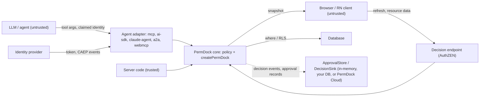

PermDock is an authorization library embedded in application code. It does not authenticate users, issue tokens or store data. Its threat model is therefore about one question: can a decision be wrong in the attacker's favour, or can the machinery around decisions leak or be bypassed. Everything below is a design constraint for Phase 1 and a test-suite checklist thereafter.

## Assets

- **Decision correctness.** A `granted` outcome for a subject that should be denied is the primary failure.
- **The policy.** Roles, grants and conditions are server-only. They describe the shape of the business and often include tenant and ownership rules.
- **Snapshots.** Serialised grants sent to clients. They reveal what a subject may do.
- **Approval tokens.** A `Decision.token` that authorises a specific action once a human approves it.
- **Audit trail.** `on('decision')` events and OTel spans. Tampering or gaps hide abuse.
- **Generated artefacts.** RLS policies, OpenAPI documents and catalogs are consumed by other systems; a wrong artefact enforces the wrong thing elsewhere.

## Trust boundaries

- **Model to adapter.** Everything a model produces (tool arguments, claimed user ids, "the user approved") is untrusted input.
- **Client to server.** Resource data and refresh requests from the browser are untrusted; the session or token that identifies the caller is trusted only after the application's real authentication has validated it.
- **Server to core.** Trusted rows from the application's own database are not re-validated (`validate: 'boundary'`).
- **Core to database.** Generated `where` clauses and RLS are trusted by the database; they must be correct and never widen access.
- **IdP to adapter.** Tokens and CAEP events are trusted only after signature and issuer verification.
- **Core to store and sink.** The approval store and decision sink are trusted server components (the same standing as the database). They never influence a decision; a resume re-runs `decide` and recomputes the token before trusting a stored `approved`.

## Invariants

1. **Fail closed.** No matching grant, an unknown role, a validation failure, a thrown condition, a rejected sub-policy, a network error to a PDP: all are `denied`. `can` never throws and never returns `true` by accident. `@ai-sdk/policy-opa` fails open on unrecognised decisions ([vercel/ai#19978](https://github.com/vercel/ai/issues/19978)); PermDock's adapters never emit `not-applicable`.
2. **Deny overrides allow.** A `deny` grant in any applicable role wins over every `allow`. Allows OR together; denies AND against them.
3. **Unknown reference is a type error.** Permissions are typed references; a grant for a permission outside `permissions`, or a check with the wrong arity, does not compile. At runtime, a key that `findPermission` cannot resolve is denied.
4. **Prototype-safe paths.** Condition field paths and `subject.*` references are resolved with own-property lookups; `__proto__`, `constructor` and `prototype` segments are rejected at definition time and never traversed.
5. **No eval.** Portable conditions are data interpreted by a fixed evaluator. Closures are user code, branded non-portable, and never reconstructed from a string. Nothing in a snapshot, catalog or RLS import is executed.
6. **Boundary validation.** Data that crossed a trust boundary is validated against the resource's Standard Schema before a rule runs. A schema that cannot validate synchronously raises `PermDockValidationError` rather than skipping validation.
7. **Never trust model-supplied subjects.** `principal`, `actor`, `delegation`, `memberships` and the active `tenant` come from the adapter's verified `authInfo`, session, signature, or a `MembershipSource` / `RoleSource` the server owns, never from tool arguments, prompt content, request bodies or unsigned headers. A tool argument named `userId` or `orgId` is data about the resource, not the subject. There is never a default tenant: an absent or unmatched tenant means tenant-scoped grants do not apply ([tenancy](/docs/concepts/tenancy)).
8. **`service_role` is never emitted.** RLS generation never writes policies for bypass roles and never suggests them.
9. **The decision endpoint sits behind real authentication.** The AuthZEN endpoint answers for the authenticated caller only. A shared "public secret" in client code (the Kilpi endpoint pattern) is obfuscation, not authentication, and is not supported as a configuration.
10. **Server-only imports never reach client entries.** `definePolicy`, `createPermDock` and adapters live in server entry points; `permdock/react` exports only snapshot consumers. Bundle tests enforce it.
11. **Snapshots reveal grants, scoped snapshots limit it.** A snapshot tells the client what its subject may do, including conditions. It never contains other subjects' grants, role definitions beyond names, closures (they serialise as `{ portable: false }`) or opaque SQL. `snapshot({ include: [...] })` limits a route to the features it renders.
12. **Approval tokens are replay-safe.** `Decision.token` is a hash of permission key, resource id, subject and actor. An approval for one call cannot be replayed on another. See [approvals](/docs/security/approvals).
13. **Quotas are server-side.** `limit` grants (Phase 4) are enforced by a `LimitStore` the server owns, never by the client snapshot.
14. **Immutable, request-scoped instances.** `createPermDock` returns a frozen object per request; nothing mutates shared state between requests.
15. **No network call to decide.** `can`, `decide`, `assert`, `filter`, `where`, `simulate` and `snapshot` run in-process; the `pdp` provider is the only opt-in exception. Approval stores, decision sinks and snapshot sources are interfaces with in-process defaults; PermDock Cloud is one implementation and is never required ([ADR 0021](/docs/decisions/0021-embedded-pdp-hosted-ads)).

## Threat table

| Threat | Mitigation | Where documented |
| --- | --- | --- |
| Model claims to be another user in tool arguments | Subject only from verified `authInfo`; arguments are resource data | [MCP adapter](/docs/adapters/mcp), invariant 7 |
| Prompt injection asks the agent to call a tool it lacks | Tool list filtered per caller; handler re-checks; `denied` with alternatives | [MCP authorization](/docs/standards/mcp-authorization), [OWASP mapping](/docs/security/owasp-agentic) |
| Malformed or oversized tool arguments | Boundary validation against the resource schema | [Validation](/docs/concepts/validation) |
| Agent exceeds the user it acts for | Decision = principal grants ∩ delegation; widening chain hops rejected | [Delegation](/docs/security/delegation) |
| Replayed approval on different arguments | `token` hash bound to permission, resource id, subject, actor; re-checked on resume | [Approvals](/docs/security/approvals) |
| Client edits its snapshot to grant itself access | Snapshot is advisory for UI only; every mutation is re-checked server-side | [Snapshots](/docs/concepts/snapshots) |
| Client calls the decision endpoint for another subject | Endpoint ignores request-body subject; uses the authenticated session | [AuthZEN](/docs/standards/authzen), invariant 9 |
| Snapshot leaks tenant rules to the browser | Scoped snapshots; closures and opaque conditions never serialised | [Snapshots](/docs/concepts/snapshots), invariant 11 |
| Policy imported into a client bundle | Server-only entry points; bundle tests | invariant 10 |
| Prototype pollution through condition paths | Own-property lookups; forbidden segments rejected | invariant 4 |
| Code execution through a snapshot or import | No eval; conditions are data | invariant 5 |
| Deny rule silently ignored | Deny overrides allow, tested in the policy matrix | [Policies](/docs/concepts/policies), invariant 2 |
| Async schema skips validation | Sync requirement; `PermDockValidationError` | [Standard Schema](/docs/standards/standard-schema) |
| Remote PDP unreachable | Denied, never granted | [pdp provider](/docs/adapters/pdp), invariant 1 |
| Stale snapshot after revocation | CAEP receiver invalidates by subject | [Shared Signals](/docs/standards/shared-signals-caep) |
| Generated RLS widens access | Never emits `service_role`; `deny` becomes RESTRICTIVE; `verify` parity tests | [Postgres RLS](/docs/standards/postgres-rls) |
| RLS import executes attacker SQL | Import parses to AST; opaque SQL is stored, never run app-side | [Postgres RLS](/docs/standards/postgres-rls) |
| Denial body leaks other users' grants | Problem Details bounded to the subject's own view | [Problem Details](/docs/standards/problem-details) |
| Agent floods a paid action | `limit` grants with server-side `LimitStore` (Phase 4) | [Policies](/docs/concepts/policies) |
| Unsigned bot impersonates an agent | Web Bot Auth verification fails closed; unsigned requests have no `actor` | [Web Bot Auth](/docs/standards/web-bot-auth) |
| Decisions not auditable | `on('decision')` carries outcome, reasons, actor, delegation; `permdock/otel` | [Audit and observability](/docs/concepts/audit-and-observability) |
| Token with `alg: none`, or an RSA public key replayed as an HMAC secret (key confusion) | Explicit `algorithms` allow-list, `none` never accepted, keys only from the configured JWKS, `jku` / `x5u` / `jwk` headers ignored | [JWT adapter](/docs/adapters/jwt), [Authentication](/docs/concepts/authentication) |
| Unverified claims used for grants (decoded JWT, `X-User-Id` header, client-supplied `userId`) | Only `subjectFrom*` outputs and framework session APIs feed the subject; verification failure yields anonymous, never a partial principal | [Authentication](/docs/concepts/authentication), [Server kernel](/docs/adapters/server-kernel) |
| Access token in a query string (logged by proxies, leaked via `Referer`) | Tokens read from `Authorization` / `DPoP` headers only; rejected outright under `profile: 'fapi2'` | [JWT adapter](/docs/adapters/jwt), [FAPI 2.0](/docs/standards/fapi-2) |
| Stale token honoured after revocation or role change | `exp` and `session_expiry` bound `expiresAt`; CAEP `session-revoked` / `credential-change` invalidate by subject; role-from-`context` when freshness matters | [Authentication](/docs/concepts/authentication), [Shared Signals](/docs/standards/shared-signals-caep) |
| Privilege escalation through user-editable claims (`user_metadata.role = 'admin'`, Clerk unsafe metadata) | Providers read only server-set claims (`app_metadata`, hook-injected claims, backend-set metadata); user-editable metadata is never a grant source | [Supabase provider](/docs/adapters/supabase), [Clerk provider](/docs/adapters/clerk) |
| Roles or tenant derived from SSO material that is not authoritative (the domain of `email`, a group display name, a missing `hd` or `tid` replaced by a default tenant) | Tenant from a server-set tenant claim (`hd`, `tid`, `org_id`) compared against onboarded tenants, absent claim means no tenant; roles from app roles, a groups claim filter or group object ids mapped server-side, never display names; `permdock doctor` `PD010` / `PD011` flag the claim paths | [Authentication](/docs/concepts/authentication) single sign-on, [doctor](/docs/cli/doctor) |
| Tenant switch to an organisation the user does not belong to (forged `orgId` in a URL, header or `refresh({ tenant })` body) | The active tenant is accepted only when a membership in the verified subject matches; otherwise every tenant-scoped check is `denied` with `no-membership` and the snapshot is empty for that tenant; the row's tenant key is compared against the membership, not against the request | [Tenancy](/docs/concepts/tenancy), invariant 7 |
| Cross-tenant row reached through a valid role (an Acme admin updates a Globex post by id) | Scoped roles require the row's `scopes.tenant.key` to equal the membership tenant, `denied` with `tenant-mismatch`; collection actions require the active tenant to hold the role; the same `memberOf` node compiles into RLS so the database enforces it too | [Tenancy](/docs/concepts/tenancy), [RLS](/docs/adapters/rls) |
| Tenant admin defines a custom role wider than the policy allows | Custom roles are data that compose declared `assignable` roles only; an unknown or non-assignable name resolves to nothing; a custom role cannot carry conditions; `assignable()` intersects with what the assigner holds | [Tenancy](/docs/concepts/tenancy), [ADR 0024](/docs/decisions/0024-scoped-roles-and-memberships) |
| Team or group membership keyed on an editable display name, or inherited through an unbounded group graph | Memberships key on provider or SCIM `id` / `value`, never `display`; nested groups are flattened by the directory before they reach PermDock, and resource role derivation follows only declared `parent` fields (no self-reference) | [JWT authorization claims](/docs/standards/jwt-authorization-claims), [Tenancy](/docs/concepts/tenancy) |
| Expired or revoked membership still honoured (time-bound access, off-boarded team member) | `Membership.expiresAt` is checked on every evaluation and compiled into RLS; membership rows are re-read per request through the `MembershipSource` or refreshed with the session; CAEP events invalidate snapshots by subject | [Tenancy](/docs/concepts/tenancy), [Shared Signals](/docs/standards/shared-signals-caep) |
| Simulated ("view as") snapshot used to obtain a real approval token or mutate data | Snapshots carry `simulated: true`; the decision endpoint and `approvalsHandler` refuse them; only a subject holding a preview permission may request one | [UI](/docs/concepts/ui), [Snapshots](/docs/concepts/snapshots) |
| Terminal token stored on disk read by another process or user | Short-lived, scoped tokens in the OS credential store where available, file mode `0600` otherwise; refresh tokens never written in plain text; CAEP revocation where the issuer supports it | [Terminal adapter](/docs/adapters/terminal) |
| Agent-run CLI claims an actor or principal via `--actor` or a bare `PERMDOCK_ACTOR` name (as opposed to a verified `PERMDOCK_ACTOR_TOKEN` JWT) | Flags and environment variables never build a subject; actor and principal come from a verified token (device grant, client credentials, workload identity) or the process is anonymous | [Terminal adapter](/docs/adapters/terminal), [Authentication](/docs/concepts/authentication) |
| Non-interactive approval bypass (`--yes`, piped stdin, agent answering its own prompt) | `approval-required` in a non-TTY resolves to `denied`; approval `token` is bound to permission, resource id, subject and actor, so a scripted answer cannot approve a different call | [Terminal adapter](/docs/adapters/terminal), [Approvals](/docs/security/approvals) |
| OpenAPI Overlay strips `security` before the document is published | `permdock openapi --check` applies the Overlay in CI and diffs the result against the generated `security` requirements; a removed or weakened requirement fails the build | [OpenAPI adapter](/docs/adapters/openapi), [OpenAPI Overlay](/docs/standards/openapi-overlay) |
| Approval store tampered with (a record flipped from `pending` to `approved`, or a forged record inserted) | The store is a trusted server component like the database; resume still re-runs `decide` and recomputes `token`, so a forged record for a different call fails the comparison; `approval` events give an audit trail of every transition | [Approvals adapter](/docs/adapters/approvals), [ADR 0022](/docs/decisions/0022-approvals-are-pluggable) |
| Approver identity spoofed (agent approves its own call, or the approve request names an approver) | Approver comes only from authentication (`subject` on `approvalsHandler`, Eve's `responder`, the session); an approver equal to the request's `actor` is refused; `requireDistinctApprover` also excludes the principal | [Approvals](/docs/security/approvals), [Eve adapter](/docs/adapters/eve) |
| Approval answered from a chat platform by a spoofed or replayed interaction (forged Slack payload, a card forwarded to someone outside `approvers`) | The Chat SDK verifies the platform's request signature before it returns the responder's `user.id`; the application maps that id to a `Subject` server-side, never from the message body; `store.resolve` applies the actor rule; the resumed call recomputes `token`, so a replayed interaction cannot approve a different call | [Approvals adapter](/docs/adapters/approvals) Delivery, [Approvals](/docs/security/approvals) |
| Approval reused after the window (long-lived pending approval spent later) | `expiresAt` on the request record; `expire()` marks stale records; resume against an expired record is `denied` | [Approvals adapter](/docs/adapters/approvals) |
| `PERMDOCK_CLOUD_KEY` leaked to a client bundle or log | Server-only entry; `tests/bundle` asserts no client entry reaches `permdock/cloud`; `permdock doctor` flags `NEXT_PUBLIC_*` or client imports; keys are per environment and rotatable; the key never authorises a decision | [Cloud adapter](/docs/adapters/cloud) |
| Unauthenticated or cross-environment caller on the hosted ADS | Vercel OIDC or client-credentials token verified with `permdock/jwt`; `aud` bound to the environment; no shared-secret mode; body `subject` ignored unless the caller is a registered trusted PEP | [Cloud adapter](/docs/adapters/cloud), [AuthZEN adapter](/docs/adapters/authzen), invariant 9 |
| Cloud unreachable or returning an unknown format | Decisions never depend on the Cloud (invariant 15); the sink drops to `on('error')`; an unknown `v` is rejected; a resume that cannot read its record is `denied` | [Cloud adapter](/docs/adapters/cloud), invariant 1 |

## Out of scope

- Authentication, login, session management and token issuance (providers and frameworks own these; PermDock consumes their result). Token *verification* is in scope only for the optional `permdock/jwt` entry and the provider adapters, never for core; see [Authentication and PermDock](/docs/concepts/authentication) and [ADR 0018](/docs/decisions/0018-authentication-is-upstream).
- Protecting the server process itself (secrets, dependency supply chain) beyond PermDock's own zero-runtime-dependency core.
- Preventing an application from calling `can` with the wrong permission; types reduce this, tests and the `audit-permissions` skill catch the rest.

## Open questions

- Whether `denials` and `alternatives` in 403 bodies should be off by default in production (see [Problem Details](/docs/standards/problem-details)).
- The `LimitStore` interface and whether quotas belong in core at all.
- Whether to verify delegation chains in core or trust the token layer (see [delegation](/docs/security/delegation)).
- Whether approvals answered through a signed link (email, Slack action) without an approver session are acceptable, and how the link binds to an identity (see [approvals](/docs/security/approvals)).
