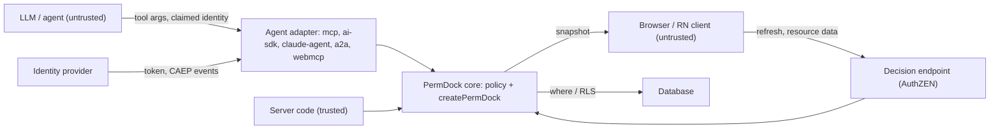

PermDock is an authorization library embedded in application code. It does not authenticate users, issue tokens or store data. Its threat model is therefore about one question: can a decision be wrong in the attacker's favour, or can the machinery around decisions leak or be bypassed. Everything below is a design constraint for Phase 1 and a test-suite checklist thereafter.

## Assets

- **Decision correctness.** A `granted` outcome for a subject that should be denied is the primary failure.
- **The policy.** Roles, grants and conditions are server-only. They describe the shape of the business and often include tenant and ownership rules.
- **Snapshots.** Serialised grants sent to clients. They reveal what a subject may do.
- **Approval tokens.** A `Decision.token` that authorises a specific action once a human approves it.
- **Audit trail.** `on('decision')` events and OTel spans. Tampering or gaps hide abuse.
- **Generated artefacts.** RLS policies, OpenAPI documents and catalogs are consumed by other systems; a wrong artefact enforces the wrong thing elsewhere.

## Trust boundaries

- **Model to adapter.** Everything a model produces (tool arguments, claimed user ids, "the user approved") is untrusted input.
- **Client to server.** Resource data and refresh requests from the browser are untrusted; the session or token that identifies the caller is trusted only after the application's real authentication has validated it.
- **Server to core.** Trusted rows from the application's own database are not re-validated (`validate: 'boundary'`).
- **Core to database.** Generated `where` clauses and RLS are trusted by the database; they must be correct and never widen access.
- **IdP to adapter.** Tokens and CAEP events are trusted only after signature and issuer verification.

## Invariants

1. **Fail closed.** No matching grant, an unknown role, a validation failure, a thrown condition, a rejected sub-policy, a network error to a PDP: all are `denied`. `can` never throws and never returns `true` by accident. `@ai-sdk/policy-opa` fails open on unrecognised decisions ([vercel/ai#19978](https://github.com/vercel/ai/issues/19978)); PermDock's adapters never emit `not-applicable`.
2. **Deny overrides allow.** A `deny` grant in any applicable role wins over every `allow`. Allows OR together; denies AND against them.
3. **Unknown reference is a type error.** Permissions are typed references; a grant for a permission outside `permissions`, or a check with the wrong arity, does not compile. At runtime, a key that `findPermission` cannot resolve is denied.
4. **Prototype-safe paths.** Condition field paths and `subject.*` references are resolved with own-property lookups; `__proto__`, `constructor` and `prototype` segments are rejected at definition time and never traversed.
5. **No eval.** Portable conditions are data interpreted by a fixed evaluator. Closures are user code, branded non-portable, and never reconstructed from a string. Nothing in a snapshot, catalog or RLS import is executed.
6. **Boundary validation.** Data that crossed a trust boundary is validated against the resource's Standard Schema before a rule runs. A schema that cannot validate synchronously raises `PermDockValidationError` rather than skipping validation.
7. **Never trust model-supplied subjects.** `principal`, `actor` and `delegation` come from the adapter's verified `authInfo`, session or signature, never from tool arguments or prompt content. A tool argument named `userId` is data about the resource, not the subject.
8. **`service_role` is never emitted.** RLS generation never writes policies for bypass roles and never suggests them.
9. **The decision endpoint sits behind real authentication.** The AuthZEN endpoint answers for the authenticated caller only. A shared "public secret" in client code (the Kilpi endpoint pattern) is obfuscation, not authentication, and is not supported as a configuration.
10. **Server-only imports never reach client entries.** `definePolicy`, `createPermDock` and adapters live in server entry points; `permdock/react` exports only snapshot consumers. Bundle tests enforce it.
11. **Snapshots reveal grants, scoped snapshots limit it.** A snapshot tells the client what its subject may do, including conditions. It never contains other subjects' grants, role definitions beyond names, closures (they serialise as `{ portable: false }`) or opaque SQL. `snapshot({ include: [...] })` limits a route to the features it renders.
12. **Approval tokens are replay-safe.** `Decision.token` is a hash of permission key, resource id, subject and actor. An approval for one call cannot be replayed on another. See [approvals](/docs/security/approvals).
13. **Quotas are server-side.** `limit` grants (Phase 4) are enforced by a `LimitStore` the server owns, never by the client snapshot.
14. **Immutable, request-scoped instances.** `createPermDock` returns a frozen object per request; nothing mutates shared state between requests.

## Threat table

| Threat | Mitigation | Where documented |
| --- | --- | --- |
| Model claims to be another user in tool arguments | Subject only from verified `authInfo`; arguments are resource data | [MCP adapter](/docs/adapters/mcp), invariant 7 |
| Prompt injection asks the agent to call a tool it lacks | Tool list filtered per caller; handler re-checks; `denied` with alternatives | [MCP authorization](/docs/standards/mcp-authorization), [OWASP mapping](/docs/security/owasp-agentic) |
| Malformed or oversized tool arguments | Boundary validation against the resource schema | [Validation](/docs/concepts/validation) |
| Agent exceeds the user it acts for | Decision = principal grants ∩ delegation; widening chain hops rejected | [Delegation](/docs/security/delegation) |
| Replayed approval on different arguments | `token` hash bound to permission, resource id, subject, actor; re-checked on resume | [Approvals](/docs/security/approvals) |
| Client edits its snapshot to grant itself access | Snapshot is advisory for UI only; every mutation is re-checked server-side | [Snapshots](/docs/concepts/snapshots) |
| Client calls the decision endpoint for another subject | Endpoint ignores request-body subject; uses the authenticated session | [AuthZEN](/docs/standards/authzen), invariant 9 |
| Snapshot leaks tenant rules to the browser | Scoped snapshots; closures and opaque conditions never serialised | [Snapshots](/docs/concepts/snapshots), invariant 11 |
| Policy imported into a client bundle | Server-only entry points; bundle tests | invariant 10 |
| Prototype pollution through condition paths | Own-property lookups; forbidden segments rejected | invariant 4 |
| Code execution through a snapshot or import | No eval; conditions are data | invariant 5 |
| Deny rule silently ignored | Deny overrides allow, tested in the policy matrix | [Policies](/docs/concepts/policies), invariant 2 |
| Async schema skips validation | Sync requirement; `PermDockValidationError` | [Standard Schema](/docs/standards/standard-schema) |
| Remote PDP unreachable | Denied, never granted | [pdp provider](/docs/adapters/pdp), invariant 1 |
| Stale snapshot after revocation | CAEP receiver invalidates by subject | [Shared Signals](/docs/standards/shared-signals-caep) |
| Generated RLS widens access | Never emits `service_role`; `deny` becomes RESTRICTIVE; `verify` parity tests | [Postgres RLS](/docs/standards/postgres-rls) |
| RLS import executes attacker SQL | Import parses to AST; opaque SQL is stored, never run app-side | [Postgres RLS](/docs/standards/postgres-rls) |
| Denial body leaks other users' grants | Problem Details bounded to the subject's own view | [Problem Details](/docs/standards/problem-details) |
| Agent floods a paid action | `limit` grants with server-side `LimitStore` (Phase 4) | [Policies](/docs/concepts/policies) |
| Unsigned bot impersonates an agent | Web Bot Auth verification fails closed; unsigned requests have no `actor` | [Web Bot Auth](/docs/standards/web-bot-auth) |
| Decisions not auditable | `on('decision')` carries outcome, reasons, actor, delegation; `permdock/otel` | [Audit and observability](/docs/concepts/audit-and-observability) |

## Out of scope

- Authentication, session management and token validation (providers and frameworks own these; PermDock consumes their result).
- Protecting the server process itself (secrets, dependency supply chain) beyond PermDock's own zero-runtime-dependency core.
- Preventing an application from calling `can` with the wrong permission; types reduce this, tests and the `audit-permissions` skill catch the rest.

## Open questions

- Whether `denials` and `alternatives` in 403 bodies should be off by default in production (see [Problem Details](/docs/standards/problem-details)).
- The `LimitStore` interface and whether quotas belong in core at all.
- Whether to verify delegation chains in core or trust the token layer (see [delegation](/docs/security/delegation)).
- How `approval-required` surfaces over plain HTTP without a session to resume into (see [approvals](/docs/security/approvals)).
