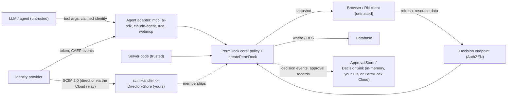

PermDock is an authorization library embedded in application code. It does not authenticate users, issue tokens or store data. Its threat model is therefore about one question: can a decision be wrong in the attacker's favour, or can the machinery around decisions leak or be bypassed. Everything below is a design constraint and a test-suite checklist.

## Assets

- **Decision correctness.** A `granted` outcome for a subject that should be denied is the primary failure.
- **The policy.** Roles, grants and conditions are server-only. They describe the shape of the business and often include tenant and ownership rules.
- **Snapshots.** Serialised grants sent to clients. They reveal what a subject may do.
- **Approval tokens.** A `Decision.token` that authorises a specific action once a human approves it.
- **Audit trail.** `on('decision')` events and OTel spans. Tampering or gaps hide abuse.
- **Generated artefacts.** RLS policies, OpenAPI documents and catalogs are consumed by other systems; a wrong artefact enforces the wrong thing elsewhere.

## Trust boundaries

- **Model to adapter.** Everything a model produces (tool arguments, claimed user ids, "the user approved") is untrusted input.
- **Client to server.** Resource data and refresh requests from the browser are untrusted; the session or token that identifies the caller is trusted only after the application's real authentication has validated it.
- **Server to core.** Every row is validated unless the caller marks it `trusted: true` because the application loaded it from its own database (`validate: 'boundary'`).
- **Core to database.** Generated `where` clauses and RLS are trusted by the database; they must be correct and never widen access.
- **IdP to adapter.** Tokens and CAEP events are trusted only after signature and issuer verification.
- **IdP or Cloud relay to `scimHandler`.** Provisioning writes are accepted only with the tenant's static bearer or an RFC 7523 bearer verified against the Cloud JWKS; the tenant is the credential's, never the body's. What lands in the store becomes memberships bounded by declared `assignable` roles.
- **Core to store and sink.** The approval store and decision sink are trusted server components (the same standing as the database). They never influence a decision; a resume re-runs `decide` and recomputes the token before trusting a stored `approved`.

## Invariants

1. **Fail closed.** No matching grant, an unknown role, a validation failure, a thrown condition, a rejected sub-policy, a network error to a PDP: all are `denied`. `can` never throws and never returns `true` by accident. `@ai-sdk/policy-opa` fails open on unrecognised decisions ([vercel/ai#19978](https://github.com/vercel/ai/issues/19978)); PermDock's adapters never emit `not-applicable`.
2. **Deny overrides allow.** A `deny` grant in any applicable role wins over every `allow`. Allows OR together; denies AND against them.
3. **Unknown reference is a type error.** Permissions are typed references; a grant for a permission outside `permissions`, or a check with the wrong arity, does not compile. At runtime, a key that `findPermission` cannot resolve is denied.
4. **Prototype-safe paths.** Condition field paths and `subject.*` references are resolved with own-property lookups; `__proto__`, `constructor` and `prototype` segments are rejected at definition time and never traversed.
5. **No eval.** Portable conditions are data interpreted by a fixed evaluator. Closures are user code, branded non-portable, and never reconstructed from a string. Nothing in a snapshot, catalog or RLS import is executed.
6. **Boundary validation.** Data is untrusted by default and validated against the resource's Standard Schema before a rule runs. A schema that cannot validate synchronously raises `PermDockValidationError` rather than skipping validation.
7. **Never trust model-supplied subjects.** `principal`, `actor`, `delegation`, `memberships` and the active `tenant` come from the adapter's verified `authInfo`, session, signature, or a `MembershipSource` / `RoleSource` the server owns, never from tool arguments, prompt content, request bodies or unsigned headers. A tool argument named `userId` or `orgId` is data about the resource, not the subject. There is never a default tenant: an absent or unmatched tenant means tenant-scoped grants do not apply ([tenancy](/docs/concepts/tenancy)).
8. **`service_role` is never emitted.** RLS generation never writes policies for bypass roles and never suggests them.
9. **The decision endpoint sits behind real authentication.** The AuthZEN endpoint answers for the authenticated caller only. A shared "public secret" in client code (the Kilpi endpoint pattern) is obfuscation, not authentication, and is not supported as a configuration.
10. **Server-only imports never reach client entries.** `definePolicy`, `createPermDock` and adapters live in server entry points; `permdock/react` exports only snapshot consumers. Bundle tests enforce it.
11. **Snapshots reveal grants, scoped snapshots limit it.** A snapshot tells the client what its subject may do, including conditions. It never contains other subjects' grants, role definitions beyond names, closures (they serialise as `{ portable: false }`) or opaque SQL. `snapshot({ include: [...] })` limits a route to the features it renders.
12. **Approval tokens are replay-safe and single-use.** `Decision.token` is a hash of the permission key, the resource id, the principal's `id`, `tenant` and `issuer`, the actor's `id` and `kind`, and the matched grant's condition fingerprint. An approval for one call cannot be replayed on another, and `ApprovalStore.consume` spends it once. See [approvals](/docs/security/approvals).
13. **Quotas are server-side.** `limit` grants are enforced by a `LimitStore` the server owns, never by the client snapshot. `can` never consumes. A `LimitStore` failure denies with `limit-unavailable`.
14. **Immutable, request-scoped instances.** `createPermDock` returns a frozen object per request; nothing mutates shared state between requests.
15. **No network call to decide.** `can`, `decide`, `assert`, `filter`, `where`, `simulate` and `snapshot` run in-process; the `pdp` provider is the only opt-in exception. Approval stores, decision sinks and snapshot sources are interfaces with in-process defaults; PermDock Cloud is one implementation and is never required. The Cloud may relay directory provisioning into a `DirectoryStore` the application owns; it still implements neither `MembershipSource` nor `RoleSource`, and in that bring-your-own mode holds no authoritative copy. In Cloud-native directory mode the Cloud is the directory of record, and its facts reach `decide` only as claims on a token the application verifies locally, never through a request-time call.

## Threat table

| Threat | Mitigation | Where documented |
| --- | --- | --- |
| Model claims to be another user in tool arguments | Subject only from verified `authInfo`; arguments are resource data | [MCP adapter](/docs/adapters/mcp), invariant 7 |
| Prompt injection asks the agent to call a tool it lacks | Tool list filtered per caller; handler re-checks; `denied` with alternatives | [MCP authorization](/docs/standards/mcp-authorization), [OWASP mapping](/docs/security/owasp-agentic) |
| MCP tool registered on the raw server, outside `protectServer` (an OpenAPI-to-MCP bridge wiring its own tools) | Only tools registered through the guarded server carry a `permission`; a tool with none stays listed and callable, so bridges register on the server `protectServer` returns. `mcp-oauth` asserts per-token tool lists | [MCP adapter](/docs/adapters/mcp) |
| A filtered `tools/list` served from a shared cache to another caller | Filtered list results are marked `cacheScope: 'private'`; the list is rebuilt per request from `authInfo` | [MCP adapter](/docs/adapters/mcp) |
| A PEP spoofs a subject in an AuthZEN body (a browser or service claims to evaluate for another user) | The body subject, actor and delegation are ignored unless `trustedPep` accepts the authenticated caller; otherwise the caller itself is evaluated. `tests/runtimes` asserts both on Node, Bun, Deno and workerd | [AuthZEN](/docs/adapters/authzen) |
| Malformed or oversized tool arguments | Boundary validation against the resource schema | [Validation](/docs/concepts/validation) |
| Agent exceeds the user it acts for | Decision = principal grants ∩ delegation; chain attenuation is enforced by the token layer, and core evaluates only the final delegation | [Delegation](/docs/security/delegation) |
| An agent inherits the user's full authority because its adapter found no scopes (an in-process agent, a signed Web Bot Auth request with no token) | An `actor` with no `delegation`, or one with no `scopes`, `authorizationDetails` or `access`, is denied every check with `no-delegation`, and its snapshot carries empty `scopes`; agent adapters have no default `delegation`. A delegated entry with an `identifier` covers only that resource id | [Delegation](/docs/security/delegation), invariant 1 |
| Replayed approval on different arguments | `token` hash bound to permission, resource id, principal id, tenant and issuer, actor; re-checked on resume | [Approvals](/docs/security/approvals) |
| Replayed approval on the same call | `ApprovalStore.consume` makes an approval single-use; a replay is `approval-consumed` | [approvals](/docs/adapters/approvals) |
| ABAC condition reads a user-editable claim (a region or clearance from Supabase `user_metadata`), or request context the database never sees | Claim refs compile into RLS only as `principal.claims.*` from the verified token; the docs name server-set claims (the access token hook, `app_metadata`) as the only source and `subjectFromSupabase` never lifts `user_metadata` into roles; a `context.*` ref is refused by `permdock rls generate` and listed by doctor PD027, so it cannot silently fall out of the database policy | [RLS](/docs/adapters/rls#subject-attributes-abac), [Supabase](/docs/adapters/supabase) |
| Row changed between approval and resume (a small refund approved, then the amount raised before the retry) | With `approval: { staleOn: 'resource-change' }` the token hashes the resource's `version` field, so the resume recomputes a different token and denies with `stale-approval`; without `staleOn`, the approval binds the row id only, which the approvals page states | [Approvals](/docs/security/approvals#approvals-that-go-stale) |
| Admin of another tenant approves or lists a request | Every approval with a tenant needs an approver membership there; the inbox lists only the approver's tenants | [Approvals adapter](/docs/adapters/approvals) |
| Client edits its snapshot to grant itself access | Snapshot is advisory for UI only; every mutation is re-checked server-side | [Snapshots](/docs/concepts/snapshots) |
| Client calls the decision endpoint for another subject | Endpoint ignores request-body subject; uses the authenticated session. AuthZEN honours a body subject, actor or delegation only for a PEP the `trustedPep` allow-list accepts (off by default) | [AuthZEN](/docs/adapters/authzen), invariant 9 |
| Forged row in a decision-endpoint body or an A2A task | `resource.properties` validated at the boundary; a throwing AuthZEN loader denies instead of evaluating the request's `{ id }` stub; A2A never uses the task body as the row and requires a `data` loader for instance skills | [AuthZEN](/docs/adapters/authzen), [A2A](/docs/adapters/a2a) |
| Tool runs after a denial because a boolean hook cannot deny | AI SDK `needsApproval` throws on denial; the post-approval re-check denies without a recorded approval | [AI SDK](/docs/adapters/ai-sdk) |
| Protected Nest handler reached over GraphQL, WebSocket or RPC | Guard denies a protected non-HTTP route unless `request` maps the context | [Nest](/docs/adapters/nest) |
| Internal error details leak through tRPC error data | `errorFormatter` merges only PermDock Problem Details | [tRPC](/docs/adapters/trpc) |
| Snapshot leaks tenant rules to the browser | Scoped snapshots; closures and opaque conditions never serialised | [Snapshots](/docs/concepts/snapshots), invariant 11 |
| Policy imported into a client bundle | Server-only entry points; bundle tests | invariant 10 |
| Prototype pollution through condition paths | Own-property lookups; forbidden segments rejected | invariant 4 |
| Code execution through a snapshot or import | No eval; conditions are data | invariant 5 |
| Deny rule silently ignored | Deny overrides allow, tested in the policy matrix; a deny whose closure throws or whose condition is opaque or unanswerable denies instead of being skipped, and `not` cannot turn an opaque node into a match | [Policies](/docs/concepts/policies), invariant 2 |
| Async schema skips validation | Sync requirement; `PermDockValidationError` | [Standard Schema](/docs/standards/standard-schema) |
| Remote PDP unreachable | Denied, never granted | [pdp provider](/docs/adapters/pdp), invariant 1 |
| A cached remote PDP answer reused for another tenant, agent or row | The cache key holds the mapped request (subject, resource properties, action), the permission key, the principal's issuer, the tenant and the actor id and kind; the cache is bounded and drops expired entries | [pdp provider](/docs/adapters/pdp) |
| A delegated permission read as granted from a pending Promise (`if (permdock.can(...))` on an async instance) | The request-scoped instance stays synchronous and denies delegated permissions with `pdp-unavailable`; only `protect` awaits the provider when the adapter has `pdp` | [pdp provider](/docs/adapters/pdp), invariant 1 |
| Stale snapshot after revocation | CAEP receiver invalidates by subject | [Shared Signals](/docs/standards/shared-signals-caep) |
| A demoted member keeps using a sensitive permission until their token expires | Permissions in the policy's `fresh` list deny with `stale-credentials` when token memberships are behind the source's authorization version (`authz_ver`, bumped by generated triggers on every membership change) or either version is missing; the snapshot drops those allows too; `jwt_expiry = 900` bounds the rest | [Supabase token hook](/docs/adapters/supabase-hook) |
| A user writes a membership column (`user_id`, `customer_id`, `role`, `expires_at`) on a row they may edit, such as their own contact record, and the hook and helpers read it as a membership | Membership sources name their deciding columns; doctor PD028 warns while the migrations leave any of them insertable or updatable by `anon` or `authenticated`, and models a column-level `revoke` under a table-level grant as still writable, as Postgres does | [Supabase token hook](/docs/adapters/supabase-hook#sources), [doctor](/docs/cli/doctor) |
| A user sets their own attribute (`region`, `clearance`) through `user_metadata` or a writable profile column, and an attribute condition grants rows | The hook's `attrs` come only from allow-listed server-owned columns and `app_metadata`; `generate` refuses `user_metadata`; the migration refuses to install while `anon` or `authenticated` can insert or update a listed column; incoming `attrs` are replaced; doctor PD028 | [Supabase token hook](/docs/adapters/supabase-hook#attributes), [RLS](/docs/adapters/rls#subject-attributes-abac) |
| A token too large for the cookie silently drops memberships | The generated hook keeps the active tenant's memberships first and sets `memberships_truncated`; `claimsFirst` then reads every membership from the source | [Supabase token hook](/docs/adapters/supabase-hook) |
| The application (or a client) edits a membership the identity provider provisioned, and the next sync reverts or diverges | `managedBy: 'idp'` on SCIM memberships; `decideRoleChange` refuses with `externally-managed`; the generated `permdock_protect_managed` trigger raises `42501` for `anon` and `authenticated` writes | [Supabase token hook](/docs/adapters/supabase-hook), [SCIM](/docs/adapters/scim) |
| Generated RLS widens access | Never emits `service_role`; `deny` becomes RESTRICTIVE; `verify` parity tests | [Postgres RLS](/docs/standards/postgres-rls) |
| A share on a parent folder leaks a restricted subfolder, or a deep or cyclic tree exhausts the evaluator | A restricted row stops the walk in `can` and in the closure triggers alike; walks read at most `depth` ancestors (default 16, at most 32); a cycle denies with `relation-depth` and the triggers refuse a write that creates one; `rls verify --tree` checks parity on a tree with restricted branches | [Relationships](/docs/concepts/relationships), [RLS closure table](/docs/adapters/rls#closure-table) |
| A graph read fails and a relation deny is skipped, or a pending lookup reads as granted | Any `RelationSource` failure fails the grant; on a deny it denies the decision; a Promise is never awaited on the decision path and is `relation-unavailable` until `loadRelations` loads it | [Relationships](/docs/concepts/relationships), invariant 1 |
| The closure table exposes another tenant's folder tree | RLS is enabled on `permdock_closure` and `authenticated` reads only rows whose ancestor its own `permitted_<resource>_ids` returns; snapshots carry no graph facts | [RLS closure table](/docs/adapters/rls#closure-table) |
| An access review trusts a partial holder list | `whoCan` sets `complete: false` whenever a grantee cannot be enumerated and confirms every listed holder with a full decision; it never grants | [Relationships](/docs/concepts/relationships#whocan) |
| SQL function twin drifts from the live helper | `sqlFunction` twins are proven by `rls verify --db`; import fingerprints the deparsed AST; opaque SQL never runs app-side | [conditions](/docs/concepts/conditions), [RLS](/docs/adapters/rls) |
| RLS import executes attacker SQL | Import parses to AST; opaque SQL is stored, never run app-side | [Postgres RLS](/docs/standards/postgres-rls) |
| A client reads a field-limited column straight from the table, or through a view that runs as its owner | `fields` redact in the application; `rls generate --fields views` adds a `security_invoker` `<table>_visible` whose restricted columns are `case when <permitted> then col end` over the row policy's own helper calls, and `--revoke-columns` leaves `anon` and `authenticated` only the unrestricted columns of the table. The owner-rights `<table>_visible_fields` companion masks every column with the whole field decision, denies included, keeps only rows with a readable column and is a `security_barrier` view, so reading it directly reveals nothing `pick` hides; with `FORCE ROW LEVEL SECURITY` and an owner without `BYPASSRLS` it returns no rows (fail-closed). Field-only read denies leave the row policy but stay in the masks. When a view `anon` reads calls the helpers, `anon` may execute them; they find no subject and return nothing. `rls verify` and `rlsParity({ fieldViews })` compare the view with `pick`; doctor PD030 flags columns the table still returns | [RLS field security](/docs/adapters/rls#field-security) |
| Supabase `authorize()` answers a tenant request from global roles (a member of Acme passes `authorize('post.update', globex_id)`) | Tenant-scoped grants pass the row's tenant; `authorizeSql` checks it against the membership table (database mode) or the `memberships` claim (JWT mode) and returns `false` when neither is configured | [Supabase provider](/docs/adapters/supabase), [rls](/docs/cli/rls) |
| A revoked role keeps working in Postgres until the token expires | `--authorize database` (the default) reads `user_roles` per statement; JWT mode is opt-in and doctor PD019 warns when `jwt_expiry` exceeds an hour with sensitive grants | [Supabase provider](/docs/adapters/supabase), [doctor](/docs/cli/doctor) |
| The access-token hook is callable by clients or resolves unqualified names | The hook runs with `set search_path = ''`, every name is schema-qualified, `execute` is revoked from `authenticated`, `anon` and `public`, and only `supabase_auth_admin` reads `user_roles` | [Supabase provider](/docs/adapters/supabase) |
| Denial body leaks other users' grants | Problem Details bounded to the subject's own view; `denials` and `alternatives` are included in every environment because they name only roles and permissions the subject already holds | [Problem Details](/docs/standards/problem-details) |
| Agent floods a paid action | `limit` grants with server-side `LimitStore`; an exhausted limit answers `429` with `Retry-After` and `RateLimit` fields so a well-behaved client backs off, and a store that cannot answer is `503`, never a grant | [Policies](/docs/concepts/policies), [RateLimit header fields](/docs/standards/ratelimit-headers) |
| A caller walks ids to learn which rows exist (a private repository, a patient record), from `403` versus `404` | `disclosure: 'hide'` on the resource: a denied check on a loaded row answers with the same `404` `/not-found` body and headers as a missing row, including for an anonymous caller; the reason stays on the decision event. Only denials that arise once the subject holds a matching grant (step-up, limits) still answer as themselves | [Permissions](/docs/concepts/permissions) |
| A route with an id in its path checks the permission without the row, so any holder of the permission reaches every id (BOLA, OWASP API1) | `protect(permission, loader)` decides against the loaded row; doctor PD036 flags a `protect(permission)` with no loader on a route whose path names an id | [doctor](/docs/cli/doctor#pd036-id-route-without-a-row-loader) |
| A response returns columns the grant's `fields` leave out (OWASP API3) | `pick` after the check returns only listed fields; writes check each field against the stored row | [Policies](/docs/concepts/policies#field-level-responses) |
| Unsigned bot impersonates an agent | Web Bot Auth verification fails closed; unsigned requests have no `actor` | [Web Bot Auth](/docs/standards/web-bot-auth) |
| Decisions not auditable | `on('decision')` carries outcome, reasons, actor, delegation; `permdock/otel` | [Audit and observability](/docs/concepts/audit-and-observability) |
| Token with `alg: none`, or an RSA public key replayed as an HMAC secret (key confusion) | Explicit `algorithms` allow-list, `none` never accepted, keys only from the configured JWKS, `jku` / `x5u` / `jwk` headers ignored | [JWT adapter](/docs/adapters/jwt), [Authentication](/docs/concepts/authentication) |
| Algorithm confusion within a family (an `EdDSA` token verified against a `crv: Ed448` key, or a curve the allow-list did not intend) | Fully-specified algorithm names per RFC 9864 (`Ed25519`, `ES256`, `PS256`); polymorphic `EdDSA` accepted only when the resolved key is `crv: Ed25519`; `permdock doctor` flags `EdDSA` in configuration | [JOSE](/docs/standards/jose), [JWT adapter](/docs/adapters/jwt) |
| Discovery document spoofed or redirected (a `jwks_uri` pointing at an attacker's keys, an `issuer` that differs from the one asked for) | `discovery` is HTTPS only; the document's `issuer` must equal the configured issuer byte for byte (Discovery 4.3, RFC 8414 3.3) or the document is rejected and tokens stay anonymous; `jwks_uri` is taken only from a matching document; the token never names its own JWKS | [OpenID Connect](/docs/standards/openid-connect), [JWT adapter](/docs/adapters/jwt) |
| ID token presented as an access token (a token meant for the RP's front end, with `aud` = client id and `nonce`, replayed at the API) | `typ` checked (`at+jwt` or `JWT`, `at+jwt` only under FAPI 2.0); ID tokens are rejected with cause `wrong-token-type` unless `accept: 'id-token'` is an explicit opt-in, and then never carry `delegation` | [OpenID Connect](/docs/standards/openid-connect), [JWT adapter](/docs/adapters/jwt) |
| Encrypted token without integrity, or a JWE used to smuggle an unsigned payload (`alg: RSA1_5`, `enc` without an inner signature) | JWE accepted only when `decryptionKeys` is configured, only as a nested JWS with `cty: JWT`, never `RSA1_5`, never `zip`; anything else is `encrypted-token` and anonymous | [JOSE](/docs/standards/jose), [JWT adapter](/docs/adapters/jwt) |
| Signed snapshot or decision export accepted from the wrong signer, or after key rotation with a stale key | Verifier is configured with the signer's JWKS and the exact `typ`; header `alg` must be in the allow-list and `kid` must resolve; `aud` and `exp` are checked before the private claim is read; rotation keeps the old key published until every artefact signed with it has expired; a failed snapshot is treated as absent (`server-only`), never as a partial grant set | [Wire formats](/docs/concepts/wire-formats), [Cloud adapter](/docs/adapters/cloud), [JOSE](/docs/standards/jose) |
| Same `sub` from two issuers treated as one principal (grant or approval collision across identity providers) | `principal.issuer` is set by every `subjectFrom*`; grants, memberships, approvals and audit key on `issuer` + `id` | [Subject](/docs/concepts/subject), [subject](/docs/concepts/subject) |
| Claimed `act` nest that is not an object with a string `sub`, or an unsigned GNAP `access` array used as a new input | `subjectFromJwt` / `subjectFromIntrospection` yield anonymous with cause `invalid-chain`; `delegation.access` is only read from verified claims or an introspection body the RS already authenticated, then intersected with grants and never widened | [JWT adapter](/docs/adapters/jwt), [delegation](/docs/security/delegation) |
| Unverified claims used for grants (decoded JWT, `X-User-Id` header, client-supplied `userId`) | Only `subjectFrom*` outputs and framework session APIs feed the subject; verification failure yields anonymous, never a partial principal | [Authentication](/docs/concepts/authentication), [Server kernel](/docs/adapters/server-kernel) |
| Access token in a query string (logged by proxies, leaked via `Referer`) | Tokens read from `Authorization` / `DPoP` headers only; rejected outright under `profile: 'fapi2'` | [JWT adapter](/docs/adapters/jwt), [FAPI 2.0](/docs/standards/fapi-2) |
| Stale token honoured after revocation or role change | `exp` and `session_expiry` bound `expiresAt`; CAEP `session-revoked` / `credential-change` invalidate by subject; role-from-`context` when freshness matters | [Authentication](/docs/concepts/authentication), [Shared Signals](/docs/standards/shared-signals-caep) |
| Share link that never dies, is replayed after revocation, or is forwarded to someone it was not meant for | A capability is a `permdock-capability+jwt` with a required `exp`; `subjectFromCapability` requires `iss` and `aud`, binds `sub` to the capability id, calls `revoked(id)` and denies when it throws, claims the `jti` of a one-time link in a `ReplayStore` (and refuses one without a store), applies the linked scope instances' `linkPolicy` at resolution so a tenant's tightened rules reach links already issued, and checks `redeemer` against the request's own verified subject, never a link; every failure is the anonymous subject | [Link capabilities](/docs/concepts/capabilities), [JWT adapter](/docs/adapters/jwt) |
| A share link escalates beyond its record (an `owner` role named in the link, a guest link reading sibling rows or drafts) | A link principal holds one `{ on }` membership and no roles or scope memberships, so only resource-scoped grants on that resource (and its children through their parent field) can match, with their row conditions; `permissions` narrows further through `delegation.scopes`; issuing is application code guarded by its own permission | [Link capabilities](/docs/concepts/capabilities), [Tenancy](/docs/concepts/tenancy) |
| Leaked or stolen API key (database dump, a key in a repository, a key that outlived its owner's role) | Keys are opaque `pdk_<id>_<secret><checksum>` with 256-bit secrets and a CRC-32 checksum so secret scanners find leaked keys without false positives; only the SHA-256 hash is stored and compared in constant time; `expiresAt` is required unless the tenant's `credentials` settings set `allowNoExpiry` (doctor PD029); `subjectFromApiKey` re-reads expiry, `revoked(id)` and the tenant settings on every use, so a tightened rule reaches existing keys; a user-bound key is its owner's live rights intersected with the key through `coveredByDelegation`, so a demotion, suspension or deletion reaches it at once; a missing owner or any throwing store is the anonymous subject | [API keys](/docs/concepts/credentials) |
| A key or service account that does more than its creator could (a developer minting an admin CI key, a key minting keys, an OAuth client widening itself) | `decideCredential` bounds a service key by the creator's `assignableRoles` and `assignablePermissions` in its one tenant (`exceeds-creator`), refuses link and credential creators, keeps a delegated creator inside its delegation, and binds an approval token to the key's content and creator; a service principal holds one tenant membership from the credential and nothing else | [API keys](/docs/concepts/credentials), [Custom roles](/docs/concepts/custom-roles) |
| A capability used as an access token, or an access token used as a capability | Distinct `typ`: `subjectFromJwt` accepts only `at+jwt` / `JWT`, `subjectFromCapability` only `permdock-capability+jwt` | [JOSE](/docs/standards/jose) |
| Database reached with a forged or stale capability claim | Postgres never sees the link token: `exchangeCapability` mints a short-lived `role: 'anon'` token (default 300 seconds, never past the capability's expiry, never `service_role`, no `sub`) signed with the project's own key after verification; `permdock_capability_ids` also checks `v`, `holder`, the role, the permission and `expiresAt`; revocation reaches the database within the exchanged token's lifetime | [Supabase adapter](/docs/adapters/supabase), [RLS](/docs/cli/rls) |
| Forged, replayed or indefinitely valid Security Event Token (a SET may omit `exp`, RFC 8417) | `joseTokenVerifier` waives `exp` only for `typ: secevent+jwt` and then requires `iat`; the SSF receiver checks `iss`, `aud`, `iat` within tolerance and claims each `jti` once per issuer in its `ReplayStore`; a SET is an invalidation signal, never a decision input, so a replay can only revoke again | [SSF adapter](/docs/adapters/ssf), [JOSE](/docs/standards/jose) |
| Privilege escalation through user-editable claims (`user_metadata.role = 'admin'`, Clerk unsafe metadata) | Providers read only server-set claims (`app_metadata`, hook-injected claims, backend-set metadata); user-editable metadata is never a grant source | [Supabase provider](/docs/adapters/supabase), [Clerk provider](/docs/adapters/clerk) |
| A session object from another library is trusted without its verification state (`{ kind: 'anon' }` or `{ kind: 'invalid' }` carrying stale claims) | `subjectFromSupabaseSession` maps only `kind: 'user'`; every other or unknown `kind` is the anonymous subject, whatever `claims` holds | [Supabase provider](/docs/adapters/supabase) |
| A token Supabase's OAuth server issued to a third-party app (`client_id`) is treated as the user, or plans for one tenant leak into another | `subjectFromSupabase` maps `client_id` and `act` to an actor that needs a delegation covering each permission, from `scope`; `plans` reads only the active tenant's entry of the claim. The exported `actorOf` reads only `act` and `client_id`, and its `{ ok: false }` (a malformed `act`) must deny. Callers apply the role rule first: `anon` and `service_role` map to the anonymous subject and never carry an actor | [Supabase provider](/docs/adapters/supabase#actor-and-delegation-actorof-and-delegationof) |
| Roles or tenant derived from SSO material that is not authoritative (the domain of `email`, a group display name, a missing `hd` or `tid` replaced by a default tenant) | Tenant from a server-set tenant claim (`hd`, `tid`, `org_id`) compared against onboarded tenants, absent claim means no tenant; roles from app roles, a groups claim filter or group object ids mapped server-side, never display names; `permdock doctor` `PD010` / `PD011` flag the claim paths | [Authentication](/docs/concepts/authentication) single sign-on, [doctor](/docs/cli/doctor) |
| SAML assertion trusted without termination (a raw assertion posted to an API, or a `permdock/saml` entry) | Not accepted. Only a session or JWT from the SSO layer that already terminated SAML reaches `subjectFrom*` | [Authentication](/docs/concepts/authentication) Enterprise SSO, [PermDock Cloud](/docs/adapters/cloud) |
| Tenant switch to an organisation the user does not belong to (forged `orgId` in a URL, header or `refresh({ tenant })` body) | The active tenant is accepted only when a membership in the verified subject matches; otherwise every tenant-scoped check is `denied` with `no-membership` and the snapshot is empty for that tenant; the row's tenant key is compared against the membership, not against the request | [Tenancy](/docs/concepts/tenancy), invariant 7 |
| Cross-tenant row reached through a valid role (an Acme admin updates a Globex post by id) | Scoped roles require the row's key for the role's scope (and each declared ancestor) to equal the membership's instance, through a membership of exactly that scope (no cascade), `denied` with `tenant-mismatch`; collection actions require the active tenant to hold the role; the same `memberOf` node compiles into RLS so the database enforces it too | [Tenancy](/docs/concepts/tenancy), [RLS](/docs/adapters/rls) |
| A list query returns rows from every org the user belongs to (`where()` combined every allow with no tenant filter) | `where()` ANDs each tenant or team grant with its membership and drops memberships outside the active tenant; with no active tenant, tenant grants contribute nothing. `ormParity` checks Drizzle, Kysely and Prisma 7 against `filter()` on Postgres | [snapshots](/docs/concepts/snapshots) |
| Previous user's permission UI still in the DOM after sign-out (Next.js App Router keeps visited routes as hidden trees; a client-side sign-out leaves them) | Sign out through a document navigation: a form POST to a Route Handler that clears the session, expires the user's cache tag and answers `303` | [Next.js Cache Components](/docs/guides/next-cache-components) |
| Cross-tenant write through a proposed row (a member of Acme creates `{ orgId: 'globex' }` under `/acme/projects`, or an update pair moves `orgId` from Acme to Globex) | The tenant check runs on the proposed row of a collection write and on both rows of an update pair, server and client alike, `denied` with `tenant-mismatch`; `testHttpAdapter` sends the cross-tenant create through every HTTP adapter | [Tenancy](/docs/concepts/tenancy), [testing](/docs/adapters/testing) |
| A global middleware caches a tenantless instance that a later tenant-scoped route reuses | The kernel caches one instance per `(Request, tenant)` and every adapter resolves `tenant` again on each `protect`, from its own framework context; RPC adapters read each procedure's own input, so a batch never shares a tenant | [Server kernel](/docs/adapters/server-kernel) |
| Tenant admin defines a custom role wider than the policy allows | Custom roles are data resolved by one function (`resolveCustomRole`) and intersected with the ceiling: the code allows of declared `assignable` roles in the role's scope, never hosted grants; unknown keys, keys outside the ceiling and grants carrying a condition are dropped and reported (`validateCustomRole`, doctor PD023); every custom-role grant inherits the declared grant's condition, approval and limit, and the source role's declared denies; a declared role name always wins over a custom one | [Custom roles](/docs/concepts/custom-roles), [tenancy](/docs/concepts/tenancy) |
| A row written straight into the custom-role tables, or a forged `grants` claim entry, widens database access | The generated helpers resolve custom roles only through the `permdock_ceiling` view of assignable declared roles; a permission outside it reaches no grant key; the tables have RLS on and no privileges for `anon` or `authenticated`; the claim is read only with `--custom-roles` and only from a token the database already trusts | [Custom roles](/docs/concepts/custom-roles), [RLS](/docs/adapters/rls) |
| Tenant admin hands out more than they hold | `assignableRoles()` and `assignablePermissions()` intersect the ceiling, narrowed by `RoleSource.assignable`, with what the assigner holds in that tenant; only a held role or granted permission marked `meta.manageRoles` lifts it; a throwing `assignable` assigns nothing; the save action re-checks on the server with `validateCustomRole`; with an `assigns` graph, a role hands out exactly what it lists | [Custom roles](/docs/concepts/custom-roles) |
| An identity-provider group, or a Clerk organization plan, grants more than the application allows (a group mapped to `owner`, a principal id read as SCIM filter syntax, an `o:` plan from one organization used in another) | Core drops `assignable: false` roles from `managedBy: 'idp'` memberships; `directoryMembershipSource` looks users up with a structured `eq` node, never interpolated filter text; `subjectFromClerk` puts `o:` plans and features on the session organization's membership, so they match only while it is the active tenant | [SCIM](/docs/adapters/scim), [Clerk](/docs/adapters/clerk) |
| An admin promotes themselves, demotes the last owner, or gives an external (guest, contact, partner) membership an admin role | `decideRoleChange` takes the actor from the instance, never from the change, and refuses self-changes (`self-demotion`), roles outside the actor's `assigns` (`not-assignable-by`), kinds outside the role's `for` (`not-allowed-for-membership`), and count breaks (`last-holder`, `max-holders`, `transfer-only`), failing closed when the holder count is unknown; a role held through a kind its `for` does not list grants nothing in `decide`, snapshots and generated RLS; the generated holder-count and transfer-only triggers refuse a write that skipped the check | [Ownership](/docs/concepts/ownership) |
| A role change or activation names another organization's ancestors in `within`, or an expired membership still assigns roles or mints credentials | `decideRoleChange` and `activate` read the tenant and ancestors from the subject's live membership and deny a disagreeing `within` with `no-membership`; a `within` with no held membership counts only with `{ trusted: true }`, set by the application after loading it; the activation token covers `within`; expired memberships give no tenant, no `assignableRoles` and no credential ceiling | [Ownership](/docs/concepts/ownership), [Elevated access](/docs/concepts/elevated-access) |
| Team or group membership keyed on an editable display name, or inherited through an unbounded group graph | Memberships key on provider or SCIM `id` / `value`, never `display`; nested groups are flattened by the directory before they reach PermDock, and resource role derivation follows only declared `parent` fields (no self-reference) | [JWT authorization claims](/docs/standards/jwt-authorization-claims), [Tenancy](/docs/concepts/tenancy) |
| Expired or revoked membership still honoured (time-bound access, off-boarded team member) | `Membership.expiresAt` is checked on every evaluation and compiled into RLS; membership rows are re-read per request through the `MembershipSource` or refreshed with the session; CAEP events invalidate snapshots by subject | [Tenancy](/docs/concepts/tenancy), [Shared Signals](/docs/standards/shared-signals-caep) |
| A disabled organization or suspended user keeps database access until their token refreshes (`jwt` mode claims still name the membership) | `rls.suspension` makes every generated helper, `authorize()` and the Supabase token hook check the users and scope-instance status tables live, in both modes; a disabled ancestor voids nested memberships; a missing status row counts as suspended; the in-process side reads the same status through the `MembershipSource` | [Scopes](/docs/concepts/scopes), [RLS](/docs/cli/rls) |
| Simulated ("view as") snapshot used to obtain a real approval token or mutate data | Snapshots carry `simulated: true`; the decision endpoint and `approvalsHandler` refuse them; only a subject holding a preview permission may request one | [UI](/docs/concepts/ui), [Snapshots](/docs/concepts/snapshots) |
| Terminal token stored on disk read by another process or user | Short-lived, scoped tokens in the OS credential store where available, file mode `0600` otherwise; refresh tokens never written in plain text; CAEP revocation where the issuer supports it | [Terminal adapter](/docs/adapters/terminal) |
| Agent-run CLI claims an actor or principal via `--actor` or a bare `PERMDOCK_ACTOR` name (as opposed to a verified `PERMDOCK_ACTOR_TOKEN` JWT) | Flags and environment variables never build a subject; actor and principal come from a verified token (device grant, client credentials, workload identity) or the process is anonymous | [Terminal adapter](/docs/adapters/terminal), [Authentication](/docs/concepts/authentication) |
| A CI job token accepted as a user, or a token minted for another audience or another provider reused | `subjectFromCiOidc` pins the provider's issuer and JWKS, requires `aud`, returns only a `workload` principal (`sub` as the id, repository and ref as attributes, no roles from the token) and is anonymous on any failure, including a failing `schema` | [Terminal adapter](/docs/adapters/terminal), [Authentication](/docs/concepts/authentication) |
| A destructive command run by accident or by an agent answering `y` | A `destructive` permission needs the resource id typed at a terminal; without one the command exits `64` unless `--yes` is passed; `--dry-run` decides without running or consuming quota | [Terminal adapter](/docs/adapters/terminal#destructive-commands-and-dry-runs) |
| Non-interactive approval bypass (`--yes`, piped stdin, agent answering its own prompt) | `--yes` only waives the destructive confirmation; `approval-required` in a non-TTY resolves to `denied`; approval `token` is bound to permission, resource id, subject and actor, so a scripted answer cannot approve a different call | [Terminal adapter](/docs/adapters/terminal), [Approvals](/docs/security/approvals) |
| OpenAPI Overlay strips `security` before the document is published | `permdock openapi --check` applies the Overlay in CI and diffs the result against the generated `security` requirements; a removed or weakened requirement fails the build | [OpenAPI adapter](/docs/adapters/openapi), [OpenAPI Overlay](/docs/standards/openapi-overlay) |
| Approval store tampered with (a record flipped from `pending` to `approved`, or a forged record inserted) | The store is a trusted server component like the database; resume still re-runs `decide` and recomputes `token`, so a forged record for a different call fails the comparison; `approval` events give an audit trail of every transition | [Approvals adapter](/docs/adapters/approvals), [approvals](/docs/adapters/approvals) |
| Approver identity spoofed (agent approves its own call, or the approve request names an approver) | Approver comes only from authentication (`subject` on `approvalsHandler`, Eve's `responder`, the session); an approver equal to the request's `actor` is refused; `approval.by` refuses an ineligible approver (`approver-not-eligible`) | [Approvals](/docs/security/approvals), [Eve adapter](/docs/adapters/eve), [approval security](/docs/security/approvals) |
| Requester approves their own request (a user asks their agent for a refund and approves it) | The principal is refused as approver on every approval (`approver-is-principal`); only `approval: { distinct: false }` on the grant lifts it, doctor PD024 lists each opt-out, `requireDistinctApprover` on the handler overrides the opt-out, and a hosted grant cannot add one (`weaker-approval`) | [Approval security](/docs/security/approvals), [approvals adapter](/docs/adapters/approvals), [doctor](/docs/cli/doctor) |
| Approval answered from a chat platform by a spoofed or replayed interaction (forged Slack payload, a card forwarded to someone outside `approvers`) | The Chat SDK verifies the platform's request signature before it returns the responder's `user.id`; the application maps that id to a `Subject` server-side, never from the message body; `store.resolve` applies the actor rule; the resumed call recomputes `token`, so a replayed interaction cannot approve a different call | [Approvals adapter](/docs/adapters/approvals) Delivery, [Approvals](/docs/security/approvals) |
| Approval reused after the window (long-lived pending approval spent later) | `expiresAt` on the request record; `expire()` marks stale records; resume against an expired record is `denied` | [Approvals adapter](/docs/adapters/approvals) |
| `PERMDOCK_CLOUD_KEY` leaked to a client bundle or log | Server-only entry; `tests/bundle` asserts no client entry reaches `permdock/cloud`; `permdock doctor` flags `NEXT_PUBLIC_*` or client imports; keys are per environment and rotatable; the key never authorises a decision | [Cloud adapter](/docs/adapters/cloud) |
| Unauthenticated or cross-environment caller on the hosted ADS | Vercel OIDC or client-credentials token verified with `permdock/jwt`; `aud` bound to the environment; no shared-secret mode; body `subject` ignored unless the caller is a registered trusted PEP | [Cloud adapter](/docs/adapters/cloud), [AuthZEN adapter](/docs/adapters/authzen), invariant 9 |
| Hosted policy document replayed from another environment, or a snapshot served unsigned by a compromised proxy | `cloud()` verifies the `permdock-policy+jwt` with `iss` and `aud` both equal to the environment URL (`<url>/v1/environments/<environment>`) and the environment JWKS, so a document signed for another environment is rejected; `snapshots.get()` sends `Accept: application/jwt` and throws on anything but a compact JWS; `hostable` still bounds every hosted grant | [Cloud adapter](/docs/adapters/cloud), [Wire formats](/docs/concepts/wire-formats) |
| Cloud unreachable or returning an unknown format | Decisions never depend on the Cloud (invariant 15); the sink drops to `on('error')`; an unknown `v` is rejected; a resume that cannot read its record is `denied` | [Cloud adapter](/docs/adapters/cloud), invariant 1 |
| SCIM endpoint called with a leaked, guessed or another tenant's credential (forged `POST /Users`, a `Group` with roles for a tenant the caller does not own) | `scimHandler` authenticates every request with a per-tenant static bearer compared against a stored hash, or an RFC 7523 JWT bearer through `verifier` (`aud` = the endpoint, tenant claim); the tenant is bound to the credential and never read from a body or path; an unauthenticated request is a SCIM `401` and writes nothing; every method on `DirectoryStore` takes the tenant first | [SCIM adapter](/docs/adapters/scim), [SCIM](/docs/standards/scim), invariant 7 |
| Compromised or malicious SCIM source or Cloud relay pushes groups that grant wide access | A group's `roles` extension can only name roles the policy declared `assignable`; unknown names are dropped; `directoryMembershipSource` produces memberships, never grants or conditions; the relay's bearer is verified against the Cloud JWKS and cannot reach the store any other way; every replayed operation is in the Cloud sync log and a `directory` event plus a `membership` event per affected user in the sink, so the change is visible and reversible | [SCIM adapter](/docs/adapters/scim), [Audit and observability](/docs/concepts/audit-and-observability) |
| Deprovisioned user keeps access (IdP sets `active: false` or deletes, but cached memberships or snapshots still hold) | `directoryMembershipSource` yields no memberships for an inactive or deleted user on the next read; `scimHandler` publishes CAEP `session-revoked` into the `revocations` feed and `onChange` (`kind: 'session-revoked'`) on deactivation or delete, so open streams and sockets end and the application invalidates cached snapshots for the affected principals; a CAEP transmitter at the same IdP sends the same signal through `permdock/ssf`; the residual window is the snapshot `expiresAt` and is stated in the runbook | [SCIM adapter](/docs/adapters/scim), [Authentication](/docs/concepts/authentication) Lifecycle |
| Cloud relay outage or Cloud-side directory copy treated as authoritative (bring-your-own mode) | The Cloud never implements `MembershipSource` or `RoleSource` and holds no authoritative copy of what it relays; the IdP retries against the relay and the relay retries against `scimHandler`; the store the application owns keeps its last state and decisions continue from it (invariant 15) | [Cloud adapter](/docs/adapters/cloud), [PermDock Cloud](/docs/adapters/cloud) |
| Governance action from the Cloud (rejecting an actor's pending approvals, invalidating snapshots) mistaken for a deny, or a "freeze" that leaves an agent running | Governance actions operate on the store and the snapshot source only; a future `decide` is unaffected until the application's own `RoleSource` or `context` reads a kill-switch it owns; the Cloud UI states this and never shows a "deny" control | [Audit and observability](/docs/concepts/audit-and-observability) Evidence and governance, [PermDock Cloud](/docs/adapters/cloud) |
| Webhook receiver in another trust domain accepts a forged or replayed CloudEvents batch | Deliveries are always signed; receivers verify the JWS batch (`typ: permdock-decisions+jwt`, Cloud JWKS, `aud` = the receiver, `exp`) with `verifyWebhook`, which has no unsigned mode, rejects event types outside the closed list and drops a replayed `jti` through a `ReplayStore`; a webhook delivers evidence and approval notifications, never an approval resolution | [Cloud integrations](/docs/adapters/cloud-integrations), [Wire formats](/docs/concepts/wire-formats) |
| Agent resolves an approval through the Cloud's MCP server, or reads another tenant's evidence | The Cloud MCP server is read-only (evidence queries, pending approvals, catalog and drift); no tool resolves an approval; the OAuth token's subject and tenant scope the queries; approver identity comes only from the Cloud's own authentication | [Cloud integrations](/docs/adapters/cloud-integrations), [Approvals](/docs/security/approvals) |
| Trusted-issuer connector misconfigured on the Cloud (wrong JWKS, an issuer that mints tokens for many tenants) | The ADS and snapshot edge verify with `permdock/jwt` under the same rules as the application (`iss`, `aud`, `typ`, algorithm allow-list); a tenant claim with no onboarded connection is no tenant; the connector can widen who is authenticated at the Cloud, never what the embedded engine decides | [Cloud integrations](/docs/adapters/cloud-integrations), [Authentication](/docs/concepts/authentication) |
| Relation grantee matches on a client-supplied field (`authorId` posted in a body) | Boundary validation runs the resource schema first; only rows the caller marks `trusted: true` skip it; the relation still compiles to the same portable `where` the evaluator, `filter` and RLS use | [Policies](/docs/concepts/policies), [RLS](/docs/adapters/rls), invariant 9 |
| An upgrade hint reveals a feature the subject could not reach on any plan, or a client grants on the hint | `not-entitled` is added only for grants whose roles the subject holds, so a plan name is shown only where buying it would grant; the snapshot's `notEntitled` entries are denials only, never read by `can`, `filter` or `where`; a mix with any other reason is a plain `/denied` | [Decisions](/docs/concepts/decisions), [snapshots](/docs/concepts/snapshots) |
| Plan or entitlement claim forged in user-editable metadata | `principal.plans` comes from verified claims (`entitlements`, Clerk `pla`) through `subjectFrom*`; user_metadata never feeds grants | [JWT adapter](/docs/adapters/jwt), [Clerk adapter](/docs/adapters/clerk), invariant 13 |
| Cloud identity gateway used as a second decision engine, or a device-flow token accepted without PKCE | Cloud issues tokens; `subjectFromJwt({ discovery })` verifies them; core still decides in-process; authorization code plus PKCE and the device flow are the only grants; Agent Auth capabilities map to permission references, never to a Cloud-side `can` | [Cloud adapter](/docs/adapters/cloud), [PermDock Cloud](/docs/adapters/cloud) |
| Compromised Cloud-native directory or Cloud admin session mints wide roles into tokens | Minted `roles` and `entitlements` are limited to declared `assignable` roles and plans in the uploaded catalog; names the policy never declared are dropped by `subjectFromJwt` and reported by `on('auth')`; an admin cannot hand out a role they do not hold in that tenant; every change is a `membership` event with `source: 'cloud'` and `by`, so it is visible and reversible; the Cloud still grants nothing a code policy does not | [Cloud adapter](/docs/adapters/cloud), [PermDock Cloud](/docs/adapters/cloud), [audit and observability](/docs/concepts/audit-and-observability) |
| Role removed in the Cloud-native directory keeps working on an issued token | Cloud-native access tokens default to a lifetime of minutes and the UI states the bound; the Cloud's CAEP transmitter sends `session-revoked` or `credential-change` for the subject and the snapshot edge invalidates signed snapshots; the app never looks the directory up live, so the bound is the token's `exp` | [SSF adapter](/docs/adapters/ssf), [PermDock Cloud](/docs/adapters/cloud) |
| Cloud admin assigns a role that is not assignable, or a free-text role | The assignment UI reads roles and plans from the catalog only and rejects free text; `assignable: false` roles and roles outside the tenant's assignable set are never offered; a name that slips through is dropped at decide time (fewer grants, never more) | [Tenancy](/docs/concepts/tenancy), [PermDock Cloud](/docs/adapters/cloud) |
| Forged, replayed or rolled-back hosted policy document | Documents are compact JWS with `typ: permdock-policy+jwt` verified against the environment JWKS with `aud`; an unverifiable document is absent and the last verified one stays; hosted grants apply only to `hostable` permissions, cannot override a code deny, and cannot drop a code `approval`; `createPermDock` reads the source's `current()` and never fetches; grantees are declared roles, plans or relations only and conditions portable only; every matched hosted grant records the document `fingerprint` and grant `id`, and the merged fingerprint rebinds approval tokens to the document; `permdock doctor` PD020 warns when a `hostable` permission is also compiled into RLS | [PermDock Cloud](/docs/adapters/cloud), invariants 2, 7 and 15 |
| Standing admin rights left assigned long after they are needed | A role with `activation` is eligible-only and never held directly; `permdock.activate` mints a `via: 'elevated'` membership with `expiresAt`, `grantedBy` and `reason`, optionally behind an approval and a fresh-authentication (`assurance`) check; expiry and the `authz_ver` counter end it; `permdock doctor` PD033 flags an activation without `maxDuration` or an activation role held standing | [Elevated access](/docs/concepts/elevated-access) |
| Break-glass used to read restricted data without a trace, or compiled into a database policy | A `breakGlass` grant overrides only the deny grants it names, is engaged by `context.purpose`, and denies without the required purpose, reason or assurance; every use is `granted` with `notify`, `review` and `justify` obligations and a high-severity OCSF event carrying `purpose` and `reason`; the grant is non-portable, so RLS never compiles it and the server reads through a `security definer` function that checks a signed session and writes an audit row; `permdock doctor` PD034 flags a compile attempt | [Elevated access](/docs/concepts/elevated-access) |
| Vendor support reads or writes tenant data without consent or attribution | `supportAccess` access exists only through a consented, time-bound `via: 'support'` membership a tenant owner grants via an `ApprovalRequest`; `actorRequired` denies every decision under it with `actor-required` unless the subject carries an `act`, so impersonation is never the user's own session; `forbid` compiles to deny grants scoped to `via: 'support'`; `access.started` / `.ended` / `.revoked` events record the session, and revoking consent bumps the revocation counter; `permdock doctor` PD035 flags a support role without `actorRequired` | [Elevated access](/docs/concepts/elevated-access) |

## Out of scope

- Authentication, login, session management and token issuance (providers and frameworks own these; PermDock consumes their result). Token *verification* is in scope only for the optional `permdock/jwt` entry and the provider adapters, never for core. PermDock Cloud may issue tokens as an identity gateway; that path stays off the decision engine. See [Authentication and PermDock](/docs/concepts/authentication).
- Protecting the server process itself (secrets, dependency supply chain) beyond PermDock's own zero-runtime-dependency core.
- Preventing an application from calling `can` with the wrong permission; types reduce this, tests and the `audit-permissions` skill catch the rest.
