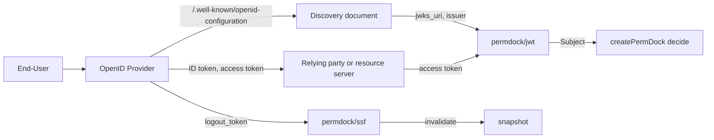

Status: shipped
Phase: 1

Phase 1 ships the `discovery` option, the `accept` option and the claim-to-Subject mapping below in [`permdock/jwt`](/docs/adapters/jwt). Phase 3 adds Back-Channel Logout as a revocation input to [`permdock/ssf`](/docs/adapters/ssf). Adapter phases: `permdock/jwt` 1, `permdock/ssf` 3, provider adapters (`supabase`, `clerk`, `better-auth`) 1 for the claims they already expose. Federation, the Enterprise Extensions, IPSIE and Identity Assurance stay on the [watch list](/docs/standards/watch-list).

## What it is

[OpenID Connect Core 1.0](https://openid.net/specs/openid-connect-core-1_0.html) is the identity layer on top of OAuth 2.0: an OpenID Provider (OP) authenticates an End-User and returns an ID token, a signed JWT that tells the Relying Party (RP) who was authenticated, when, how, and for which client. The specification is Final (incorporating errata set 2, December 2023) and has been adopted as ISO/IEC 26131:2024 and ITU-T X.1285, which makes it the most widely deployed federated identity protocol and the one every provider PermDock has an adapter for (Auth0, Okta, Entra, Google, Supabase, Clerk, Better Auth) implements. The parts a permissions library cares about:

- **The ID token claims (Core section 2).** `iss`, `sub`, `aud`, `exp`, `iat`, plus `auth_time`, `nonce`, `acr`, `amr`, `azp`. `sub` is "locally unique and never reassigned within the Issuer", so the pair `iss` + `sub` is the only stable identity; `sub` alone is not.
- **Subject identifier types (Core section 8).** `public` (the same `sub` for every client) or `pairwise` (a different `sub` per client sector). A permissions layer that keys grants on `sub` must know which one it has.
- **Discovery ([OpenID Connect Discovery 1.0](https://openid.net/specs/openid-connect-discovery-1_0.html)).** `GET <issuer>/.well-known/openid-configuration` returns the OP's metadata: `issuer`, `jwks_uri`, `id_token_signing_alg_values_supported`, `acr_values_supported`, `claims_supported`. [RFC 8414](https://www.rfc-editor.org/rfc/rfc8414.html) defines the same document for plain OAuth 2.0 authorization servers at `/.well-known/oauth-authorization-server`.
- **Access tokens versus ID tokens.** OIDC says nothing about the access token's format; [RFC 9068](https://www.rfc-editor.org/rfc/rfc9068.html) does, as a JWT with `typ: at+jwt`, and it is the access token, not the ID token, that a resource server authorises. The ID token's audience is the client; the access token's audience is the resource.
- **Session lifecycle.** [Back-Channel Logout 1.0](https://openid.net/specs/openid-connect-backchannel-1_0.html) delivers a `logout_token` (a JWT with `typ: logout+jwt`, an `events` claim naming `http://schemas.openid.net/event/backchannel-logout`, and `sub` and/or `sid`) to the RP when the OP session ends. The `sid` claim identifies the session the token came from.
- **Step-up.** [RFC 9470](https://www.rfc-editor.org/rfc/rfc9470.html) lets a resource server answer `WWW-Authenticate: Bearer error="insufficient_user_authentication", acr_values="...", max_age=...` when the token's `acr` or `auth_time` is not good enough, and the client re-authenticates with those parameters.

Around Core sit the specifications the watch list tracks: [OpenID Federation](https://openid.net/specs/openid-federation-1_0.html) (trust without pairwise configuration), the Enterprise Extensions (`session_expiry`), the IPSIE profiles, Identity Assurance (`verified_claims`), the Ephemeral Subject Identifier draft and Key Binding.

## Why it matters for PermDock

PermDock never authenticates ([ADR 0018](/docs/decisions/0018-authentication-is-upstream)). The OIDC flow ends where PermDock starts: once the RP or resource server holds a verified token, `permdock/jwt` or a provider adapter turns its claims into a [Subject](/docs/concepts/subject) and `createPermDock` decides from there. Three things go wrong when that boundary is fuzzy, and each is a rule below:

1. **Keying grants on `sub` alone.** Two issuers can both mint `sub: "1234"`. The principal carries `issuer` next to `id`, and audit events record both.
2. **Authorising an ID token.** An ID token proves a login happened for a client; it says nothing about what the client may do at an API. `permdock/jwt` rejects ID tokens presented as access tokens unless a deployment opts in.
3. **Hard-coding `jwks_uri`.** Providers rotate keys and occasionally move JWKS endpoints. Discovery is the source of `jwks_uri` and `issuer`, and the issuer in the document must equal the issuer asked for.



## How PermDock uses it

### Discovery in `permdock/jwt`

```ts
import { createJwtSubjectResolver } from 'permdock/jwt'

const resolve = createJwtSubjectResolver({
  discovery: 'https://login.example.com',        // fetches /.well-known/openid-configuration, then RFC 8414
  audience: 'https://api.example.com',
  algorithms: ['ES256', 'PS256', 'Ed25519'],
  claims: { id: 'sub', roles: 'roles', assurance: { acr: 'acr', amr: 'amr', authTime: 'auth_time' } },
})
```

`discovery` replaces `jwks` and `issuer`: the resolver fetches the document lazily, requires `issuer` in the document to equal the configured issuer byte for byte (Discovery section 4.3), takes `jwks_uri` from it, and caches both under the JWKS cache rules. Fetching happens in the resolver, never in `decide` ([invariant 15](/docs/security/threat-model)). A document served over plain HTTP, with a mismatched `issuer`, or without `jwks_uri` is a configuration error reported once by `permdock doctor`; tokens resolve to anonymous until it is fixed. Full option list on the [JWT adapter](/docs/adapters/jwt).

### Access tokens by default, ID tokens by opt-in

`accept: 'access-token'` (the default) requires `typ: at+jwt` under `profile: 'fapi2'` and otherwise accepts `at+jwt` or `JWT`; a token that looks like an ID token (`nonce` present, `aud` equal to a client identifier rather than the configured audience) is rejected with reason `wrong-token-type`. `accept: 'id-token'` is for backends-for-frontends that verify the ID token themselves and want its claims as the principal; it requires `audience` to be the client id and applies Core section 3.1.3.7 validation (`aud`, `azp` when several audiences, `iss`, `exp`, `iat`). A resolver accepts one or the other, never both.

### Claims that reach the principal

| OIDC claim | PermDock field | Rule |
| --- | --- | --- |
| `sub` | `principal.id` | Opaque string; compared byte for byte; never a display name or email |
| `iss` | `principal.issuer` | Always set by `permdock/jwt` and the provider adapters; audit events carry `issuer` next to `id` |
| `aud`, `azp` | Verified, not stored | `aud` must contain `audience`; with `accept: 'id-token'` and several audiences, `azp` must equal the client id |
| `exp`, `session_expiry` | `subject.expiresAt` | `min(exp, session_expiry)`; copied into the snapshot |
| `iat`, `nbf` | Verified, not stored | Within `clockTolerance` |
| `acr` | `principal.assurance.acr` | The authentication context class reference, compared as an opaque string against the policy's step-up conditions |
| `amr` | `principal.assurance.amr` | Array of RFC 8176 method names (`pwd`, `otp`, `hwk`, `mfa`); conditions may require a member |
| `auth_time` | `principal.assurance.authTime` | Seconds since the epoch; the input to `max_age` style conditions |
| `sid` | `subject.session` | Session identifier, used to match a later `logout_token` or CAEP `session-revoked` event to the snapshot |
| `nonce` | Rejected on access tokens | Its presence is one of the signals for `wrong-token-type` |
| `roles`, `groups`, `entitlements` | `principal.roles`, `principal.memberships` | RFC 9068 claim names and SCIM encoding ([JWT authorization claims](/docs/standards/jwt-authorization-claims)) |
| `org_id`, `tid`, `hd`, `org_code` | `principal.tenant` | No standard claim exists; the provider page names the claim; a tenant with no matching membership is no tenant |
| `verified_claims` | `principal.assurance.verified` | Identity Assurance; Phase 4, consumed as opaque evidence for conditions |
| `email`, `name`, `picture` | Nowhere | The provider owns them; conditions do not need them ([subject](/docs/concepts/subject)) |

`user_metadata`-style claims that the End-User can edit are never mapped to roles or memberships ([authentication](/docs/concepts/authentication)).

### Step-up denials

A permission whose condition reads `subject.assurance` (for example `acr` in a required set, or `authTime` newer than a bound) is `denied` with reason `insufficient-user-authentication`. HTTP adapters render that exact reason as the RFC 9470 challenge, `WWW-Authenticate: Bearer error="insufficient_user_authentication", acr_values="<required>", max_age=<seconds>`, taking `acr_values` and `max_age` from the condition that failed; the status is 401 and the Problem Details body is `type: .../step-up-required` carrying the same values as `acrValues` and `maxAge` ([Problem Details](/docs/standards/problem-details)). MCP renders it as a `scopeChallenge`-style elicitation. The mapping from every denial reason to RFC 6750 and RFC 9470 is on the [JWT adapter](/docs/adapters/jwt).

### Back-Channel Logout as a revocation input

`permdock/ssf` accepts a `logout_token` next to Shared Signals SETs: same `TokenVerifier`, `typ: logout+jwt` required, `events` must contain the back-channel logout member, `nonce` must be absent (Back-Channel Logout section 2.6), `sub` or `sid` must be present. A matching snapshot (by `principal.id` plus `issuer`, or by `session`) is invalidated exactly as for CAEP `session-revoked` ([Shared Signals](/docs/standards/shared-signals-caep)). This is a receiver for a token the OP already sends; PermDock does not implement the RP's logout endpoint routing.

### What PermDock does not do

It does not run the authorization code flow, exchange codes, refresh tokens, verify `nonce` on the RP's behalf, manage the RP session, or implement Federation trust-chain resolution. Those are the provider SDK's or the OAuth client library's job; PermDock consumes their result. It does not support the Implicit Flow's `id_token` in a fragment as authorization material.

## Mapping table

| OpenID Connect concept | PermDock concept |
| --- | --- |
| OpenID Provider | The issuer configured through `discovery`; `principal.issuer` |
| Relying Party / resource server | The application running `createPermDock`; `permdock/jwt` is its token-to-subject step |
| End-User | `principal` with `kind: 'user'` |
| Client (`azp`, `client_id`) | `actor` when it differs from the subject and acts under a delegation; otherwise verified and dropped |
| ID token | Accepted only with `accept: 'id-token'`; never as authorization for an API |
| Access token (RFC 9068 `at+jwt`) | The default input to `subjectFromJwt` |
| Discovery document | Source of `jwks_uri` and `issuer`; cached with the JWKS |
| `acr`, `amr`, `auth_time` | `principal.assurance.{acr, amr, authTime}` |
| RFC 9470 step-up challenge | `denied` with reason `insufficient-user-authentication`, rendered as `WWW-Authenticate` |
| `sid` | `subject.session`; the join key for logout and CAEP events |
| Back-Channel Logout `logout_token` | Revocation input to `permdock/ssf` |
| Public vs pairwise `sub` | Documented on the provider page; grants and audit key on `issuer` + `id` either way |
| Federation entity statements | Tracking: candidate trust mechanism for `permdock/pdp` |

## Sources

- [OpenID Connect Core 1.0 incorporating errata set 2](https://openid.net/specs/openid-connect-core-1_0.html), sections 2, 3.1.3.7 and 8; [How OpenID Connect works](https://openid.net/developers/how-connect-works/).
- [OpenID Connect Discovery 1.0](https://openid.net/specs/openid-connect-discovery-1_0.html), sections 3 and 4.3; [RFC 8414](https://www.rfc-editor.org/rfc/rfc8414.html).
- [OpenID Connect Back-Channel Logout 1.0](https://openid.net/specs/openid-connect-backchannel-1_0.html), sections 2.4 to 2.6.
- [RFC 9068](https://www.rfc-editor.org/rfc/rfc9068.html) (JWT profile for access tokens), [RFC 9470](https://www.rfc-editor.org/rfc/rfc9470.html) (step-up authentication), [RFC 8176](https://www.rfc-editor.org/rfc/rfc8176.html) (`amr` values).
- [OpenID Foundation specifications index](https://openid.net/developers/specs/) for Federation, the Enterprise Extensions, IPSIE and Identity Assurance.

## Related

- [JOSE](/docs/standards/jose): the token formats and algorithms behind every OIDC artefact.
- [JWT adapter](/docs/adapters/jwt): `discovery`, `accept`, the claim options and the error mapping.
- [Authentication](/docs/concepts/authentication): the verified-material rule and the provider recipes.
- [Subject](/docs/concepts/subject): `principal.issuer`, `assurance`, `session`.
- [FAPI 2.0](/docs/standards/fapi-2): the high-security profile of the same flow.
- [Shared Signals and CAEP](/docs/standards/shared-signals-caep): the other revocation input.
- [ADR 0026](/docs/decisions/0026-spec-aligned-naming): why `issuer`, `assurance.acr` and `session` were added.
- [Standards watch list](/docs/standards/watch-list).

## Open questions

- Whether `discovery` should accept several issuers (one resolver per issuer is the current answer, matching the JWT adapter's open question).
- Whether pairwise subject identifiers need a `sector` marker on the principal so an audit consumer can tell that two `sub` values from one issuer may be one person.
- Whether Federation trust-chain resolution ever belongs in `permdock/jwt` (for `permdock/pdp` discovering a remote PDP's keys) or stays a deployment concern.
